# クロステ ～Cross Stage～

**音楽と身体が交差するWebリズムゲーム**

> メディアフロンティアのプレゼンテーション兼READMEとして、短時間で作品を伝えられる構成にしています。

クロステ は、TextAlive App API による歌詞同期技術と MediaPipe (Pose / FaceMesh) による動作検知AIを融合させた、Webリズムゲームです。  
ライブステージを舞台に、流れてくる歌詞を「掴み」「奏でる」ような体験を提供します。


<br>

---

## 目次

| セクション | 内容 |
|:---|:---|
| **概要** | 1分でわかる クロステ / 展示ポイント / デモの流れ |
| **プロダクト** | ゲーム概要 / プレイモード |
| **技術** | 技術的な特徴 / 技術の見せ場 / システム仕様詳細 |
| **設計** | 設計・DB・API・モジュール |
| **品質・運用** | テスト仕様 / 展示チェックリスト / 開発・デプロイ / ライセンス |

<br>

---
---

# PART 1: 概要

---

## 1分でわかる クロステ

| 観点 | 内容 |
|:---|:---|
| **体験** | 歌詞を「つかむ・奏でる」体感型リズムアクション |
| **特徴** | TextAlive歌詞同期 × MediaPipe動作認識の融合 |
| **強み** | 4つの操作モードで誰でも遊べる（PC/スマホ/カメラ） |
| **価値** | 音楽×身体×視覚演出を一体化したライブ感 |

<br>

## 展示ポイント（見どころ）

| ポイント | 説明 |
|:---|:---|
| **動きがそのまま入力になる** | Pose/Faceによる直感的な体験 |
| **歌詞と演出の同期** | TextAliveとゲーム判定が噛み合う快感 |
| **誰でも遊べる** | デバイス/環境に合わせた4モード設計 |

<br>

## デモの流れ（展示用）

```
1. タイトルでモード選択（Cursor / Mobile / Body / Face）
       ↓
2. 楽曲開始 → 歌詞が流れてくる
       ↓
3. ホールドでスコア獲得 → コンボと演出が強化
       ↓
4. リザルト & ランキング → その場で順位を確認
```

<br>

---
---

# PART 2: プロダクト

---

## ゲーム概要

プレイヤーはライブステージの演者となり、楽曲に合わせて流れてくる「歌詞」をタイミングよく操作します。  
単なるタップではなく、**「ホールド（長押し）」** することでゲージを溜め、スコアを稼ぐ独自のリズムアクションを採用しています。  
プレイ結果はオンラインランキングに登録されます。

### Immersive Live Experience

| 要素 | 内容 |
|:---|:---|
| **ネオン×グラスモーフィズム** | ネオンライトと透き通るようなUIデザイン |
| **3Dステージ演出** | Three.js と CSS Animation を組み合わせた、軽量なライティング演出 |
| **レスポンシブデザイン** | PCの大画面からスマートフォンプレイまで、デバイスに対応したUI |

<br>

---

## プレイモード

デバイスや環境に合わせて、4つの操作モードを搭載しています。

| モード | 対象デバイス | 操作方法 | 特徴 |
|:---|:---|:---|:---|
| **カーソル** | PC | マウスカーソルで歌詞をホールド。手軽に楽しめる基本モード |
| **モバイル** | スマートフォン | タップ & ホールド | スマホ操作に特化。画面下部の歌詞表示を排除し、プレイ領域を最大化。親指一つで遊べる直感的な操作感 |
| **ボディ** | PC (Webカメラ) | 全身アクション | Webカメラでプレイヤーの動きを検知。手や体を歌詞に重ねて「触れる」ことで入力する、全身を使ったモード |
| **フェイス** | スマートフォン | 顔移動 & 口パク | カメラで顔を認識。顔を動かして位置を合わせ、口を「パクッ」と開けることで歌詞をキャッチするモード |

<br>

---
---

# PART 3: 技術

---

## 技術的な特徴

### Frontend (Modern Web)

| カテゴリ | 内容 |
|:---|:---|
| **React 18 & Vite** | SPA構成で高速遷移、HMRで開発体験を最適化 |
| **Game Core Architecture** | `GameManager` を中枢に `GameLoop` と各Manager（Input/Lyrics/Results/Visuals/Detectors/UI/Effects）を分離 |
| **MediaPipe統合** | Pose/FaceMesh/SelfieSegmentation を並列利用し、Body/Face各モードの入力パイプラインを最適化 |
| **Rendering/UX最適化** | バブルはDOMプール、UIは差分更新、`requestAnimationFrame` で安定した60fps志向 |
| **サービス境界** | `ScoreService`/`TokenService` でAPI呼び出しを集約し、画面ロジックと通信を分離 |

### Backend (Robust & Secure)

| カテゴリ | 内容 |
|:---|:---|
| **Cloudflare Workers & Hono** | エッジ実行で低レイテンシなスコア登録/取得 |
| **Supabase (PostgreSQL)** | RLSとスキーマ検証でデータ整合性を担保 |
| **Multi-layer Security** | Turnstile(Bot対策) / HMAC署名+Nonce(改ざん・リプレイ防止) / RateLimiter(IP制限) / Origin検証 |
| **Service分割** | Workers/Serverで`scoreService`/`adminService`を分離し、ルート層を薄く保守性を向上 |

<br>

---

## 技術の見せ場（展示で説明するポイント）

| ポイント | 詳細 |
|:---|:---|
| **リアルタイム入力** | カメラ入力のランドマークを即時に判定へ接続 |
| **判定と演出の一体化** | ホールド中に演出が強化され、体験が可視化される |
| **安全なスコア登録** | HMAC/Nonce/Turnstile/RateLimiterの多層防御 |

<br>

---

## システム仕様詳細

<br>

### 3-1. システム構成図

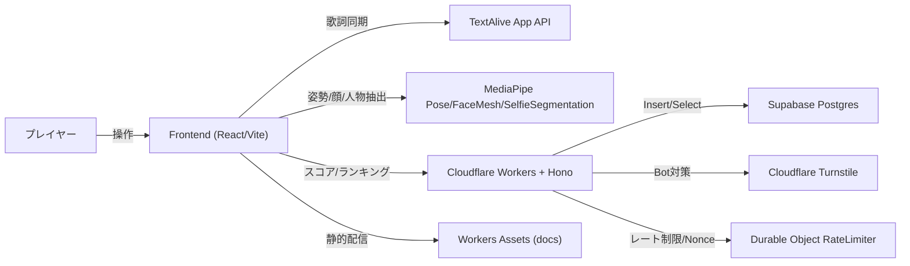

<br>

### 3-2. 機能階層図

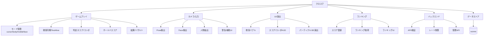

<br>

### 3-3. 主要機能の処理フロー (IPO図)

```mermaid
flowchart TB
  subgraph Gameplay[ゲームプレイ/スコアリング]
    GP_In[Input: TextAliveタイミング, プレイヤー入力, カメラLandmarks]
    GP_Proc[Process: バブル生成, ヒット/ホールド判定, コンボ/スコア計算]
    GP_Out[Output: スコアUI, 演出, リザルト]
    GP_In --> GP_Proc --> GP_Out
  end

  subgraph Camera[カメラ認識]
    C_In[Input: Webカメラ映像]
    C_Proc[Process: Pose/FaceMesh/Segmentation, 品質/負荷制御]
    C_Out[Output: ランドマーク/人体マスク/判定イベント]
    C_In --> C_Proc --> C_Out
  end

  subgraph ScoreSubmit[スコア登録]
    S_In[Input: GameResult, x-score-token?, turnstileToken?]
    S_Proc[Process: Origin/Rate limit/HMAC/Turnstile検証, Supabase挿入]
    S_Out[Output: 保存結果/エラー]
    S_In --> S_Proc --> S_Out
  end
```

<br>

### 3-4. 画面遷移図

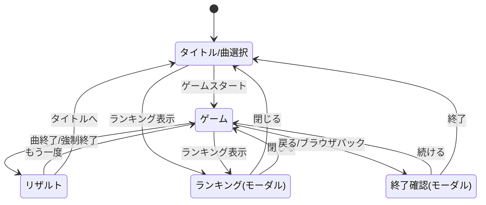

<br>

### 3-5. 要件定義 (マインドマップ)

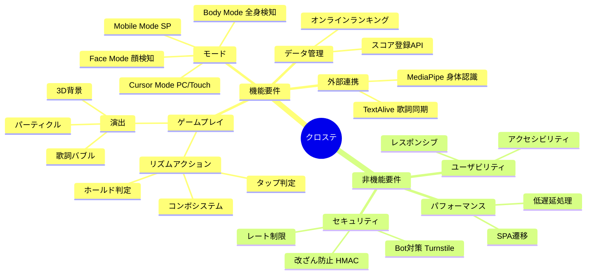

<br>

### 3-6. 開発スケジュール (ガントチャート)

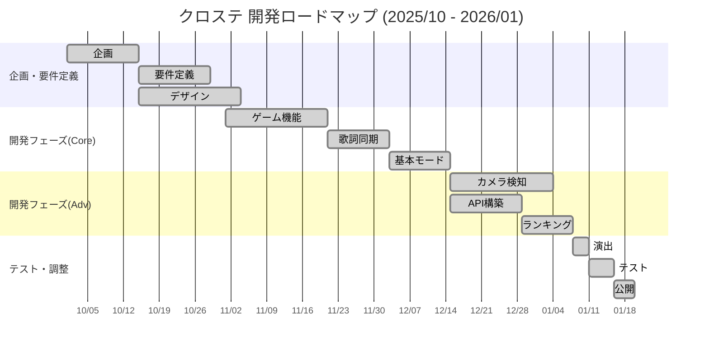

<br>

### 3-7. API仕様

| Method | Path | 概要 | 認証/条件 |
|:---|:---|:---|:---|
| GET | `/api/health` | ヘルスチェック | なし |
| GET | `/api/config` | Turnstile Site Key 取得 | なし |
| GET | `/api/token` | スコア署名トークン発行 | SCORE_SIGNING_SECRET 設定時のみ有効 |
| POST | `/api/score` | スコア登録 | FRONTEND_ORIGIN/Rate limit/HMAC/Turnstile (条件付き) |
| GET | `/api/ranking` | ランキング取得 | songId 必須 |
| DELETE | `/admin/scores` | スコア削除 | x-admin-token 必須 |

<br>

---
---

# PART 4: 設計

---

## データベース設計

### ER図（単一テーブル）

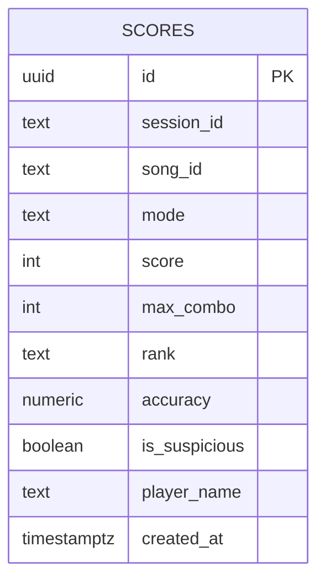

### テーブル定義 (scores)

| カラム | 型 | 説明 |
|:---|:---|:---|
| id | uuid | プライマリキー |
| session_id | text | 匿名セッションID |
| song_id | text | 楽曲ID |
| mode | text | cursor/body/mobile/face |
| score | integer | スコア |
| max_combo | integer | 最大コンボ |
| rank | text | ランク |
| accuracy | numeric | 精度(%) |
| is_suspicious | boolean | チート疑いフラグ |
| player_name | text | プレイヤー名 |
| created_at | timestamptz | 登録日時 |

<br>

---

## モジュール設計

### モジュール分割図

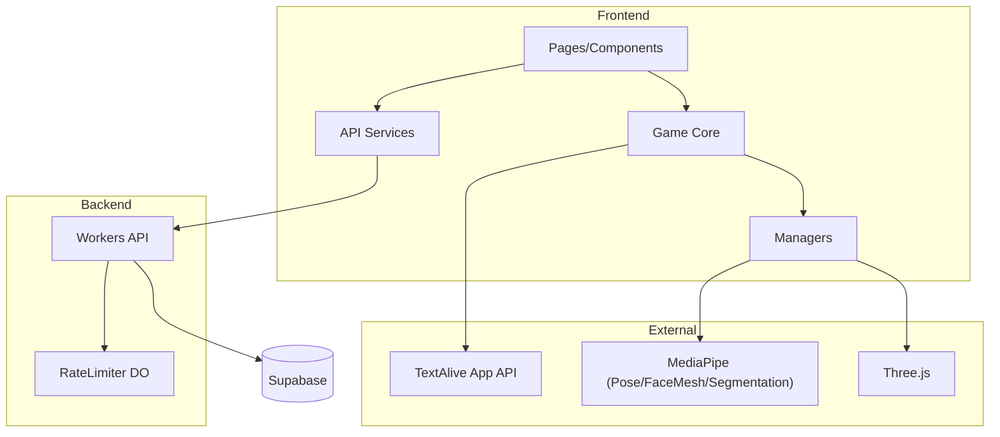

<br>

### 主要モジュールの責務

| モジュール | 責務 | 主なファイル |
|:---|:---|:---|
| ルーティング/ページ | SPAルーティング、画面遷移 | `src/App.tsx`, `src/pages/IndexPage.tsx`, `src/pages/GamePage.tsx` |
| UIコンポーネント | ランキング表示、モード切替 | `src/components/game/RankingModal.tsx`, `src/components/game/ModeTabs.tsx` |
| ゲームコア | ゲーム進行、ループ、タイマー | `src/game/GameManager.ts`, `src/game/GameLoop.ts`, `src/game/TimerManager.ts` |
| マネージャ群 | 入力/描画/演出/リザルト/表示最適化 | `src/game/managers/*`, `src/game/BubblePool.ts` |
| サービス層 | API呼び出しの集約 | `src/services/scoreService.ts`, `src/services/tokenService.ts` |
| Workers API | スコア登録/ランキング取得/管理 | `worker/index.ts`, `worker/routes/*`, `worker/services/*` |
| 検証/スキーマ | APIバリデーション | `worker/schemas/*` |
| レート制限 | Durable Object による制限/Nonce | `worker/rateLimiter.ts` |
| ローカルServer | Workers互換の開発用API | `server/index.ts`, `server/routes/*`, `server/services/*` |

<br>

### クラス図（Frontend）

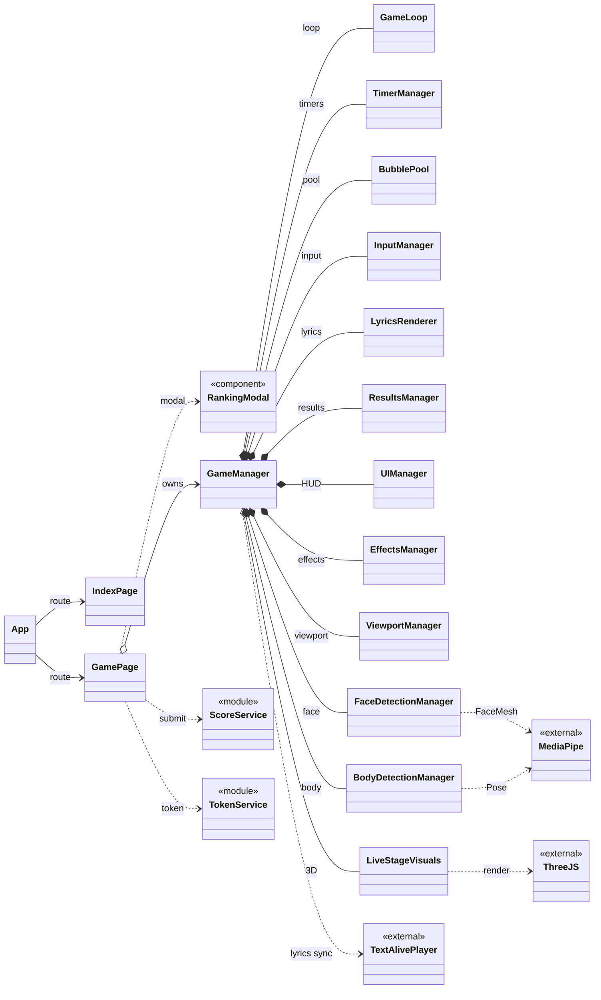

<br>

### クラス図（Backend）

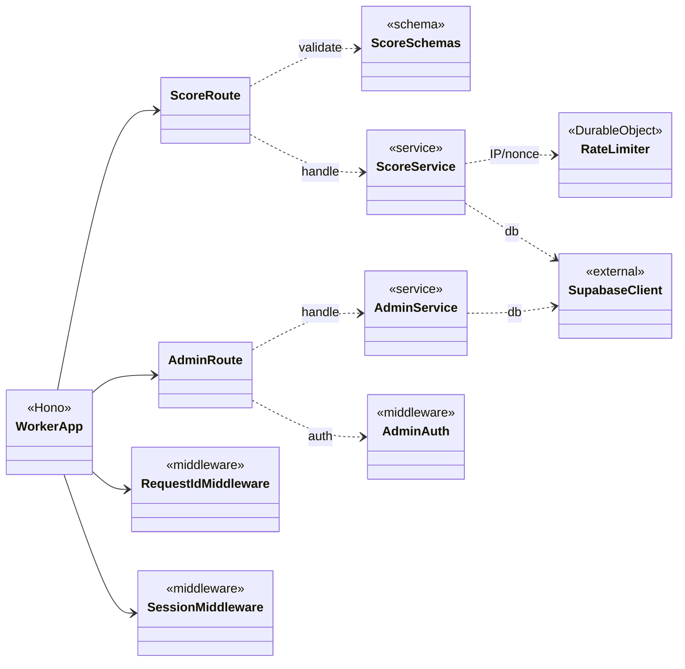

<br>

---

## 設計方針

### 前提

| 対象 | 方針 |
|:---|:---|
| フロント | 入力/描画/判定/結果を同一セッションで完結 |
| バックエンド | スコア登録/ランキング取得/管理APIに責務を限定 |
| 本番/開発 | Workers が本番基盤、`server/` は開発用の互換実装 |
| 外部連携 | TextAlive/MediaPipe/Three.js はゲームコア側から直接利用 |

### 境界定義

| レイヤー | 内容 |
|:---|:---|
| UI層 | ページ/モーダル/ランキング表示 |
| ドメイン層 | GameManager + 各Manager + GameLoop + TimerManager + BubblePool |
| サービス層 | scoreService/tokenService でAPI境界を固定 |
| インフラ層 | Workers/Supabase/RateLimiter/Turnstile |
| 開発支援 | server (ローカルのみ) |

<br>

### データフロー（スコア登録）

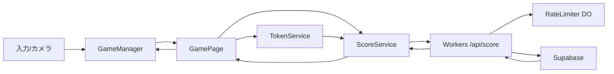

<br>

### 非機能設計

| 観点 | 内容 |
|:---|:---|
| 性能 | GameLoop + BubblePool + DOM再利用でGC圧を抑制 |
| 信頼性 | TimerManager でタイマーを集中管理、cleanup で資源解放 |
| セキュリティ | RateLimiter + HMAC + Turnstile + Origin検証 |
| 運用 | requestId/sessionId でログ追跡可能 |

<br>

---

## クラス設計一覧

| クラス/モジュール | 役割 | 主な責務 |
|:---|:---|:---|
| GameManager | ゲーム進行の中枢 | モード制御、スコア/コンボ、ループ更新、各マネージャ統合 |
| GameLoop | ループ実行 | `requestAnimationFrame` による更新コールバック |
| TimerManager | タイマー管理 | `setTimeout`/`setInterval` の一元管理とクリア |
| BubblePool | DOM再利用 | 歌詞バブルの生成/再利用/破棄 |
| LyricsRenderer | 歌詞描画 | バブル生成、配置、表示/非表示制御 |
| InputManager | 入力統合 | マウス/タッチ/キー入力のイベント配線 |
| UIManager | HUD更新 | 指示文やUI表示の更新 |
| EffectsManager | 演出 | クリック時エフェクト生成 |
| ResultsManager | リザルト | 結果表示、登録UI、送信ボタン制御 |
| FaceDetectionManager | 顔検出 | FaceMesh 解析、口開閉判定と入力反映 |
| BodyDetectionManager | 全身検出 | Pose 判定、カウントダウン/警告制御 |
| ViewportManager | 表示最適化 | `--vh` 更新など表示領域調整 |
| LiveStageVisuals | 3D描画 | Three.js によるステージ/ランドマーク描画 |
| GameEventEmitter | イベントバス | ゲーム内イベントの配信（拡張用） |
| scoreService (frontend) | API送信 | スコア送信、成功時フック |
| tokenService (frontend) | トークン取得 | 署名トークンの取得/更新 |
| scoreService (Workers) | Workers処理 | スコア投稿の検証/保存、ランキング取得 |
| adminService (Workers) | Workers管理 | 管理APIでの削除処理 |
| scoreService (Server) | Server処理 | スコア保存/ランキング取得 |
| RateLimiter | レート制限 | IP制限/Nonce管理 |

<br>

---

## ディレクトリ構成

```
star/
├── src/                  # フロントエンド・ソースコード
│   ├── components/       # React UIコンポーネント (Ranking, Modal等)
│   ├── game/             # ゲームコアロジック
│   │   ├── GameManager.ts    # ゲーム進行管理
│   │   ├── GameLoop.ts       # メインループ
│   │   └── managers/         # 各種マネージャ
│   ├── pages/            # ルーティングページ (Index, Game)
│   ├── services/         # API呼び出し (scoreService, tokenService)
│   └── styles.css        # グローバルスタイル・アニメーション定義
│
├── worker/               # バックエンド・API (Cloudflare Workers)
│   ├── index.ts          # Hono エントリーポイント
│   ├── rateLimiter.ts    # レート制限 (Durable Object)
│   ├── routes/           # ルート定義
│   ├── services/         # ビジネスロジック
│   └── schemas/          # バリデーション
│
└── server/               # ローカル開発用サーバー
```

<br>

---
---

# PART 5: 品質・運用

---

## テスト仕様（ユーザビリティ視点）

### 結合テスト

| ID | シーン | 手順/入力 | 期待結果（ユーザビリティ） |
|:---:|:---|:---|:---|
| 01 | タイトル導線 | モードを切り替える | 選択中のモードが視覚的に強調され、説明文も即時に更新される |
| 02 | 遊び方モーダル | 「遊び方」を開く→閉じる | 内容が読みやすく表示され、閉じる操作で元画面に戻る |
| 03 | ランキングモーダル | 「ランキング」→期間/モード切替→閉じる | 一覧が更新され、閉じると元の画面へ戻れる |
| 04 | ゲーム開始 | 「ゲームスタート」→ロード完了待ち | ロード中表示があり、再生/リスタートが無効→準備完了で有効化される |
| 05 | 再生/一時停止 | 再生→一時停止→再生 | ボタン表記が状態に一致し、歌詞/スコア更新が停止/再開する |
| 06 | マウス操作 | バブルを長押し | 進捗表示が出てスコア/コンボが加算され、離すと解除される |
| 07 | モバイル操作 | タップで長押し | 指操作でもホールドでき、誤操作が起きにくい |
| 08 | ボディモード開始 | 全身が映る→カウントダウン完了 | 調整メッセージ→カウントダウン→再生開始の順で表示される |
| 09 | ボディモード警告 | 再生中に全身が外れる | 一定時間後に警告が表示され、復帰で警告が消える |
| 10 | フェイスモード | 口を開く/閉じる | 開口時のみホールド判定、閉口で解除される |
| 11 | リザルト表示 | 曲終了 | リザルト画面が表示され、スコア/最大コンボ/ランク/名前入力が視認できる |
| 12 | スコア登録成功 | 名前入力→登録 | 「登録完了」に変わり、ボタンが無効化される |
| 13 | スコア登録失敗 | 通信失敗を模擬→登録 | 「登録失敗(再試行)」に変わり、再試行が可能になる |
| 14 | 未登録の離脱 | 登録せずにタイトル/リトライ | 確認モーダルが表示され、続ける/終了するを選べる |
| 15 | ランキング空表示 | スコアなしの曲でランキング表示 | 「まだスコアがありません」等の案内が出る |
| 16 | ランキング通信失敗 | /api/ranking 失敗 | エラーメッセージが表示され、画面がフリーズしない |

<br>

### 単体テスト

| ID | 対象 | 条件/入力 | 期待結果（ユーザビリティ） |
|:---:|:---|:---|:---|
| 01 | UIManager | モード切替操作 | 画面の操作説明文が各モードに適した文言に更新される |
| 02 | PlayButton | 再生/一時停止の切替 | ボタン表記やアイコンが「再生」「一時停止」に正しく切り替わる |
| 03 | BodyWarning | 警告有効/無効 | 全身が映っていない時の警告メッセージ表示の有無が正しく切り替わる |
| 04 | CountDown | ランドマーク検出 | カウントダウン開始/キャンセル、警告文表示が正しく切り替わる |
| 05 | FaceDetection | 口開/閉の判定 | 開口時のみ判定座標が有効になり、閉口時は解除される |
| 06 | SubmitButton | 登録処理の状態変化 | 成功/失敗に応じてボタンの文言が変わり、連打が防止(disabled)される |
| 07 | ConfirmModal | 離脱イベント発火 | メッセージと遷移アクション（OK/Cancel）が正しく設定される |
| 08 | RankingList | データ状態(loading/error/empty) | 「ロード中」「エラー」「データなし」の表示が正しく切り替わる |
| 09 | RankCalculator | スコア境界値 | ランク表示（S/A/B/C）が境界値で正しく判定される |

<br>

---

## 展示チェックリスト

| カテゴリ | 確認項目 |
|:---|:---|
| **機材** | PC/スマホ、Webカメラ、スピーカー、安定した回線 |
| **環境** | 明るさと背景が安定、カメラ位置は胸〜顔が収まる高さ |
| **動作確認** | カメラ許可、音声出力、ランキングAPI接続 |
| **説明順** | 1分概要 → デモ → 技術の見せ場 → 設計図 |

<br>

---

## 開発・デプロイ

### 必須要件

| 項目 | バージョン/詳細 |
|:---|:---|
| Node.js | 20+ |
| Cloudflare | アカウント (Workers / Turnstile) |
| Supabase | プロジェクト作成済み |

### セットアップ

```bash
# 1. 依存関係のインストール
npm install

# 2. 環境変数の設定
#    .env ファイルを作成し、必要なAPIキーを設定

# 3. 開発サーバー起動
npm run dev        # フロントエンド
npm run cf:dev     # バックエンド(エミュレーション)

# 4. デプロイ
npm run deploy
```

<br>

---

## ライセンス & クレジット

| 項目 | 内容 |
|:---|:---|
| **License** | MIT |
| **Music & Lyrics** | Powered by [TextAlive App API](https://api.songle.jp/) (National Institute of Advanced Industrial Science and Technology - AIST) |
| **Vision AI** | MediaPipe by Google |
| **Special Thanks** | 加賀（ネギシャワーP） ストリートライト piapro（https://piapro.jp/t/ULcJ）|