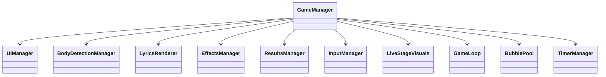

# Cross Stage（クロスステージ）

音楽と一体化する Web リズムアクションゲーム。  
TextAlive App API の歌詞タイミングと MediaPipe Pose の全身/手の検知を組み合わせ、流れてくる歌詞バブルを「長押し（ホールド）」してスコアを稼ぎます。


---

## 特徴

- **ホールド判定リズムゲーム**
  - 歌詞バブルをホールドしてゲージMAXでコンボ/スコア加算。
  - 近距離スポーンの重なり回避、ホールド中バブルの最前面化など、プレイ感を重視。
- **3つの入力モード**
  - `cursor`: マウス/タッチでホールド（PC/タブレット向け）。
  - `body`: Webカメラ + Pose で全身入力。手首/指先の近接でホールド判定。
  - `mobile`: スマホ専用 UI（タップホールド特化、端末検知で自動切替）。
  - `hand`: 研究/拡張枠（現在は Pose ベースの手判定を強化中）。
- **Live Venue UI**
  - ネオン×ガラスモーフィズム調のステージ UI。
  - Three.js による軽量ステージ演出（WebGL 非対応環境では自動で無効化）。
- **TextAlive フォールバック**
  - API が不安定な場合でもフォールバック歌詞とローカルタイマーでプレイ継続。
  - 曲頭の歌詞漏れ対策として最初の 500ms はスポーン抑制。
- **モード別ランキング**
  - Supabase `scores` テーブルへ保存し、`all / weekly / daily` の期間別で表示。
  - Workers 側で冪等キーを生成し重複投稿を抑止。

---

## 技術スタック

|カテゴリ|技術|役割|
|---|---|---|
|Frontend|React 19 / Vite / TypeScript|SPA|
|Game Core|TextAlive App API|再生/歌詞同期|
|Input|MediaPipe Pose / SelfieSegmentation|全身/背景処理|
|Effects|Three.js|ステージ演出（任意）|
|Backend|Cloudflare Workers + Hono|API / 静的配信|
|DB|Supabase (PostgreSQL)|RLS / ランキング|

---

## アーキテクチャ概要

### Frontend
SRP に基づき GameManager を中心に各責務を分割。



### Backend (Workers)
- `/api/*` を Hono で提供。
- Durable Object `RateLimiter` で **分散レート制限**と**nonce 再利用防止**。
- Supabase は service role を Workers のみが持つ（anon は read-only）。

---

## データベース (Supabase)
`supabase_scores.sql` に定義。

主なカラム:
- `session_id`, `song_id`, `mode`, `score`, `max_combo`, `rank`, `accuracy`
- `player_name`
- `is_suspicious`: 疑わしい投稿フラグ（ランキング除外）
- `idempotency_key`: 重複投稿防止（Workersが `clientAttemptId` を元に生成）

RLS:
- anon/auth は `is_suspicious=false` の **SELECT のみ**許可。
- INSERT/DELETE は Workers(service role) のみ。

---

## API
Base: `/api`

### スコア登録
`POST /api/score`

Headers:
- `Content-Type: application/json`
- `x-score-token: <token>`（`SCORE_SIGNING_SECRET` 設定時のみ必須）

Body:
```json
{
  "playerName": "Guest",
  "songId": "HmfsoBVch26BmLCm",
  "mode": "cursor",
  "score": 10000,
  "maxCombo": 50,
  "rank": "S",
  "accuracy": 95.5,
  "turnstileToken": "...",
  "clientAttemptId": "uuid-v4"
}
```

補足:
- Turnstile を有効にしている場合、`turnstileToken` が必須です（フロントが自動付与）。
- `hhrg` の強制リザルト時は `debugBypass=true` が自動で付与され、短いデモ投稿のみ疑わしい判定を無効化します。
- `clientAttemptId` は「このプレイ1回分のID」。同じスコアでも別プレイなら別IDになるので、**同点の再登録もランキングに反映**されます。二重送信だけを防ぐ目的です。

### ランキング取得
`GET /api/ranking?songId=...&mode=cursor&period=all&limit=20`

Query:
- `songId`（必須）
- `mode`（任意: `cursor|body|mobile|hand`）
- `period`（任意: `all|weekly|daily`）
- `limit`（任意: 1〜50）

### スコア用トークン取得（署名付き投稿）
`GET /api/token`

### 公開設定取得
`GET /api/config`
- `turnstileSiteKey` を返します（Workers 側の環境変数から配布）。

### ヘルスチェック
`GET /api/health`

### 管理スコア削除
`DELETE /admin/scores?confirm=true&songId=...`

Headers:
- `x-admin-token: <ADMIN_TOKEN>`

安全弁:
- `confirm=true` のときは `songId|mode|before|after` のどれか条件必須。
- 全削除は `confirm=ALL` のみ。

---

## セキュリティ設計（要点）

- **RLS + service role 分離**  
  anon/auth は読み取りのみ。書き込みは Workers 経由。
- **署名付きスコア投稿**  
  `/api/token` で 5分有効の HMAC トークン発行。nonce 再利用は DO で拒否。
- **分散レート制限**  
  `/api/score` は IP あたり 10/min、`/api/ranking` は 120/min。
- **Turnstile ボット対策**  
  スコア投稿前に不可視 Turnstile を実行し、人間確認トークンを同梱。
- **CSP/セキュリティヘッダ**  
  Workers が CSP/Permissions‑Policy/HSTS/COOP/CORP 等を付与。
- **サプライチェーン対策**  
  `index.html` の CDN スクリプトは **バージョン固定 + SRI(integrity)**。

---

## 開発手順

### 要件
- Node.js 20+
- Cloudflare Workers アカウント
- Supabase プロジェクト

### 環境変数（ローカル）
`.dev.vars`（Workers dev 用）
```ini
SUPABASE_URL=https://your-project.supabase.co
SUPABASE_ANON_KEY=your-anon-key
SUPABASE_SERVICE_ROLE_KEY=your-service-role-key
ADMIN_TOKEN=secret-admin-token
FRONTEND_ORIGIN=http://localhost:5173
SCORE_SIGNING_SECRET=long-random-secret
TURNSTILE_SECRET_KEY=your-turnstile-secret
TURNSTILE_SITE_KEY=your-turnstile-site
```

Vite 側 `.env`（dev で site key を直読みしたい場合のみ）
```ini
VITE_TURNSTILE_SITE_KEY=your-turnstile-site
```

### 起動
```bash
npm install
npm run dev
```
- Frontend: `http://localhost:5173`
- Workers dev: `http://localhost:8787`

### Workers ローカル実機寄りデバッグ
```bash
npm run cf:dev
```

### デプロイ
```bash
npm run build
npm run deploy
```

Secrets 登録:
```bash
wrangler secret put SUPABASE_URL
wrangler secret put SUPABASE_ANON_KEY
wrangler secret put SUPABASE_SERVICE_ROLE_KEY
wrangler secret put ADMIN_TOKEN
wrangler secret put FRONTEND_ORIGIN
wrangler secret put SCORE_SIGNING_SECRET
wrangler secret put TURNSTILE_SECRET_KEY
wrangler secret put TURNSTILE_SITE_KEY
```

---

## ディレクトリ構成

```
star/
├── src/                  # Frontend (React)
│   ├── components/       # UI components
│   ├── game/             # Game logic (Managers)
│   └── pages/            # Pages
├── worker/               # Backend (Cloudflare Workers)
│   ├── index.ts          # Entry / headers / config
│   ├── rateLimiter.ts    # Durable Object
│   ├── supabaseClient.ts # Supabase clients
│   ├── middleware/       # requestId/session/admin
│   └── routes/           # score/ranking/admin
├── server/               # Node dev server (optional)
├── docs/                 # Built static assets
├── supabase_scores.sql   # Supabase schema
├── wrangler.jsonc        # Workers config
└── README.md
```

---

## ライセンス & クレジット
- MIT License
- TextAlive App API / Songle (AIST)  
  利用規約に従い、https://api.songle.jp/ へのリンク表記を行っています。
