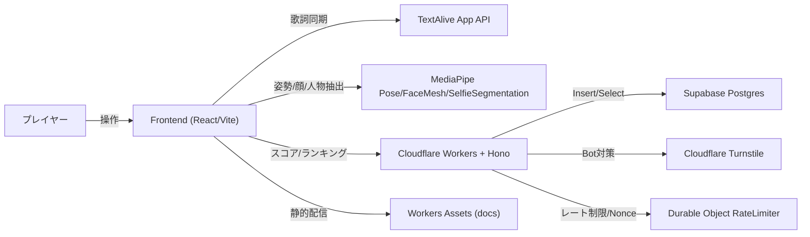
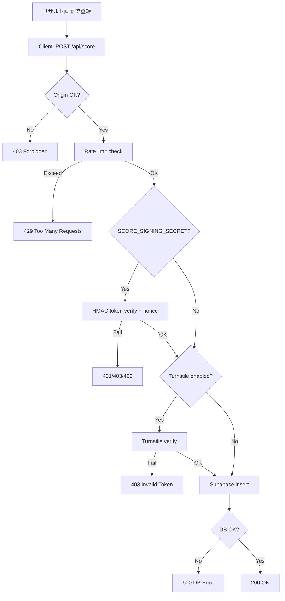
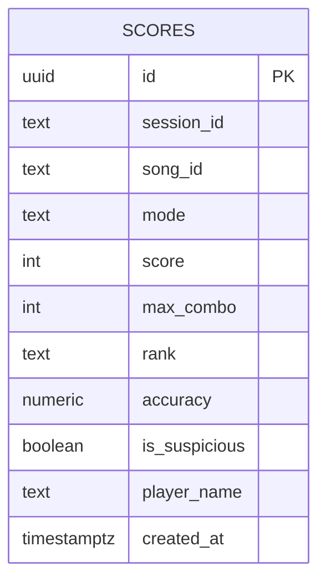
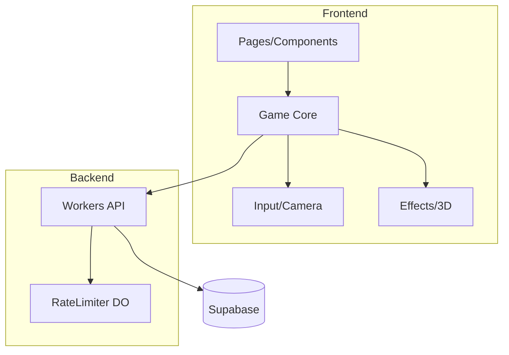

```mermaid
flowchart TB
  subgraph Gameplay[ゲームプレイ/スコアリング]
    GP_In[Input: TextAliveタイミング, プレイヤー入力, カメラLandmarks]
    GP_Proc[Process: バブル生成, ヒット/ホールド判定, コンボ/スコア計算]
    GP_Out[Output: スコアUI, 演出, リザルト]
    GP_In --> GP_Proc --> GP_Out
  end

  subgraph Camera[カメラ認識]
    C_In[Input: Webカメラ映像]
    C_Proc[Process: Pose/FaceMesh/Segmentation, 品質/負荷制御]
    C_Out[Output: ランドマーク/人体マスク/判定イベント]
    C_In --> C_Proc --> C_Out
  end

  subgraph ScoreSubmit[スコア登録]
    S_In[Input: GameResult, x-score-token?, turnstileToken?]
    S_Proc[Process: Origin/Rate limit/HMAC/Turnstile検証, Supabase挿入]
    S_Out[Output: 保存結果/エラー]
    S_In --> S_Proc --> S_Out
  end
```

# Cross Stage (クロスステージ)

**音楽と身体が交差する、次世代Webリズムアクション。**

Cross Stage は、TextAlive App API による歌詞同期技術と MediaPipe (Pose / FaceMesh) による動作検知AIを融合させた、没入型Webリズムゲームです。
近未来的なライブステージを舞台に、流れてくる歌詞を「掴み」「奏でる」ような体験を提供します。


---

## 🎮 ゲーム概要

プレイヤーはバーチャルライブステージの観客、あるいは演者となり、楽曲に合わせて流れてくる「歌詞バブル」をタイミングよく操作します。単なるタップではなく、**「ホールド（長押し）」**することでゲージを溜め、スコアを稼ぐ独自のリズムアクションを採用しています。

プレイ結果はオンラインランキングに登録され、世界中のプレイヤーとスコアを競い合うことができます。

### Immersive Live Experience
- **ネオン×グラスモーフィズム**: 暗闇に輝くネオンライトと、透き通るようなUIデザイン。
- **3Dステージ演出**: Three.js と CSS Animation を組み合わせた、軽量かつダイナミックなライティング演出。
- **レスポンシブデザイン**: PCの大画面からスマートフォンの縦持ちプレイまで、デバイスに最適化されたUI。

---

## 🕹️ プレイモード

デバイスや環境に合わせて、4つの操作モードを搭載しています。

| モード | 対象デバイス | 操作方法 | 特徴 |
| :--- | :--- | :--- | :--- |
| **Cursor Mode** | PC / タブレット | マウス / タッチ | マウスカーソルやタッチ操作で歌詞をホールド。手軽に楽しめる基本モード。 |
| **Mobile Mode** | スマートフォン | タップ & ホールド | スマホ操作に特化。画面下部の歌詞表示を排除し、プレイ領域を最大化。親指一つで遊べる直感的な操作感。 |
| **Body Mode** | PC (Webカメラ) | 全身アクション | Webカメラでプレイヤーの動きを検知。手や体を歌詞に重ねて「触れる」ことで入力する、全身を使ったモード。 |
| **Face Mode** | スマートフォン / PC (カメラ付) | 顔移動 & 口パク | カメラで顔を認識。顔を動かして位置を合わせ、口を「パクッ」と開けることで歌詞をキャッチするモード。 |

---

## 🚀 技術的な特徴

### Frontend (Modern Web)
- **React 19 & Vite**: 高速なレンダリングと開発体験。
- **Architecture**: `GameManager` を中心とした厳格な責務分離（SRP）。ゲームループ、入力処理、描画、音声同期を独立管理。
- **Performance**: パーティクルやバブルの描画に `will-change` 最適化やオブジェクトプーリングを採用し、Webブラウザ上で滑らかな60fps動作を実現。

### Backend (Robust & Secure)
- **Cloudflare Workers & Hono**: エッジでの高速なAPI処理。
- **Supabase (PostgreSQL)**: RLS (Row Level Security) を活用した堅牢なデータ管理。
- **Security First**:
  - **Turnstile**: CloudflareのスマートCAPTCHAによるボット排除。
  - **HMAC署名**: スコア送信時の改ざん防止。
  - **Idempotency**: 冪等性を担保し、ネットワーク不安定時の二重投稿を防止。

---

## 🛠️ システム仕様詳細

### 1. システム構成図



### 2. 機能階層図


### 3. 主要機能の処理フロー (IPO図)


### 4. 画面遷移図


### 5. API仕様

**API一覧**
| Method | Path | 概要 | 認証/条件 |
| --- | --- | --- | --- |
| GET | /api/health | ヘルスチェック | なし |
| GET | /api/config | Turnstile Site Key 取得 | なし |
| GET | /api/token | スコア署名トークン発行 | SCORE_SIGNING_SECRET 設定時のみ有効 |
| POST | /api/score | スコア登録 | FRONTEND_ORIGIN/Rate limit/HMAC/Turnstile (条件付き) |
| GET | /api/ranking | ランキング取得 | songId 必須 |
| DELETE | /admin/scores | スコア削除 | x-admin-token 必須 |

**スコア登録フロー**


---

## 💾 データベース設計

### ER図


### テーブル定義 (scores)
| カラム | 型 | 説明 |
| --- | --- | --- |
| id | uuid | プライマリキー |
| session_id | text | 匿名セッションID |
| song_id | text | 楽曲ID |
| mode | text | cursor/body/mobile/face |
| score | integer | スコア |
| max_combo | integer | 最大コンボ |
| rank | text | ランク |
| accuracy | numeric | 精度(%) |
| is_suspicious | boolean | チート疑いフラグ |
| player_name | text | プレイヤー名 |
| created_at | timestamptz | 登録日時 |

---

## 🧩 モジュール設計

### モジュール分割図


### 主要モジュールの責務
| モジュール | 責務 | 主なファイル |
| --- | --- | --- |
| ルーティング/ページ | SPAルーティング、画面遷移 | src/App.tsx, src/pages/IndexPage.tsx, src/pages/GamePage.tsx |
| UIコンポーネント | ランキング表示、モード切替 | src/components/game/RankingModal.tsx, src/components/game/ModeTabs.tsx |
| ゲームコア | ゲーム進行、スコア、リザルト | src/game/GameManager.ts, src/game/GameLoop.ts |
| 歌詞描画 | バブル生成、表示、判定補助 | src/game/GameManager.ts (LyricsRenderer) |
| 入力/カメラ | マウス/タッチ/カメラ入力、Pose/Face 判定 | src/game/GameManager.ts (InputManager, Detectors) |
| Workers API | スコア登録/ランキング取得/管理 | worker/index.ts, worker/routes/score.ts |
| レート制限 | Durable Object による制限/Nonce | worker/rateLimiter.ts |

---

## 📦 ディレクトリ構成

```bash
star-5/
├── src/                  # フロントエンド・ソースコード
│   ├── components/       # React UIコンポーネント (Ranking, Modal等)
│   ├── game/             # ゲームコアロジック
│   │   ├── GameManager.ts # ゲーム進行管理
│   │   ├── GameLoop.ts    # メインループ
│   │   └── ...           
│   ├── pages/            # ルーティングページ (Index, Game)
│   └── styles.css        # グローバルスタイル・アニメーション定義
├── worker/               # バックエンド・API (Cloudflare Workers)
│   ├── index.ts          # Hono エントリーポイント
│   ├── rateLimiter.ts    # レート制限 (Durable Object)
│   └── ...
├── supabase_scores.sql   # データベーススキーマ定義
└── UI.md                 # UIデザイン詳細仕様書
```

---

## 🧪 テスト仕様（ユーザビリティ視点）

### 結合テスト (E2E / ユーザー体験)
| ID | シーン | 手順/入力 | 期待結果（ユーザビリティ） |
| --- | --- | --- | --- |
| E2E-01 | タイトル導線 | モードを切り替える | 選択中のモードが視覚的に強調され、説明文も即時に更新される |
| E2E-02 | 遊び方モーダル | 「遊び方」を開く→閉じる | 内容が読みやすく表示され、閉じる操作で元画面に戻る |
| E2E-03 | ランキングモーダル | 「ランキング」→期間/モード切替→閉じる | 一覧が更新され、閉じると元の画面へ戻れる |
| E2E-04 | ゲーム開始 | 「ゲームスタート」→ロード完了待ち | ロード中表示があり、再生/リスタートが無効→準備完了で有効化される |
| E2E-05 | 再生/一時停止 | 再生→一時停止→再生 | ボタン表記が状態に一致し、歌詞/スコア更新が停止/再開する |
| E2E-06 | マウス操作 | バブルを長押し | 進捗表示が出てスコア/コンボが加算され、離すと解除される |
| E2E-07 | モバイル操作 | タップで長押し | 指操作でもホールドでき、誤操作が起きにくい |
| E2E-08 | ボディモード開始 | 全身が映る→カウントダウン完了 | 調整メッセージ→カウントダウン→再生開始の順で表示される |
| E2E-09 | ボディモード警告 | 再生中に全身が外れる | 一定時間後に警告が表示され、復帰で警告が消える |
| E2E-10 | フェイスモード | 口を開く/閉じる | 開口時のみホールド判定、閉口で解除される |
| E2E-11 | リザルト表示 | 曲終了 | リザルト画面が表示され、スコア/最大コンボ/ランク/名前入力が視認できる |
| E2E-12 | スコア登録成功 | 名前入力→登録 | 「登録完了」に変わり、ボタンが無効化される |
| E2E-13 | スコア登録失敗 | 通信失敗を模擬→登録 | 「登録失敗(再試行)」に変わり、再試行が可能になる |
| E2E-14 | 未登録の離脱 | 登録せずにタイトル/リトライ | 確認モーダルが表示され、続ける/終了するを選べる |
| E2E-15 | ランキング空表示 | スコアなしの曲でランキング表示 | 「まだスコアがありません」等の案内が出る |
| E2E-16 | ランキング通信失敗 | /api/ranking 失敗 | エラーメッセージが表示され、画面がフリーズしない |

### 単体テスト (コンポーネント挙動 / フィードバック)
| ID | 対象 | 条件/入力 | 期待結果（ユーザー視点） |
| --- | --- | --- | --- |
| UT-01 | UIManager | モード切替操作 | 画面の操作説明文が各モードに適した文言に更新される |
| UT-02 | PlayButton | 再生/一時停止の切替 | ボタン表記やアイコンが「再生」「一時停止」に正しく切り替わる |
| UT-03 | BodyWarning | 警告有効/無効 | 全身が映っていない時の警告メッセージ表示の有無が正しく切り替わる |
| UT-04 | CountDown | ランドマーク検出 | カウントダウン開始/キャンセル、警告文表示が正しく切り替わる |
| UT-05 | FaceDetection | 口開/閉の判定 | 開口時のみ判定座標が有効になり、閉口時は解除される |
| UT-06 | SubmitButton | 登録処理の状態変化 | 成功/失敗に応じてボタンの文言が変わり、連打が防止(disabled)される |
| UT-07 | ConfirmModal | 離脱イベント発火 | メッセージと遷移アクション（OK/Cancel）が正しく設定される |
| UT-08 | RankingList | データ状態(loading/error/empty) | 「ロード中」「エラー」「データなし」の表示が正しく切り替わる |
| UT-09 | RankCalculator | スコア境界値 | ランク表示（S/A/B/C）が境界値で正しく判定される |

---

## 🔧 開発・デプロイ

### 必須要件
- Node.js 20+
- Cloudflare アカウント (Workers / Turnstile)
- Supabase プロジェクト

### セットアップ

1. **依存関係のインストール**
   ```bash
   npm install
   ```

2. **環境変数の設定**
   `.dev.vars` および `.env` ファイルを作成し、必要なAPIキーを設定します（`README_OLD.md` または `TROUBLESHOOTING.md` 参照）。

3. **開発サーバー起動**
   ```bash
   # フロントエンド + バックエンド(エミュレーション)
   npm run dev
   npm run cf:dev
   ```

4. **デプロイ**
   ```bash
   npm run deploy
   ```

---

## 📜 ライセンス & クレジット

- **License**: MIT
- **Music & Lyrics**: Powered by [TextAlive App API](https://api.songle.jp/) (National Institute of Advanced Industrial Science and Technology - AIST).
- **Vision AI**: MediaPipe by Google.