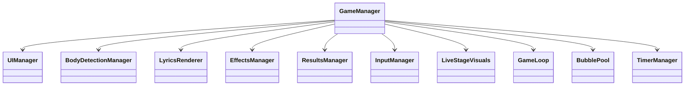

# Cross Stage (クロステ)

**音楽と一体化する、新感覚リズムアクション。**

TextAlive の歌詞同期技術と MediaPipe の身体認識技術を融合。
流れる歌詞を「目で追い」「手で触れる」ことで、楽曲の世界に没入できる次世代の Web リズムゲームです。


---

## ✨ 特徴 (Highlights)

### 🎮 2つの革新的なプレイモード
- **マウスモード (Mouse Mode)**:
  - マウスカーソルで歌詞をキャッチする、直感的で軽快なモード。
  - モバイル端末ではタップ操作に自動最適化。
- **カメラモード (Camera Mode)**:
  - Webカメラを使用し、**全身を使って**歌詞をキャッチ。
  - MediaPipe Pose & Selfie Segmentation による高精度なリアルタイム身体認識。
  - 自分のシルエットがステージ上の光と融合する、圧倒的な没入感。

### 🎨 没入感を高める "Live Venue" UI
- **Cross Stage テーマ**:
  - ダークなライブ会場をイメージした背景と、ミクグリーン (`#39C5BB`) のネオンアクセント。
  - ガラスモーフィズム（すりガラス効果）を取り入れたモダンなインターフェース。
- **リッチな演出**:
  - CSS/SVG を駆使したカスタムファビコン、ローディングアニメーション。
  - 楽曲のビートに合わせて脈打つライトや、観客のシルエット演出。

### 🎵 TextAlive による「生きた」歌詞体験
- **リアルタイム同期**:
  - 楽曲の進行に合わせて歌詞が動的に生成・配置されます。
  - 単なるテキストではなく、楽曲の一部として演出される「リリックアプリ」としての側面。
- **フォールバック機能**:
  - API 制限時やオフライン時でもプレイを継続できる堅牢な設計。

### 🏆 グローバルランキングシステム
- **Supabase 連携**:
  - プレイ結果（スコア、コンボ、ランク）をクラウドデータベースに保存。
  - プレイヤー名登録機能付き。
- **多機能ランキング**:
  - モード別（マウス/カメラ）、期間別（全期間/24時間）のフィルタリングに対応。
  - リアルタイムで更新されるリーダーボードで世界中のプレイヤーと競えます。

### 🛡️ 堅牢でユーザーフレンドリーな設計
- **離脱防止ガード**:
  - 誤って「戻る」ボタンや「リロード」を押しても、確認モーダルが表示されゲーム中断を防ぎます。
- **SPA (Single Page Application)**:
  - Hono サーバーによる SPA フォールバック実装で、どの URL からでも正しくアプリを起動。
  - クライアントサイド・ルーティングによる高速な画面遷移。

---

## 🛠️ 技術スタック (Tech Stack)

| カテゴリ | 技術 | 詳細 |
|---------|------|------|
| **Frontend** | **React 18 + Vite** | 高速なビルドとコンポーネント指向 UI |
| | **Tailwind CSS** | ユーティリティファーストなスタイリング |
| **Game Core** | **TextAlive App API** | 歌詞同期・楽曲再生制御 |
| | **MediaPipe** | Pose / Selfie Segmentation (身体認識) |
| **Backend** | **Cloudflare Workers** | Hono を動作させるエッジランタイム |
| | **Hono** | 軽量・高速な Web フレームワーク |
| **Database** | **Supabase** | PostgreSQL (pgcrypto, RLS) |
| **Infra** | **Docker** | 開発環境のコンテナ化 |

---

## 🏗️ システムアーキテクチャ (Architecture)

### 1. Backend Architecture (Hono + Workers)

本プロジェクトのバックエンドは、**MVP (Minimum Viable Product)** として「大会で語れるレベル」の品質と「実装しきれる範囲」のバランスを重視して設計されています。

#### 設計思想
*   **Single Table Design**: `scores` テーブル 1 枚のみで構成し、複雑なリレーションを排除。
*   **Middleware Chain**:
    *   `requestId`: 全ログ・レスポンスに追跡 ID を付与。
    *   `session`: `cs_session` クッキーによる匿名セッション管理（ログイン不要でスコア紐付け）。
    *   `admin`: 管理者用トークンによる認証。
*   **Security & Validation**:
    *   **Zod**: 厳格な入力バリデーション。
    *   **Origin Check**: フロントエンドからの正規リクエストのみ許可。
    *   **Cheat Detection**: 異常スコア（1,000,000点超）は `is_suspicious` フラグを付与しランキング除外。

### 2. Frontend Architecture (Game Core)

フロントエンドは「単一責任の原則 (SRP)」に基づき、機能ごとにクラスを分割しています。



*   **GameManager**: ゲーム全体の状態管理・再生制御。
*   **BodyDetectionManager**: MediaPipe を用いた全身検出・判定。
*   **LyricsRenderer**: 歌詞バブルの生成と描画。

---

## 📊 データベース設計 (Database Schema)

Supabase (PostgreSQL) の `scores` テーブル定義です。

```sql
create table public.scores (
  id uuid primary key default gen_random_uuid(),
  session_id text not null,      -- 匿名セッションID (Cookie)
  song_id text not null,         -- 楽曲ID
  mode text not null,            -- 'cursor' or 'body'
  score integer not null,        -- スコア
  max_combo integer not null,    -- 最大コンボ数
  rank text not null,            -- ランク (SS, S, A...)
  accuracy numeric(5,2),         -- 命中率
  is_suspicious boolean default false, -- チート疑惑フラグ
  player_name text,              -- プレイヤー名
  created_at timestamptz default now()
);

create index scores_song_mode_idx on public.scores (song_id, mode, score desc);
```

---

## 🔌 API 仕様 (API Specification)

ベース URL: `https://<worker-domain>/api/v1`

### 1. スコア登録
**POST** `/scores`

*   **Headers**: `Content-Type: application/json`
*   **Body**:
    ```json
    {
      "playerName": "Guest",
      "songId": "song_123",
      "mode": "cursor",
      "score": 10000,
      "maxCombo": 50,
      "rank": "S",
      "accuracy": 95.5
    }
    ```
*   **Response**: 登録されたスコアデータ

### 2. ランキング取得
**GET** `/scores`

*   **Query**:
    *   `songId` (必須): 楽曲ID
    *   `mode` (任意): `cursor` (default) or `body`
    *   `limit` (任意): 取得件数 (max 50)
*   **Response**:
    ```json
    {
      "data": [
        { "playerName": "User1", "score": 12000, "rank": "SS", ... }
      ],
      "meta": { "count": 20, "total": 100 }
    }
    ```

### 3. 管理者用全削除
**DELETE** `/admin/scores`

*   **Headers**: `x-admin-token: <ADMIN_TOKEN>`
*   **Response**: `{ "data": { "deleted": 100 } }`

---

## 🚀 開発環境セットアップ (Development Setup)

### 必要要件
*   Node.js 20+
*   Cloudflare Account (Workers 利用時)
*   Supabase Project

### 1. 環境変数の設定
`.dev.vars` ファイルをルートに作成（Workers ローカル開発用）:
```ini
SUPABASE_URL=https://your-project.supabase.co
SUPABASE_ANON_KEY=your-anon-key
ADMIN_TOKEN=secret-token
FRONTEND_ORIGIN=http://localhost:5173
```

### 2. ローカル開発の起動
```bash
# 依存関係のインストール
npm install

# フロントエンド & バックエンド同時起動
npm run dev
```
*   Frontend: `http://localhost:5173`
*   Backend (Worker): `http://localhost:8787`

### 3. デプロイ (Cloudflare Workers)
```bash
# ログイン
npx wrangler login

# シークレットの設定
npx wrangler secret put SUPABASE_URL
npx wrangler secret put SUPABASE_ANON_KEY
npx wrangler secret put ADMIN_TOKEN

# デプロイ
npm run deploy
```

---

## 📂 ディレクトリ構成 (Directory Structure)

```
star-5/
├── src/                  # Frontend (React)
│   ├── components/       # UI Components
│   ├── game/             # Game Logic (Managers)
│   └── pages/            # Page Components
├── worker/               # Backend (Cloudflare Workers)
│   ├── index.ts          # Entry Point
│   ├── supabaseClient.ts # DB Client
│   ├── middleware/       # Custom Middleware
│   ├── routes/           # API Routes
│   └── types/            # Type Definitions
├── docker-compose.yml    # Docker Config
├── wrangler.jsonc        # Workers Config
└── README.md             # This file
```

---

## 📜 ライセンス & クレジット

This project is licensed under the MIT License.

*   **TextAlive App API**: Powered by TextAlive (AIST).
*   **Songle**: Powered by Songle (AIST).
