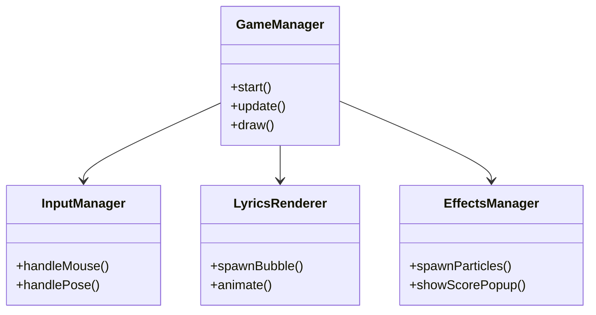

# Cross Stage (クロスステージ)

**音楽と身体が交差する、次世代Webリズムアクション。**

Cross Stage は、TextAlive App API による歌詞同期技術と MediaPipe Pose による身体検知AIを融合させた、没入型Webリズムゲームです。
近未来的なライブステージを舞台に、流れてくる歌詞を「掴み」「奏でる」ような体験を提供します。


---

## 🎮 ゲーム概要

プレイヤーはバーチャルライブステージの観客、あるいは演者となり、楽曲に合わせて流れてくる「歌詞バブル」をタイミングよく操作します。単なるタップではなく、**「ホールド（長押し）」**することでゲージを溜め、スコアを稼ぐ独自のリズムアクションを採用しています。

### Immersive Live Experience
- **ネオン×グラスモーフィズム**: 暗闇に輝くネオンライトと、透き通るようなUIデザイン。
- **3Dステージ演出**: Three.js と CSS Animation を組み合わせた、軽量かつダイナミックなライティング演出。
- **レスポンシブデザイン**: PCの大画面からスマートフォンの縦持ちプレイまで、デバイスに最適化されたUI。

---

## 🕹️ プレイモード

デバイスや環境に合わせて、3つの操作モードを搭載しています。

| モード | 対象デバイス | 操作方法 | 特徴 |
| :--- | :--- | :--- | :--- |
| **Cursor Mode** | PC / タブレット | マウス / タッチ | マウスカーソルやタッチ操作で歌詞をホールド。手軽に楽しめる基本モード。 |
| **Mobile Mode** | スマートフォン | タップ & ホールド | スマホ操作に特化。画面下部の歌詞表示を排除し、プレイ領域を最大化。親指一つで遊べる直感的な操作感。 |
| **Body Mode** | PC (Webカメラ) | 全身アクション | Webカメラでプレイヤーの動きを検知。手や体を歌詞に重ねて「触れる」ことで入力する、全身を使ったエクササイズモード。 |

---

## 🚀 技術的な特徴

### Frontend (Modern Web)
- **React 19 & Vite**: 高速なレンダリングと開発体験。
- **Architecture**: `GameManager` を中心とした厳格な責務分離（SRP）。ゲームループ、入力処理、描画、音声同期を独立管理。
- **Performance**: パーティクルやバブルの描画に `will-change` 最適化やオブジェクトプーリングを採用し、Webブラウザ上で滑らかな60fps動作を実現。

### Backend (Robust & Secure)
- **Cloudflare Workers & Hono**: エッジでの高速なAPI処理。
- **Supabase (PostgreSQL)**: RLS (Row Level Security) を活用した堅牢なデータ管理。
- **Security First**:
  - **Turnstile**: CloudflareのスマートCAPTCHAによるボット排除。
  - **HMAC署名**: スコア送信時の改ざん防止。
  - **Idempotency**: 冪等性を担保し、ネットワーク不安定時の二重投稿を防止。

---

## 🛠️ アーキテクチャ

### システム構成図

```mermaid
graph TD
    User[Player] -->|Interact| FE[Frontend (React/Vite)]
    FE -->|Score/Rank| API[Cloudflare Workers (Hono)]
    FE -->|Lyrics| TA[TextAlive App API]
    FE -->|Vision| MP[MediaPipe Pose]
    
    subgraph "Backend (Edge)"
        API -->|Rate Limit| DO[Durable Objects]
        API -->|Verify| TS[Turnstile]
        API -->|Auth/DB| DB[(Supabase)]
    end
```

### クラス設計 (Frontend)



---

## 📦 ディレクトリ構成

```bash
star-5/
├── src/                  # フロントエンド・ソースコード
│   ├── components/       # React UIコンポーネント (Ranking, Modal等)
│   ├── game/             # ゲームコアロジック
│   │   ├── GameManager.ts # ゲーム進行管理
│   │   ├── GameLoop.ts    # メインループ
│   │   └── ...           
│   ├── pages/            # ルーティングページ (Index, Game)
│   └── styles.css        # グローバルスタイル・アニメーション定義
├── worker/               # バックエンド・API (Cloudflare Workers)
│   ├── index.ts          # Hono エントリーポイント
│   ├── rateLimiter.ts    # レート制限 (Durable Object)
│   └── ...
├── supabase_scores.sql   # データベーススキーマ定義
└── UI.md                 # UIデザイン詳細仕様書
```

---

## 🔧 開発・デプロイ

### 必須要件
- Node.js 20+
- Cloudflare アカウント (Workers / Turnstile)
- Supabase プロジェクト

### セットアップ

1. **依存関係のインストール**
   ```bash
   npm install
   ```

2. **環境変数の設定**
   `.dev.vars` および `.env` ファイルを作成し、必要なAPIキーを設定します（`README_OLD.md` または `TROUBLESHOOTING.md` 参照）。

3. **開発サーバー起動**
   ```bash
   # フロントエンド + バックエンド(エミュレーション)
   npm run dev
   npm run cf:dev
   ```

4. **デプロイ**
   ```bash
   npm run deploy
   ```

---

## 📜 ライセンス & クレジット

- **License**: MIT
- **Music & Lyrics**: Powered by [TextAlive App API](https://api.songle.jp/) (National Institute of Advanced Industrial Science and Technology - AIST).
- **Vision AI**: MediaPipe by Google.

---

*Enjoy the stage!* 🎤✨