# Cross Stage (クロスステージ)

**音楽と身体が交差する、次世代Webリズムアクション。**

Cross Stage は、TextAlive App API による歌詞同期技術と MediaPipe (Pose / FaceMesh) による動作検知AIを融合させた、没入型Webリズムゲームです。
近未来的なライブステージを舞台に、流れてくる歌詞を「掴み」「奏でる」ような体験を提供します。


---

## 🎮 ゲーム概要

プレイヤーはバーチャルライブステージの観客、あるいは演者となり、楽曲に合わせて流れてくる「歌詞バブル」をタイミングよく操作します。単なるタップではなく、**「ホールド（長押し）」**することでゲージを溜め、スコアを稼ぐ独自のリズムアクションを採用しています。

プレイ結果はオンラインランキングに登録され、世界中のプレイヤーとスコアを競い合うことができます。

### Immersive Live Experience
- **ネオン×グラスモーフィズム**: 暗闇に輝くネオンライトと、透き通るようなUIデザイン。
- **3Dステージ演出**: Three.js と CSS Animation を組み合わせた、軽量かつダイナミックなライティング演出。
- **レスポンシブデザイン**: PCの大画面からスマートフォンの縦持ちプレイまで、デバイスに最適化されたUI。

---

## 🕹️ プレイモード

デバイスや環境に合わせて、4つの操作モードを搭載しています。

| モード | 対象デバイス | 操作方法 | 特徴 |
| :--- | :--- | :--- | :--- |
| **Cursor Mode** | PC / タブレット | マウス / タッチ | マウスカーソルやタッチ操作で歌詞をホールド。手軽に楽しめる基本モード。 |
| **Mobile Mode** | スマートフォン | タップ & ホールド | スマホ操作に特化。画面下部の歌詞表示を排除し、プレイ領域を最大化。親指一つで遊べる直感的な操作感。 |
| **Body Mode** | PC (Webカメラ) | 全身アクション | Webカメラでプレイヤーの動きを検知。手や体を歌詞に重ねて「触れる」ことで入力する、全身を使ったモード。 |
| **Face Mode** | スマートフォン / PC (カメラ付) | 顔移動 & 口パク | カメラで顔を認識。顔を動かして位置を合わせ、口を「パクッ」と開けることで歌詞をキャッチするモード。 |

---

## 🚀 技術的な特徴

### Frontend (Modern Web)
- **React 19 & Vite**: 高速なレンダリングと開発体験。
- **Architecture**: `GameManager` を中心とした厳格な責務分離（SRP）。ゲームループ、入力処理、描画、音声同期を独立管理。
- **Performance**: パーティクルやバブルの描画に `will-change` 最適化やオブジェクトプーリングを採用し、Webブラウザ上で滑らかな60fps動作を実現。

### Backend (Robust & Secure)
- **Cloudflare Workers & Hono**: エッジでの高速なAPI処理。
- **Supabase (PostgreSQL)**: RLS (Row Level Security) を活用した堅牢なデータ管理。
- **Security First**:
  - **Turnstile**: CloudflareのスマートCAPTCHAによるボット排除。
  - **HMAC署名**: スコア送信時の改ざん防止。
  - **Idempotency**: 冪等性を担保し、ネットワーク不安定時の二重投稿を防止。

---

## 🛠️ システム仕様詳細

### 1. システム構成図

```mermaid
flowchart LR
  Player[プレイヤー] -->|操作| FE["Frontend (React/Vite)"]
  FE -->|歌詞同期| TextAlive["TextAlive App API"]
  FE -->|姿勢/顔/人物抽出| MediaPipe["MediaPipe Pose/FaceMesh/SelfieSegmentation"]
  FE -->|スコア/ランキング| API["Cloudflare Workers + Hono"]
  FE -->|静的配信| Assets["Workers Assets (docs)"]
  API -->|Insert/Select| DB["Supabase Postgres"]
  API -->|Bot対策| Turnstile["Cloudflare Turnstile"]
  API -->|レート制限/Nonce| DO["Durable Object RateLimiter"]
```



### 2. 機能階層図


### 3. 主要機能の処理フロー (IPO図)


### 4. 画面遷移図

```mermaid
stateDiagram-v2
  state "タイトル/曲選択" as Index
  state "ゲーム" as Game
  state "リザルト" as Results
  state "ランキング(モーダル)" as Ranking
  state "終了確認(モーダル)" as ExitConfirm

  [*] --> Index
  Index --> Game: START
  Index --> Ranking: ランキング表示
  Ranking --> Index: 閉じる
  Game --> Results: 曲終了/強制終了
  Results --> Game: もう一度
  Results --> Index: タイトルへ
  Game --> Ranking: ランキング表示
  Ranking --> Game: 閉じる
  Game --> ExitConfirm: 戻る/ブラウザバック
  ExitConfirm --> Game: 続ける
  ExitConfirm --> Index: 終了
```


### 5. API仕様

**API一覧**
| Method | Path | 概要 | 認証/条件 |
| --- | --- | --- | --- |
| GET | /api/health | ヘルスチェック | なし |
| GET | /api/config | Turnstile Site Key 取得 | なし |
| GET | /api/token | スコア署名トークン発行 | SCORE_SIGNING_SECRET 設定時のみ有効 |
| POST | /api/score | スコア登録 | FRONTEND_ORIGIN/Rate limit/HMAC/Turnstile (条件付き) |
| GET | /api/ranking | ランキング取得 | songId 必須 |
| DELETE | /admin/scores | スコア削除 | x-admin-token 必須 |

**スコア登録フロー**

```mermaid
flowchart TD
  A[リザルト画é¢ã§ç™»éŒ²] --> B[Client: POST /api/score]
  B --> C{Origin OK?}
  C -- No --> E[403 Forbidden]
  C -- Yes --> D[Rate limit check]
  D -- Exceed --> E2[429 Too Many Requests]
  D -- OK --> F{SCORE_SIGNING_SECRET?}
  F -- Yes --> G[HMAC token verify + nonce]
  G -- Fail --> E3[401/403/409]
  G -- OK --> H{Turnstile enabled?}
  F -- No --> H
  H -- Yes --> I[Turnstile verify]
  I -- Fail --> E4[403 Invalid Token]
  H -- No --> J[Supabase insert]
  I -- OK --> J
  J --> K{DB OK?}
  K -- No --> E5[500 DB Error]
  K -- Yes --> L[200 OK]
```


---

## 💾 データベース設計

### ER図


### テーブル定義 (scores)
| カラム | 型 | 説明 |
| --- | --- | --- |
| id | uuid | プライマリキー |
| session_id | text | 匿名セッションID |
| song_id | text | 楽曲ID |
| mode | text | cursor/body/mobile/face |
| score | integer | スコア |
| max_combo | integer | 最大コンボ |
| rank | text | ランク |
| accuracy | numeric | 精度(%) |
| is_suspicious | boolean | チート疑いフラグ |
| player_name | text | プレイヤー名 |
| created_at | timestamptz | 登録日時 |

---

## 🧩 モジュール設計

### モジュール分割図


### 主要モジュールの責務
| モジュール | 責務 | 主なファイル |
| --- | --- | --- |
| ルーティング/ページ | SPAルーティング、画面遷移 | src/App.tsx, src/pages/IndexPage.tsx, src/pages/GamePage.tsx |
| UIコンポーネント | ランキング表示、モード切替 | src/components/game/RankingModal.tsx, src/components/game/ModeTabs.tsx |
| ゲームコア | ゲーム進行、スコア、リザルト | src/game/GameManager.ts, src/game/GameLoop.ts |
| 歌詞描画 | バブル生成、表示、判定補助 | src/game/GameManager.ts (LyricsRenderer) |
| 入力/カメラ | マウス/タッチ/カメラ入力、Pose/Face 判定 | src/game/GameManager.ts (InputManager, Detectors) |
| Workers API | スコア登録/ランキング取得/管理 | worker/index.ts, worker/routes/score.ts |
| レート制限 | Durable Object による制限/Nonce | worker/rateLimiter.ts |

---

## 📦 ディレクトリ構成

```bash
star-5/
├── src/                  # フロントエンド・ソースコード
│   ├── components/       # React UIコンポーネント (Ranking, Modal等)
│   ├── game/             # ゲームコアロジック
│   │   ├── GameManager.ts # ゲーム進行管理
│   │   ├── GameLoop.ts    # メインループ
│   │   └── ...           
│   ├── pages/            # ルーティングページ (Index, Game)
│   └── styles.css        # グローバルスタイル・アニメーション定義
├── worker/               # バックエンド・API (Cloudflare Workers)
│   ├── index.ts          # Hono エントリーポイント
│   ├── rateLimiter.ts    # レート制限 (Durable Object)
│   └── ...
├── supabase_scores.sql   # データベーススキーマ定義
└── UI.md                 # UIデザイン詳細仕様書
```

---

## 🔧 開発・デプロイ

### 必須要件
- Node.js 20+
- Cloudflare アカウント (Workers / Turnstile)
- Supabase プロジェクト

### セットアップ

1. **依存関係のインストール**
   ```bash
   npm install
   ```

2. **環境変数の設定**
   `.dev.vars` および `.env` ファイルを作成し、必要なAPIキーを設定します（`README_OLD.md` または `TROUBLESHOOTING.md` 参照）。

3. **開発サーバー起動**
   ```bash
   # フロントエンド + バックエンド(エミュレーション)
   npm run dev
   npm run cf:dev
   ```

4. **デプロイ**
   ```bash
   npm run deploy
   ```

---

## 📜 ライセンス & クレジット

- **License**: MIT
- **Music & Lyrics**: Powered by [TextAlive App API](https://api.songle.jp/) (National Institute of Advanced Industrial Science and Technology - AIST).
- **Vision AI**: MediaPipe by Google.

---

*Enjoy the stage!* 🎤✨
