# クロステ ～Cross Stage～

### 音楽と身体が交差するWebリズムゲーム

> TextAlive App API の歌詞同期、MediaPipe の動作認識AI、Three.js の3D演出――全部乗せのWebリズムゲーム。
> ライブステージを舞台に、歌詞を「掴み」「奏でる」新感覚の体感型リズムアクション。


<br>

---

## 目次

| セクション | 内容 |
|:---|:---|
| **概要** | 30秒でわかるクロステ / 展示ポイント / デモの流れ |
| **プロダクト** | ゲーム概要 / ホールドの独自性 / 4つのモード / 速度コース / UI演出 |
| **技術** | 技術スタック解説 / TextAlive歌詞同期の仕組み / MediaPipeの仕組み / バックエンド技術 |
| **システム仕様** | システム構成図 / 機能階層図 / IPO図 / 画面遷移図 / 要件定義 / 開発スケジュール / API仕様 |
| **設計** | レイヤードアーキテクチャ / Managerパターン / Service パターン / DB設計 / モジュール設計 / クラス図 / ディレクトリ構成 |
| **セキュリティ** | HMAC / Nonce / Turnstile / Rate Limiter / Origin検証の多層防御 |
| **品質・運用** | テスト仕様 / 展示チェックリスト / 開発・デプロイ |

<br>

---
---

# PART 1: 概要

---

## 30秒でわかるクロステ

| 観点 | 内容 | もっとわかりやすく |
|:---|:---|:---|
| **体験** | 歌詞を「つかむ・奏でる」体感型リズムアクション | 歌詞をタイミングよくキャッチして長押しするゲーム |
| **特徴** | TextAlive歌詞同期 × MediaPipe動作認識 × Three.js演出の全部乗せ | 「歌詞の同期技術」「AIの動き認識」「3D演出」を一つに |
| **強み** | 4つの操作モード × 3つの速度コースで誰でも遊べる | マウス/スマホ/体/顔、好きな方法＆好きな難易度で遊べる |
| **価値** | 音楽×身体×視覚演出を一体化したライブ感 | まるでライブステージにいるような体験 |

```
┌─────────────────────────────────────────────────────┐
│                    クロステの体験                    │
│                                                     │
│   楽曲再生 → 歌詞が流れてくる → タイミングよく操作   │
│                      ↓                              │
│            スコア加算 → ランキング登録               │
└─────────────────────────────────────────────────────┘
```

<br>

## 展示ポイント（見どころ）

| ポイント | 説明 | 何がすごいの？ |
|:---|:---|:---|
| **動きがそのまま入力になる** | Pose/Faceによる直感的な体験 | 従来の音ゲーはボタンを押す。このゲームは「体を動かす」だけで入力できる |
| **歌詞と演出の同期** | TextAliveとゲーム判定が噛み合う快感 | 歌詞のタイミングとゲームの判定がピッタリ合う気持ちよさ |
| **誰でも遊べる** | デバイス/環境に合わせた4モード設計 | PCしかない人、スマホしかない人、みんなが遊べる |

<br>

## デモの流れ（展示用）

```
1. タイトルでモード選択（Cursor / Mobile / Body / Face）＋ 速度コース選択（8秒/10秒/12秒）
       ↓
2. 楽曲開始 → 歌詞が「バブル」として画面に出現
       ↓
3. バブルをホールド → ゲージが溜まりスコア獲得 → コンボと演出が強化
       ↓
4. リザルト & ランキング → その場で順位を確認
```

<br>

---
---

# PART 2: プロダクト

---

## ゲーム概要

プレイヤーはライブステージの演者となり、楽曲に合わせて流れてくる「歌詞」をタイミングよく操作します。
単なるタップではなく、**「ホールド（長押し）」** することでゲージを溜め、スコアを稼ぐリズムアクションを採用しています。
プレイ結果はオンラインランキングに登録されます。

| 要素 | 内容 |
|:---|:---|
| **ネオン×グラスモーフィズム** | ネオンライトと透き通るようなUIデザイン |
| **3Dステージ演出** | Three.js と CSS Animation を組み合わせた、軽量なライティング演出 |
| **レスポンシブデザイン** | PCの大画面からスマートフォンプレイまで、デバイスに対応したUI |
| **PWA対応** | ホーム画面に追加してアプリのように起動可能（manifest.json / アイコン / theme-color） |

<br>

### 「ホールド」で奏でる新しい音ゲー体験

普通の音ゲーは「タイミングよくタップ」で終わり。
クロステは **「押し始める → 押し続ける → ゲージが溜まる → 離す」** という独自のプレイ感覚。

```
一般的な音ゲー:  タイミングよくタップ → ◎ PERFECT!

クロステ:        タイミングよく押し始める → 押し続ける（ゲージが溜まる）→ 離す
                                             ↑
                                        この「溜める」感覚が独自
```

<br>

### グラスモーフィズムとは？

最近流行りのUIデザインスタイル。すりガラスみたいに背景が透けて見える。

```css
/* グラスモーフィズムの典型的なCSS */
.glass-card {
  background: rgba(255, 255, 255, 0.1);  /* 半透明の背景 */
  backdrop-filter: blur(10px);            /* 背景をぼかす */
  border: 1px solid rgba(255, 255, 255, 0.2);
  border-radius: 16px;
}
```

<br>

---

## 4つの操作モード

デバイスや環境に合わせて、4つの操作モードを搭載しています。

| モード | 対象デバイス | 操作方法 | 特徴 |
|:---|:---|:---|:---|
| **カーソル** | PC | マウス / タッチ | マウスカーソルやタッチ操作で歌詞をホールド。手軽に楽しめる基本モード |
| **モバイル** | スマートフォン | タップ & ホールド | スマホ操作に特化。画面下部の歌詞表示を排除し、プレイ領域を最大化。親指一つで遊べる直感的な操作感 |
| **ボディ** | PC (Webカメラ) | 全身アクション | Webカメラでプレイヤーの動きを検知。手や体を歌詞に重ねて「触れる」ことで入力する、全身を使ったモード |
| **フェイス** | スマートフォン | 顔移動 & 口パク | カメラで顔を認識。顔を動かして位置を合わせ、口を「パクッ」と開けることで歌詞をキャッチするモード |

### カーソルモード（PC向け・基本）

```
操作: マウスカーソルを歌詞バブルに合わせてクリック&ホールド

┌────────────────────────────┐
│    🎵 歌詞バブル           │
│        ↑                  │
│      🖱️ カーソル           │
│                           │
│  クリックして長押し！       │
└────────────────────────────┘
```

### モバイルモード（スマホ向け）

```
操作: 画面をタップしてホールド

┌────────────────────────────┐
│    🎵 歌詞バブル           │
│        ↑                  │
│      👆 タップ             │
│                           │
│  ※画面下部の歌詞表示なし   │
│  → プレイ領域を最大化      │
└────────────────────────────┘
```

### ボディモード（カメラ + 全身）

```
操作: 体を動かして歌詞バブルに「触れる」

┌────────────────────────────┐
│  📷 Webカメラが体を認識    │
│                           │
│    🎵 ←── 🙋 手を伸ばす   │
│                           │
│  体の位置 = 入力位置        │
└────────────────────────────┘
```

- 技術: MediaPipe Pose で骨格を検出

### フェイスモード（カメラ + 顔）

```
操作: 顔を動かして位置を合わせ、口を開けてキャッチ

┌────────────────────────────┐
│  📷 カメラが顔を認識       │
│                           │
│    🎵 ←── 😮 顔を移動     │
│              ↑            │
│         口を開ける = 入力   │
└────────────────────────────┘
```

- 技術: MediaPipe FaceMesh で顔のランドマークを検出

<br>

---

## 速度コース（難易度）

歌詞バブルの表示時間を3段階から選択できます。表示時間が短いほど難しく、長いほど簡単です。

```
タイトル画面で選択:
┌──────────────────────────────────────────┐
│  速度コース                              │
│                                          │
│  ┌──────┐  ┌──────┐  ┌──────┐           │
│  │ 8秒  │  │ 10秒 │  │ 12秒 │           │
│  │ 難   │  │ 普通 │  │ 易   │           │
│  └──────┘  └──────┘  └──────┘           │
└──────────────────────────────────────────┘
```

| コース | 表示時間 | 難易度 | 説明 |
|:---|:---:|:---:|:---|
| **8秒コース** | 8秒 | 難しい | バブルがすぐ消えるので素早い反応が必要 |
| **10秒コース** | 10秒 | 普通 | デフォルト。バランスの取れた難易度 |
| **12秒コース** | 12秒 | 易しい | バブルが長く表示されるので余裕を持って操作できる |

### 仕組み

CSSの `--lyric-speed` 変数で歌詞バブルの表示時間を制御しています。

```css
/* デフォルト（styles.css で定義） */
:root {
  --lyric-speed: 10s;
}
```

ゲーム開始時に GameManager が選択されたコースに応じて CSS 変数を上書きします。

```typescript
// GameManager のコンストラクタ内
document.documentElement.style.setProperty('--lyric-speed', `${speed}s`);
// → 8秒コースなら --lyric-speed: 8s に変わる
```

### ランキングとの関係

スコアは速度コースごとに記録されます。ランキング画面では「コースフィルター」で絞り込めます。

```
ランキング画面:
┌──────────────────────────────┐
│  期間: 全期間 ▼              │
│  コース: 全コース ▼          │ ← ここで絞り込み
│  モード: カーソル ▼          │
│                              │
│  1. たろう   98000           │
│  2. はなこ   95000           │
│  ...                        │
└──────────────────────────────┘
```

<br>

---
---

# PART 3: 技術

---

## 技術スタック

### フロントエンド技術（ユーザーの目に見える部分）

| 技術 | バージョン | 役割 | わかりやすく言うと |
|:---|:---:|:---|:---|
| **React** | 18 | UIライブラリ | 画面の部品を作るための道具箱。コンポーネント（部品）ベースでUIを構築 |
| **TypeScript** | 5.5 | プログラミング言語 | JavaScriptに「型」をつけて安全にしたもの。バグを事前に防ぐ |
| **Vite** | 5 | ビルドツール | コードを変換してブラウザで動くようにする。HMRでコード変更が即時反映 |
| **Three.js** | - | 3Dライブラリ | 背景の3D演出を作る |
| **MediaPipe** | - | AI/ML | カメラ映像から体・顔を認識する |
| **TextAlive** | - | 歌詞同期API | 楽曲と歌詞のタイミングを合わせる |
| **PWA** | - | Web App Manifest | ホーム画面に追加してアプリのように使える |

### Frontend アーキテクチャ

| カテゴリ | 内容 |
|:---|:---|
| **React 18 & Vite** | SPA構成で高速遷移、HMRで開発体験を最適化 |
| **Game Core Architecture** | `GameManager` を中枢に `GameLoop` と各Manager（Input/Lyrics/Results/Visuals/Detectors/UI/Effects）を分離 |
| **MediaPipe統合** | Pose/FaceMesh/SelfieSegmentation を並列利用し、Body/Face各モードの入力パイプラインを最適化 |
| **Rendering/UX最適化** | バブルはDOMプール、UIは差分更新、`requestAnimationFrame` で安定したゲームループ |
| **PWA対応** | Web App Manifest とアイコンを設定し、ホーム画面への追加・スタンドアロン起動に対応 |
| **サービス境界** | `ScoreService`/`TokenService` でAPI呼び出しを集約し、画面ロジックと通信を分離 |

### SPA（Single Page Application）とは？

```
従来のWebサイト（MPA）:
ページA → クリック → サーバーにリクエスト → ページBを丸ごと読み込み
                     ↑ 画面が白くなる（ちらつく）

SPA:
ページA → クリック → 必要な部分だけ書き換え → ページB
                     ↑ 画面はそのまま（滑らかに遷移）
```

ゲームでは「画面遷移のたびにリロード」だと体験が悪いので、SPAが適しています。

<br>

---

## TextAlive ― 歌詞同期の仕組み

産総研（AIST）が提供する **歌詞同期API**。

```
楽曲データ
    ↓
TextAlive API が解析
    ↓
「この歌詞は 0:15.234 〜 0:17.891 に表示」
という情報を取得
    ↓
ゲームがそのタイミングでバブルを出す
```

### 歌詞はどう区切られてバブルになる？

TextAlive は歌詞を3階層で管理しています。

```
楽曲データ（Video）
  └─ フレーズ（Phrase）   ← "So tell us ストリートライト" のような1行
      └─ ワード（Word）   ← "So" "tell" "us" "ストリートライト"
          └─ 文字（Char）  ← "S" "o" "t" "e" ...
```

このゲームでは **フレーズ単位** を使用。1つのフレーズ = バブル1個 = 画面に表示される歌詞テキスト1つ。

### バブル生成の仕組み

ゲーム内にはあらかじめ歌詞テキストが1行ずつ用意されています（全55行）。

```typescript
// GameManager.ts 内 - 歌詞テキスト（手動で用意）
const scriptedLines = [
  "So tell us ストリートライト",       // 1行目
  "揺らめく都市の magic",              // 2行目
  "街明かりが渦巻く　躓く my mind",    // 3行目
  // ... 計55行
];
```

TextAlive API からは **各フレーズの開始時刻・終了時刻** だけを取得し、手動テキストと順番にマッピング。

```
TextAlive API → フレーズ1のタイミング: 1000ms 〜 3740ms
                フレーズ2のタイミング: 4200ms 〜 5800ms
                ...

手動テキスト → "So tell us ストリートライト"
               "揺らめく都市の magic"
               ...

→ フレーズ1のタイミング + scriptedLines[0] → バブル1
  フレーズ2のタイミング + scriptedLines[1] → バブル2
  ...
```

### 表示時間の計算

各バブルの表示時間は、以下の中で最も大きい値になります：

```
表示時間 = max(
  フレーズの実際の長さ + 1000ms（ゆとり）,
  文字数 × 400ms,
  最低 2200ms
)
```

例えば "So tell us ストリートライト"（14文字）、フレーズ長が 2740ms の場合：

```
① フレーズ長 + ゆとり = 2740 + 1000 = 3740ms
② 文字数 × 400      = 14 × 400   = 5600ms
③ 最低保証                        = 2200ms

→ 最大の ② = 5600ms が表示時間になる
```

### フォールバックモード（TextAlive が使えない場合）

TextAlive API に接続できなかった場合は、タイミングを自動計算します。

```
表示時間 = max(文字数 × 280ms, 最低 2000ms)
行間の間隔 = 400ms
```

### 表示タイミングの制御

毎フレームで「今、表示すべき歌詞があるか」をチェックしています。

```
現在の再生位置: 5000ms

↓ lyricsData を走査

歌詞1 (time: 1000ms) → 5000 - 1000 = 4000ms 差 → 過ぎた、スキップ
歌詞2 (time: 4200ms) → 5000 - 4200 = 800ms 差  → 過ぎた、スキップ
歌詞3 (time: 4900ms) → 5000 - 4900 = 100ms 差  → ±200ms以内！表示！
歌詞4 (time: 8000ms) → まだ先、スキップ
```

さらに、バブルが一気に出るのを防ぐため **350ms の間隔** を設けています。

### TextAlive 歌詞同期まとめ

```
                TextAlive API
                    │
                    ↓
   ┌─────────────────────────────────┐
   │ フレーズのタイミング情報を抽出   │
   │ (開始時刻、終了時刻)            │
   └───────────────┬─────────────────┘
                   │
   ┌───────────────┴─────────────────┐
   │ 手動テキスト（55行）と          │
   │ 順番にマッピング               │
   └───────────────┬─────────────────┘
                   │
                   ↓
   ┌─────────────────────────────────┐
   │ LyricData 配列（55個）         │
   │ { time, text, displayDuration } │
   └───────────────┬─────────────────┘
                   │
                   ↓ 毎フレーム判定
   ┌─────────────────────────────────┐
   │ 現在位置 ± 200ms の歌詞を      │
   │ バブルとして画面に表示          │
   └─────────────────────────────────┘
```

<br>

---

## MediaPipe ― 動作認識の仕組み

Googleが提供する **機械学習ライブラリ**。カメラ映像から「人の体」「顔」をリアルタイムで認識できます。

```
カメラ映像
    ↓
MediaPipe が解析（ML推論）
    ↓
「右手は座標(x: 0.3, y: 0.5)にある」
「口の開き具合は 0.7（大きく開いている）」
という情報を取得
    ↓
ゲームが入力として利用
```

3つのモジュールを使用：

| モジュール | 何を認識？ | どのモードで使う？ |
|:---|:---|:---|
| **Pose** | 全身の骨格（33点） | Body モード |
| **FaceMesh** | 顔のランドマーク（468点） | Face モード |
| **SelfieSegmentation** | 人物の輪郭（背景分離） | 背景演出 |

### ゲームループとの統合

```
TextAlive API → フレーズのタイミング情報
                    ↓
            歌詞バブルの生成・配置
                    ↓
            毎フレーム(15fps)で判定
                    ↑
            プレイヤーの入力座標
                    ↑
MediaPipe  → 体/顔のランドマーク座標をリアルタイム取得
```

<br>

---

## バックエンド技術（サーバー側）

| 技術 | 役割 | わかりやすく言うと |
|:---|:---|:---|
| **Cloudflare Workers** | サーバー実行環境 | 世界中のサーバーでコードを動かせる（エッジコンピューティング） |
| **Hono** | Webフレームワーク | APIを簡単に作れるツール（Express.js のような軽量フレームワーク） |
| **Supabase** | データベース (PostgreSQL) | スコアデータを保存する場所。RLSとスキーマ検証でデータ整合性を担保 |
| **Durable Objects** | 状態管理 | レート制限などの状態を保持 |
| **Turnstile** | Bot対策 | 人間かどうか判定（CAPTCHAの代わり） |

### Backend アーキテクチャ

| カテゴリ | 内容 |
|:---|:---|
| **Cloudflare Workers & Hono** | エッジ実行で低レイテンシなスコア登録/取得 |
| **Supabase (PostgreSQL)** | RLSとスキーマ検証でデータ整合性を担保 |
| **Multi-layer Security** | Turnstile(Bot対策) / HMAC署名+Nonce(改ざん・リプレイ防止) / RateLimiter(IP制限) / Origin検証 |
| **Service分割** | Workers/Serverで`scoreService`/`adminService`を分離し、ルート層を薄く保守性を向上 |

### なぜ Cloudflare Workers？（エッジコンピューティング）

```
普通のサーバー:
ユーザー(日本) ──────────→ サーバー(アメリカ) ──────────→ 応答
                 遠い...                        遠い...
                 （往復 200ms くらい）

Cloudflare Workers:
ユーザー(日本) ───→ 近くのサーバー(日本) ───→ 応答
              近い!                    速い!
              （往復 20ms くらい）
```

世界中に分散したサーバーで動くので、**どこからアクセスしても速い**。

<br>

---

## 技術の見せ場（展示で説明するポイント）

| ポイント | 詳細 |
|:---|:---|
| **リアルタイム入力** | カメラ入力のランドマークを即時に判定へ接続 |
| **判定と演出の一体化** | ホールド中に演出が強化され、体験が可視化される |
| **安全なスコア登録** | HMAC/Nonce/Turnstile/RateLimiterの多層防御 |

<br>

---
---

# PART 4: システム仕様詳細

---

## 4-1. システム構成図

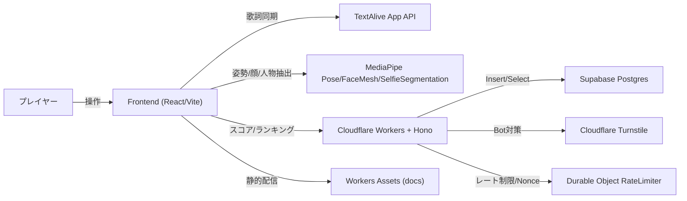

**読み方**: 矢印は「データの流れ」や「依存関係」、箱は「システムの構成要素」を示す。

```
プレイヤー
    ↓ 操作
Frontend (React/Vite)  ←→  TextAlive（歌詞）
    ↓                  ←→  MediaPipe（体/顔認識）
    ↓ スコア送信
Cloudflare Workers + Hono
    ↓                  ←→  Turnstile（Bot対策）
    ↓                  ←→  Durable Object（レート制限）
Supabase（データベース）
```

<br>

## 4-2. 機能階層図

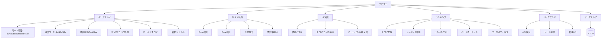

**読み方**: このシステムが持つ機能の一覧をツリー構造で整理。仕様を漏れなく把握するのに便利。

<br>

## 4-3. 主要機能の処理フロー (IPO図)

**IPO** = Input（入力）→ Process（処理）→ Output（出力）

```mermaid
flowchart TB
  subgraph Gameplay[ゲームプレイ/スコアリング]
    GP_In[Input: TextAliveタイミング, プレイヤー入力, カメラLandmarks]
    GP_Proc[Process: バブル生成, ヒット/ホールド判定, コンボ/スコア計算]
    GP_Out[Output: スコアUI, 演出, リザルト]
    GP_In --> GP_Proc --> GP_Out
  end

  subgraph Camera[カメラ認識]
    C_In[Input: Webカメラ映像]
    C_Proc[Process: Pose/FaceMesh/Segmentation, 品質/負荷制御]
    C_Out[Output: ランドマーク/人体マスク/判定イベント]
    C_In --> C_Proc --> C_Out
  end

  subgraph ScoreSubmit[スコア登録]
    S_In[Input: GameResult + speed, x-score-token?, turnstileToken?]
    S_Proc[Process: Origin/Rate limit/HMAC/Turnstile検証, Supabase挿入]
    S_Out[Output: 保存結果/エラー]
    S_In --> S_Proc --> S_Out
  end
```

<br>

## 4-4. 画面遷移図

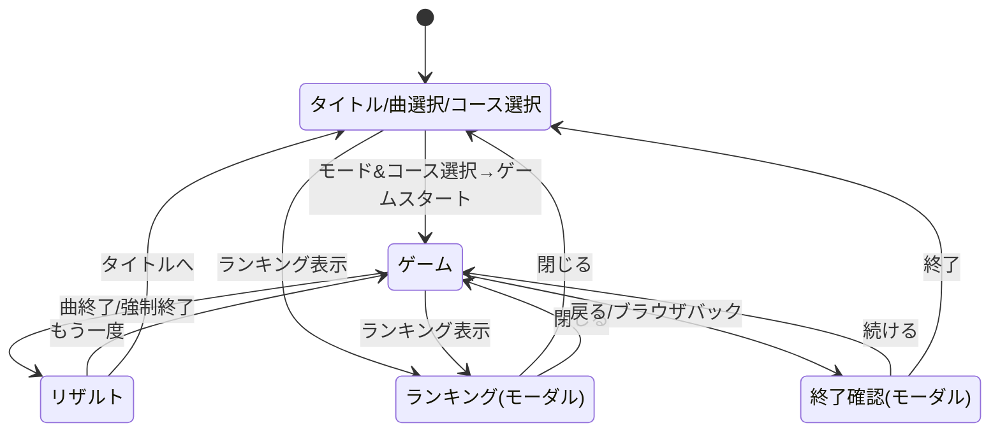

```
[開始]
   ↓
タイトル/曲選択 ←──────────────────┐
   ↓ ゲームスタート                 │
 ゲーム ─────────────→ リザルト ───→┘
   │                     │ もう一度
   │                     ↓
   └─→ 終了確認 ────→ ゲームに戻る
```

<br>

## 4-5. 要件定義 (マインドマップ)

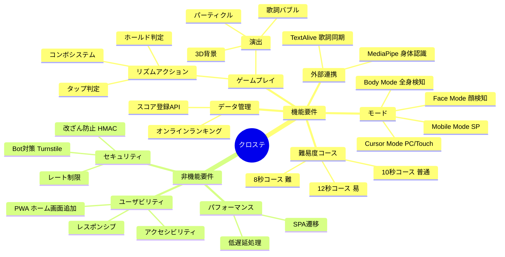

<br>

## 4-6. 開発スケジュール (ガントチャート)

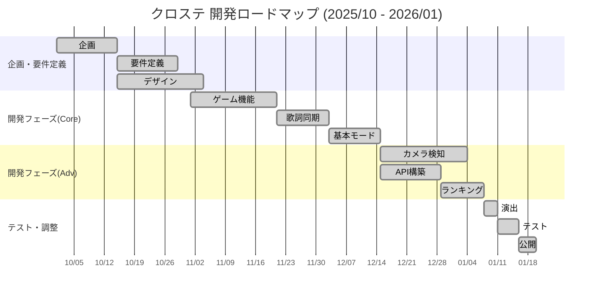

<br>

## 4-7. API仕様

| Method | Path | 概要 | 認証/条件 |
|:---|:---|:---|:---|
| GET | `/api/health` | ヘルスチェック | なし |
| GET | `/api/config` | Turnstile Site Key 取得 | なし |
| GET | `/api/token` | スコア署名トークン発行 | SCORE_SIGNING_SECRET 設定時のみ有効 |
| POST | `/api/score` | スコア登録 | FRONTEND_ORIGIN/Rate limit/HMAC/Turnstile (条件付き), speed パラメータ対応 (8/10/12) |
| GET | `/api/ranking` | ランキング取得 | songId 必須, offset/limit でページネーション対応, speed でコース別フィルタ |
| DELETE | `/admin/scores` | スコア削除 | x-admin-token 必須 |

<br>

---
---

# PART 5: 設計

---

## 設計方針

### なぜ「設計」が大事なのか

```
❌ 悪い例（全部1ファイル）
game.ts (5000行)
  - 入力処理 / 描画処理 / スコア計算 / API通信 / エフェクト
  → どこに何があるかわからない！修正が怖い！

✅ 良い例（役割で分割）
GameManager.ts    - 全体の進行を管理
InputManager.ts   - 入力だけ担当
LyricsRenderer.ts - 歌詞の描画だけ担当
ScoreService.ts   - API通信だけ担当
→ 見通しが良い！修正も安心！
```

### 前提

| 対象 | 方針 |
|:---|:---|
| フロント | 入力/描画/判定/結果を同一セッションで完結 |
| バックエンド | スコア登録/ランキング取得/管理APIに責務を限定 |
| 本番/開発 | Workers が本番基盤、`server/` は開発用の互換実装 |
| 外部連携 | TextAlive/MediaPipe/Three.js はゲームコア側から直接利用 |

<br>

---

## レイヤードアーキテクチャ（境界定義）

```
┌───────────────────────────────────────┐
│ UI層（見た目）                        │
│   IndexPage, GamePage, RankingModal   │
├───────────────────────────────────────┤
│ ドメイン層（ゲームのルール）          │
│   GameManager, LyricsRenderer, etc.   │
├───────────────────────────────────────┤
│ サービス層（外部通信）                │
│   scoreService, tokenService          │
├───────────────────────────────────────┤
│ インフラ層（データ保存等）            │
│   Workers, Supabase, RateLimiter      │
└───────────────────────────────────────┘
```

層を分けると、例えば「データベースを変更」しても UI のコードは変わらない。

```
変更前: Supabase (PostgreSQL) → インフラ層だけ変えればOK
変更後: Firebase (NoSQL)      → UI層・ドメイン層は触らなくていい
```

<br>

---

## Manager パターン（ゲームコア設計）

GameManager を司令塔に、責務ごとに Manager を分離。**単一責任の原則（SRP）** を徹底しています。

```
GameManager（司令塔）
    │
    ├── GameLoop          ... 毎フレームの更新ループ
    ├── TimerManager      ... タイマーの一元管理とクリア
    ├── BubblePool        ... 歌詞バブルDOM要素の再利用
    ├── InputManager      ... マウス/タッチ/キー入力を受け取る
    ├── LyricsRenderer    ... 歌詞を表示する
    ├── EffectsManager    ... エフェクトを出す
    ├── UIManager         ... UI(スコア等)を更新
    ├── ResultsManager    ... 結果画面を管理
    ├── FaceDetectionManager  ... 顔認識
    ├── BodyDetectionManager  ... 体認識
    ├── ViewportManager   ... 表示領域調整
    └── LiveStageVisuals  ... Three.js 3D描画
```

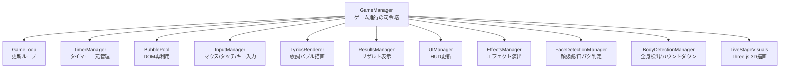

<br>

---

## Service パターン（API通信）

**「〇〇Service」** は、外部との通信を担当するモジュールです。

```
GamePage（画面）
    ↓ 「スコアを登録して」と頼むだけ
ScoreService
    ↓ 実際のAPI通信を担当
サーバー
```

画面のコードは「スコア登録をお願いする」だけでOK。通信の細かい処理は Service が隠蔽します。

### データフロー（スコア登録）

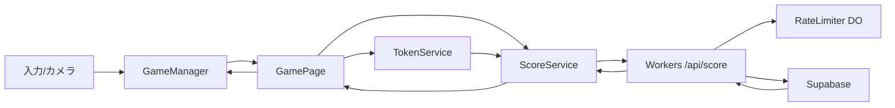

<br>

---

## データベース設計

### ER図（単一テーブル）

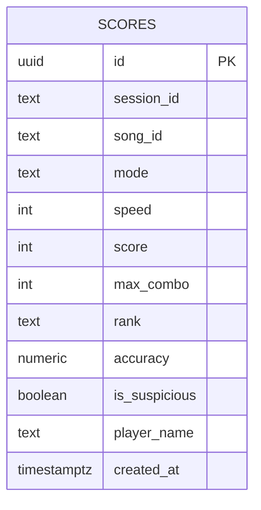

### テーブル定義 (scores)

| カラム | 型 | 説明 |
|:---|:---|:---|
| id | uuid | プライマリキー（世界で一意なID） |
| session_id | text | 匿名セッションID |
| song_id | text | 楽曲ID |
| mode | text | cursor/body/mobile/face |
| speed | integer | 速度コース (8/10/12) |
| score | integer | スコア |
| max_combo | integer | 最大コンボ |
| rank | text | ランク (S/A/B/C) |
| accuracy | numeric | 精度(%) |
| is_suspicious | boolean | チート疑いフラグ |
| player_name | text | プレイヤー名 |
| created_at | timestamptz | 登録日時 |

### なぜ `is_suspicious` がある？

チート対策のためのフラグ。

```
普通のスコア: score=50000, is_suspicious=false
怪しいスコア: score=999999999, is_suspicious=true → ランキングから除外
```

<br>

---

## モジュール設計

### モジュール分割図

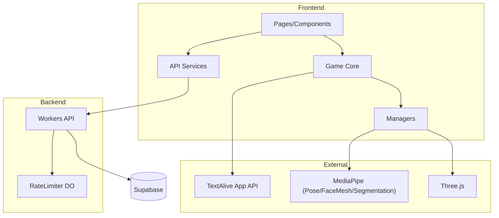

### 主要モジュールの責務

| モジュール | 責務 | 主なファイル |
|:---|:---|:---|
| ルーティング/ページ | SPAルーティング、画面遷移 | `src/App.tsx`, `src/pages/IndexPage.tsx`, `src/pages/GamePage.tsx` |
| UIコンポーネント | ランキング表示、モード切替 | `src/components/game/RankingModal.tsx`, `src/components/game/ModeTabs.tsx` |
| ゲームコア | ゲーム進行、ループ、タイマー | `src/game/GameManager.ts`, `src/game/GameLoop.ts`, `src/game/TimerManager.ts` |
| マネージャ群 | 入力/描画/演出/リザルト/表示最適化 | `src/game/managers/*`, `src/game/BubblePool.ts` |
| サービス層 | API呼び出しの集約 | `src/services/scoreService.ts`, `src/services/tokenService.ts` |
| Workers API | スコア登録/ランキング取得/管理 | `worker/index.ts`, `worker/routes/*`, `worker/services/*` |
| 検証/スキーマ | APIバリデーション | `worker/schemas/*` |
| レート制限 | Durable Object による制限/Nonce | `worker/rateLimiter.ts` |
| ローカルServer | Workers互換の開発用API | `server/index.ts`, `server/routes/*`, `server/services/*` |

<br>

---

## クラス図

### Frontend

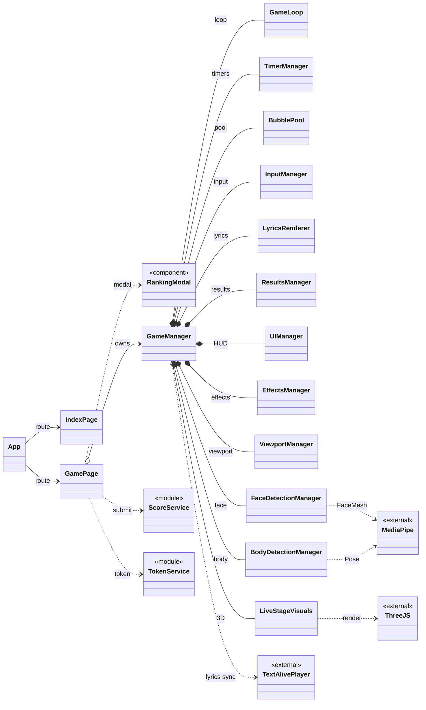

### クラス図の矢印の意味

| 記号 | 読み方 | 意味 |
|:---:|:---|:---|
| `*--` | コンポジション | 「所有している」（親が消えると子も消える） |
| `o--` | 集約 | 「参照している」（ライフサイクルは別） |
| `-->` | 依存 | 「使っている」 |
| `..>` | 弱い依存 | 「時々使う」 |

### Backend

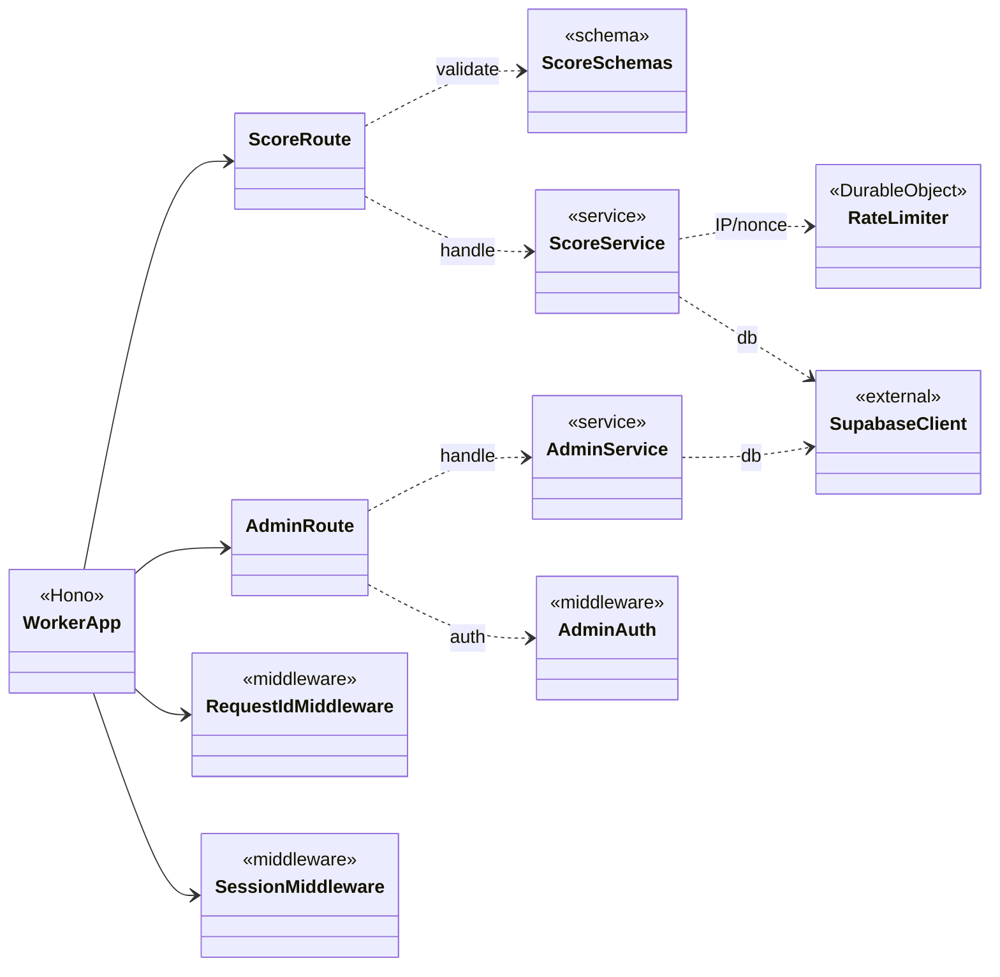

<br>

---

## クラス設計一覧

| クラス/モジュール | 役割 | 主な責務 |
|:---|:---|:---|
| GameManager | ゲーム進行の中枢 | モード制御、速度コース管理、スコア/コンボ、ループ更新、各マネージャ統合 |
| GameLoop | ループ実行 | `requestAnimationFrame` による更新コールバック |
| TimerManager | タイマー管理 | `setTimeout`/`setInterval` の一元管理とクリア |
| BubblePool | DOM再利用 | 歌詞バブルの生成/再利用/破棄 |
| LyricsRenderer | 歌詞描画 | バブル生成、配置、表示/非表示制御 |
| InputManager | 入力統合 | マウス/タッチ/キー入力のイベント配線 |
| UIManager | HUD更新 | 指示文やUI表示の更新 |
| EffectsManager | 演出 | クリック時エフェクト生成 |
| ResultsManager | リザルト | 結果表示、登録UI、送信ボタン制御 |
| FaceDetectionManager | 顔検出 | FaceMesh 解析、口開閉判定と入力反映 |
| BodyDetectionManager | 全身検出 | Pose 判定、カウントダウン/警告制御 |
| ViewportManager | 表示最適化 | `--vh` 更新など表示領域調整 |
| LiveStageVisuals | 3D描画 | Three.js によるステージ/ランドマーク描画 |
| GameEventEmitter | イベントバス | ゲーム内イベントの配信（拡張用） |
| scoreService (frontend) | API送信 | スコア送信、成功時フック |
| tokenService (frontend) | トークン取得 | 署名トークンの取得/更新 |
| scoreService (Workers) | Workers処理 | スコア投稿の検証/保存、ランキング取得 |
| adminService (Workers) | Workers管理 | 管理APIでの削除処理 |
| scoreService (Server) | Server処理 | スコア保存/ランキング取得 |
| RateLimiter | レート制限 | IP制限/Nonce管理 |

<br>

---

## 非機能設計

| 観点 | 内容 |
|:---|:---|
| 性能 | GameLoop + BubblePool + DOM再利用でGC圧を抑制 |
| 信頼性 | TimerManager でタイマーを集中管理、cleanup で資源解放 |
| セキュリティ | RateLimiter + HMAC + Turnstile + Origin検証 |
| 運用 | requestId/sessionId でログ追跡可能 |

### パフォーマンス最適化

| 手法 | 詳細 |
|:---|:---|
| **DOMプール (BubblePool)** | 歌詞バブルのDOM要素を再利用し、GC圧を抑制 |
| **差分更新** | UI要素は変更があった部分のみ更新 |
| **requestAnimationFrame** | ブラウザの描画タイミングに同期したゲームループ |
| **TimerManager** | setTimeout/setInterval を一元管理し、確実にリソース解放 |

<br>

---

## ディレクトリ構成

```
star/
├── public/               # 静的アセット
│   ├── favicon.svg           # ファビコン (SVG)
│   ├── manifest.json         # PWA マニフェスト
│   ├── pwa-192x192.png       # PWA アイコン (192×192)
│   └── pwa-512x512.png       # PWA アイコン (512×512)
│
├── src/                  # フロントエンド・ソースコード
│   ├── components/       # React UIコンポーネント (Ranking, Modal等)
│   ├── game/             # ゲームコアロジック
│   │   ├── GameManager.ts    # ゲーム進行管理（司令塔）
│   │   ├── GameLoop.ts       # メインループ（毎フレーム更新）
│   │   └── managers/         # 各種マネージャ
│   ├── pages/            # ルーティングページ (Index, Game)
│   ├── services/         # API呼び出し (scoreService, tokenService)
│   └── styles.css        # グローバルスタイル・アニメーション定義
│
├── worker/               # バックエンド・API (Cloudflare Workers) ← 本番用
│   ├── index.ts          # Hono エントリーポイント
│   ├── rateLimiter.ts    # レート制限 (Durable Object)
│   ├── routes/           # ルート定義
│   ├── services/         # ビジネスロジック
│   └── schemas/          # バリデーション
│
└── server/               # ローカル開発用サーバー ← 開発用（workerと同じ機能をローカルで動かす）
```

### なぜ worker と server が両方ある？

| ディレクトリ | 用途 | 実行環境 |
|:---|:---|:---|
| `worker/` | 本番用 | Cloudflare Workers（エッジ） |
| `server/` | 開発用 | ローカル（Node.js） |

開発中は `server/` を使って素早くテスト。本番では `worker/` をデプロイ。

<br>

---
---

# PART 6: セキュリティ（多層防御）

---

オンラインゲームには**チート対策**が必須です。

### 問題: 不正なスコア登録

```
悪意あるユーザー: 「1億点で登録しよう！」
↓
POST /api/score { score: 100000000 }
↓
ランキング破壊...
```

### 対策1: Turnstile（Bot対策）

Cloudflare の Bot対策（reCAPTCHA みたいなもの）。「人間がプレイした」ことを証明します。

```
ユーザー → Turnstile認証 → トークン取得
                              ↓
サーバー ← トークン検証 ← スコア送信
```

### 対策2: Origin検証

```
正規のフロントエンド（https://example.com）からのリクエスト → OK
不正なサイト（https://evil.com）からのリクエスト → 拒否
```

### 対策3: Rate Limiter（レート制限）

```
同じIPから短時間に大量リクエスト → Rate Limiter が検知 → ブロック
```

1分間に10回まで、など制限をかけて攻撃を防ぎます。

### 対策4: HMAC署名

メッセージが改ざんされていないことを証明する技術。

```
[ゲーム結果] + [秘密の鍵] → [署名]

サーバーは同じ鍵で署名を検証
→ 一致すれば正規のゲームからの送信
→ 不一致なら改ざんされている
```

### 対策5: Nonce（ナンス）

一度しか使えない番号（リプレイ攻撃対策）。

```
1回目: score=1000, nonce=abc123 → 登録成功
2回目: score=1000, nonce=abc123 → 拒否（同じnonceは使えない）
```

### 多層防御のまとめ

```
         リクエスト
              ↓
┌─────────────────────┐
│ Turnstile（Bot対策）│ ← 1層目
└─────────────────────┘
              ↓
┌─────────────────────┐
│ Origin検証          │ ← 2層目
└─────────────────────┘
              ↓
┌─────────────────────┐
│ Rate Limiter        │ ← 3層目
└─────────────────────┘
              ↓
┌─────────────────────┐
│ HMAC署名検証        │ ← 4層目
└─────────────────────┘
              ↓
┌─────────────────────┐
│ Nonce検証           │ ← 5層目
└─────────────────────┘
              ↓
         データベース保存
```

1つの対策を突破されても、他の対策で止められる。

<br>

---
---

# PART 7: 品質・運用

---

## テスト仕様（ユーザビリティ視点）

### 結合テスト

| ID | シーン | 手順/入力 | 期待結果（ユーザビリティ） |
|:---:|:---|:---|:---|
| 01 | タイトル導線 | モードを切り替える | 選択中のモードが視覚的に強調され、説明文も即時に更新される |
| 02 | 速度コース選択 | 8秒/10秒/12秒を切り替える | 選択中のコースが視覚的に強調され、デフォルトは10秒が選択されている |
| 03 | 遊び方モーダル | 「遊び方」を開く→閉じる | 速度コースの説明を含む内容が読みやすく表示され、閉じる操作で元画面に戻る |
| 04 | ランキングモーダル | 「ランキング」→期間/モード/コース切替→ページ移動→閉じる | コースフィルタで絞り込みが反映され、ページ移動で20件ずつ確認でき、閉じると元の画面へ戻れる |
| 05 | ゲーム開始 | 「ゲームスタート」→ロード完了待ち | ロード中表示があり、再生/リスタートが無効→準備完了で有効化される |
| 06 | 再生/一時停止 | 再生→一時停止→再生 | ボタン表記が状態に一致し、歌詞/スコア更新が停止/再開する |
| 07 | マウス操作 | バブルを長押し | 進捗表示が出てスコア/コンボが加算され、離すと解除される |
| 08 | モバイル操作 | タップで長押し | 指操作でもホールドでき、誤操作が起きにくい |
| 09 | ボディモード開始 | 全身が映る→カウントダウン完了 | 調整メッセージ→カウントダウン→再生開始の順で表示される |
| 10 | ボディモード警告 | 再生中に全身が外れる | 一定時間後に警告が表示され、復帰で警告が消える |
| 11 | フェイスモード | 口を開く/閉じる | 開口時のみホールド判定、閉口で解除される |
| 12 | 速度コースの反映 | 8秒コースを選択→ゲーム開始 | バブルの表示時間が8秒になり、10秒・12秒と比較して速く消える |
| 13 | リザルト表示 | 曲終了 | リザルト画面が表示され、スコア/最大コンボ/ランク/名前入力が視認できる |
| 14 | スコア登録成功 | 名前入力→登録 | 「登録完了」に変わり、ボタンが無効化される |
| 15 | スコア登録失敗 | 通信失敗を模擬→登録 | 「登録失敗(再試行)」に変わり、再試行が可能になる |
| 16 | 未登録の離脱 | 登録せずにタイトル/リトライ | 確認モーダルが表示され、続ける/終了するを選べる |
| 17 | ランキングコースフィルタ | コースドロップダウンで8秒を選択 | 8秒コースのスコアのみが表示される |
| 18 | ランキング空表示 | スコアなしの曲でランキング表示 | 「まだスコアがありません」等の案内が出る |
| 19 | ランキング通信失敗 | /api/ranking 失敗 | エラーメッセージが表示され、画面がフリーズしない |

<br>

### 単体テスト

| ID | 対象 | 条件/入力 | 期待結果（ユーザビリティ） |
|:---:|:---|:---|:---|
| 01 | UIManager | モード切替操作 | 画面の操作説明文が各モードに適した文言に更新される |
| 02 | PlayButton | 再生/一時停止の切替 | ボタン表記やアイコンが「再生」「一時停止」に正しく切り替わる |
| 03 | BodyWarning | 警告有効/無効 | 全身が映っていない時の警告メッセージ表示の有無が正しく切り替わる |
| 04 | CountDown | ランドマーク検出 | カウントダウン開始/キャンセル、警告文表示が正しく切り替わる |
| 05 | FaceDetection | 口開/閉の判定 | 開口時のみ判定座標が有効になり、閉口時は解除される |
| 06 | SubmitButton | 登録処理の状態変化 | 成功/失敗に応じてボタンの文言が変わり、連打が防止(disabled)される |
| 07 | ConfirmModal | 離脱イベント発火 | メッセージと遷移アクション（OK/Cancel）が正しく設定される |
| 08 | RankingList | データ状態(loading/error/empty) | 「ロード中」「エラー」「データなし」の表示が正しく切り替わる |
| 09 | SpeedValidation | 速度値の検証 (8/10/12/無効値) | 有効値(8,10,12)のみ許可され、無効値は拒否される |
| 10 | SpeedCSS | 速度コース選択→CSS変数 | `--lyric-speed` が選択した秒数に設定される |
| 11 | RankingPagination | ページ移動ボタン操作 | 前/次ボタンで20件ずつ表示が切り替わり、先頭/末尾ページでボタンが無効化される |
| 12 | RankingSpeedFilter | コースフィルタ切替 | コース変更時にページが1にリセットされ、APIリクエストにspeedパラメータが含まれる |
| 13 | RankCalculator | スコア境界値 | ランク表示（S/A/B/C）が境界値で正しく判定される |

<br>

---

## 展示チェックリスト

| カテゴリ | 確認項目 |
|:---|:---|
| **機材** | PC/スマホ、Webカメラ、スピーカー、安定した回線 |
| **環境** | 明るさと背景が安定、カメラ位置は胸〜顔が収まる高さ |
| **動作確認** | カメラ許可、音声出力、ランキングAPI接続 |
| **説明順** | 1分概要 → デモ → 技術の見せ場 → 設計図 |

<br>

---

## 開発・デプロイ

### 必須要件

| 項目 | バージョン/詳細 |
|:---|:---|
| Node.js | 20+ |
| Cloudflare | アカウント (Workers / Turnstile) |
| Supabase | プロジェクト作成済み |

### セットアップ

```bash
# 1. 依存関係のインストール
npm install

# 2. 環境変数の設定
#    .env ファイルを作成し、必要なAPIキーを設定

# 3. 開発サーバー起動
npm run dev        # フロントエンド
npm run cf:dev     # バックエンド(エミュレーション)

# 4. デプロイ
npm run deploy
```

<br>

---
---

# まとめ

```
┌─────────────────────────────────────────────────────────┐
│                                                         │
│   クロステは「音楽 × 身体 × テクノロジー」で           │
│   誰もがライブステージの演者になれるWebリズムゲーム     │
│                                                         │
│   ┌───────────┐  ┌───────────┐  ┌───────────┐          │
│   │ TextAlive │  │ MediaPipe │  │ Three.js  │          │
│   │ 歌詞同期  │  │ 動作認識  │  │ 3D演出    │          │
│   └───────────┘  └───────────┘  └───────────┘          │
│           ↓              ↓              ↓               │
│   ┌─────────────────────────────────────────┐           │
│   │     4モード × 3コースで誰でも遊べる     │           │
│   └─────────────────────────────────────────┘           │
│                                                         │
│   技術力: Manager設計 / レイヤード / 多層セキュリティ   │
│   体験力: ホールド操作 / 歌詞同期 / ネオン演出          │
│   間口  : PC / スマホ / カメラ / 3つの難易度            │
│                                                         │
└─────────────────────────────────────────────────────────┘
```

<br>

---

## ライセンス & クレジット

| 項目 | 内容 |
|:---|:---|
| **License** | MIT |
| **Music & Lyrics** | Powered by [TextAlive App API](https://api.songle.jp/) (National Institute of Advanced Industrial Science and Technology - AIST) |
| **Vision AI** | MediaPipe by Google |
| **Special Thanks** | 加賀（ネギシャワーP） ストリートライト piapro（https://piapro.jp/t/ULcJ）|
