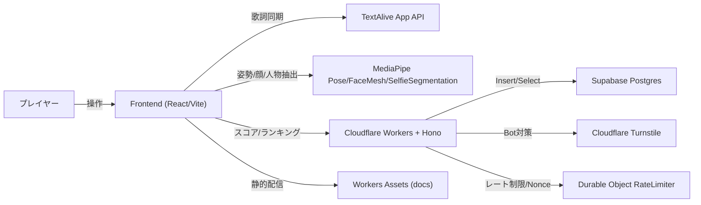
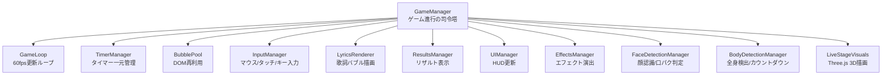
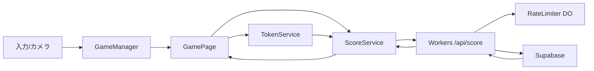
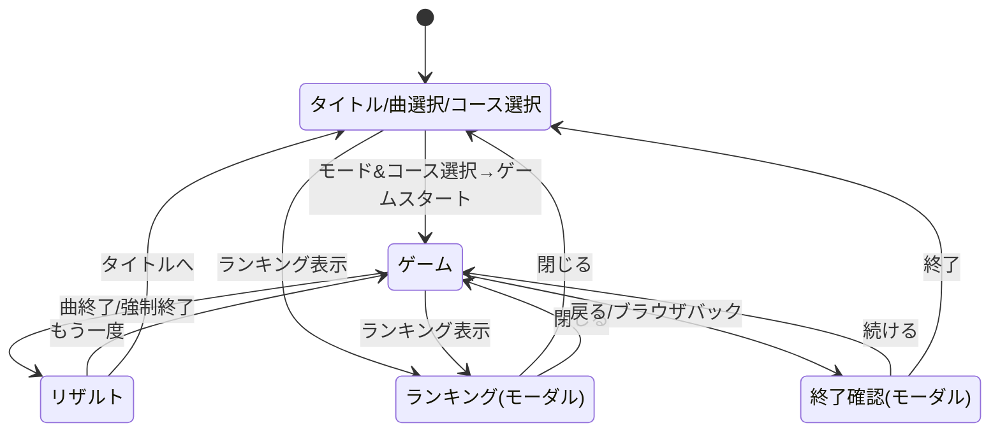
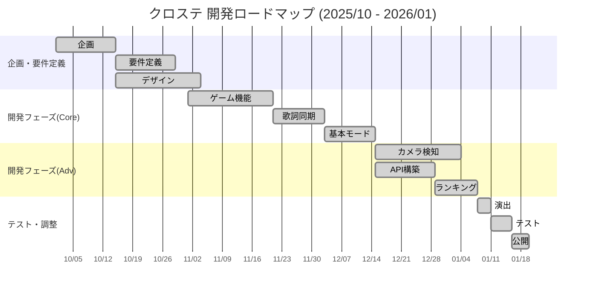

# クロステ ～Cross Stage～

### 音楽と身体が交差するWebリズムゲーム

> TextAlive App API による歌詞同期と MediaPipe による動作認識AIを融合。
> ライブステージを舞台に、歌詞を「掴み」「奏でる」新感覚の体感型リズムアクション。


---

## 30秒でわかるクロステ

| 観点 | 内容 |
|:---|:---|
| **体験** | 流れてくる歌詞をタイミングよく「ホールド（長押し）」してスコアを稼ぐリズムアクション |
| **独自性** | TextAlive歌詞同期 × MediaPipe動作認識AI の融合により、体の動きがそのまま入力になる |
| **間口の広さ** | 4つの操作モード × 3つの速度コースで、PC・スマホ・カメラ、誰でも自分に合った方法で遊べる |
| **価値** | 音楽 × 身体 × 視覚演出を一体化した「ライブステージの演者になれる」体験 |

---

## デモの流れ

```
1. タイトルでモード選択 ＋ 速度コース選択
       ↓
2. 楽曲開始 → 歌詞が「バブル」として画面に出現
       ↓
3. バブルをホールド → ゲージが溜まりスコア獲得 → コンボと演出が強化
       ↓
4. リザルト → オンラインランキングで順位確認
```

---

## このゲームが面白い理由

### 「ホールド」で奏でる新しい音ゲー体験

普通の音ゲーは「タイミングよくタップ」で終わり。
クロステは **「押し始める → 押し続ける → ゲージが溜まる → 離す」** という独自のプレイ感覚。

```
一般的な音ゲー:  タイミングよくタップ → ◎ PERFECT!

クロステ:        押し始める → 押し続ける（ゲージが溜まる）→ 離す
                              ↑ この「溜める」感覚が独自の体験
```

### 「ノーツ」ではなく「歌詞」が流れてくる

TextAlive App API で楽曲と歌詞のタイミングを同期。
**フレーズ単位の歌詞がバブルとして出現**し、歌詞を「つかむ」感覚でプレイできます。

---

## 4つの操作モード

デバイスや環境を問わず、誰でも自分に合った方法で遊べます。

| モード | 対象 | 操作 | 特徴 |
|:---|:---|:---|:---|
| **カーソル** | PC | マウス / タッチ | 手軽に楽しめる基本モード |
| **モバイル** | スマホ | タップ & ホールド | 親指一つで遊べる。プレイ領域を最大化 |
| **ボディ** | PC + Webカメラ | 全身アクション | 手や体を歌詞に重ねて「触れる」入力 |
| **フェイス** | スマホ | 顔移動 & 口パク | 顔を動かし、口を開けて歌詞をキャッチ |

```
カーソル / モバイル           ボディ / フェイス
┌──────────────────┐    ┌──────────────────┐
│  🎵 歌詞バブル    │    │  📷 カメラ認識     │
│      ↑           │    │                  │
│    🖱️/👆 操作     │    │  🎵 ←── 🙋 体/顔  │
│                  │    │                  │
│  クリック/タップ  │    │  動きがそのまま入力 │
└──────────────────┘    └──────────────────┘
```

### 速度コース（難易度）

歌詞バブルの表示時間を3段階から選択。ランキングはコース別にフィルタ可能。

| コース | 表示時間 | 難易度 |
|:---|:---|:---|
| **8秒コース** | 8秒 | 難しい |
| **10秒コース** | 10秒 | 普通（デフォルト） |
| **12秒コース** | 12秒 | 易しい |

---

## 技術アーキテクチャ

### システム構成図



### 技術スタック

| レイヤー | 技術 | 役割 |
|:---|:---|:---|
| **フロントエンド** | React 18 + TypeScript + Vite | SPA構成のゲームUI。HMRで高速開発 |
| **ゲームコア** | GameManager + Manager群 | 入力/描画/判定/演出を分離した設計 |
| **歌詞同期** | TextAlive App API | 楽曲と歌詞タイミングの自動同期 |
| **動作認識AI** | MediaPipe (Pose / FaceMesh / Segmentation) | カメラ映像からリアルタイムに体・顔を認識 |
| **3D演出** | Three.js + CSS Animation | ネオン×グラスモーフィズムのライブステージ演出 |
| **バックエンド** | Cloudflare Workers + Hono | エッジ実行で世界中どこからでも低レイテンシ |
| **データベース** | Supabase (PostgreSQL) | RLSとスキーマ検証でデータ整合性を担保 |
| **セキュリティ** | Turnstile / HMAC / Nonce / RateLimiter | 多層防御でチート・不正スコアを防止 |

---

## 技術的な見どころ

### 1. TextAlive × MediaPipe の融合

2つの外部技術を**同一のゲームループ内でリアルタイムに統合**しています。

```
TextAlive API → フレーズのタイミング情報
                    ↓
            歌詞バブルの生成・配置
                    ↓
            毎フレーム(60fps)で判定
                    ↑
            プレイヤーの入力座標
                    ↑
MediaPipe  → 体/顔のランドマーク座標をリアルタイム取得
```

- **Pose**: 全身33点の骨格をリアルタイム検出 → Body モードの入力
- **FaceMesh**: 顔468点のランドマーク検出 → 口の開閉でホールド判定
- **SelfieSegmentation**: 人物の背景分離 → 演出に活用

### 2. パフォーマンス最適化

60fpsの安定動作のため、複数の最適化を実施。

| 手法 | 詳細 |
|:---|:---|
| **DOMプール (BubblePool)** | 歌詞バブルのDOM要素を再利用し、GC圧を抑制 |
| **差分更新** | UI要素は変更があった部分のみ更新 |
| **requestAnimationFrame** | ブラウザの描画タイミングに同期したゲームループ |
| **TimerManager** | setTimeout/setInterval を一元管理し、確実にリソース解放 |

### 3. 多層セキュリティ

オンラインランキングの公正性を守るため、5層の防御を実装。

```
         リクエスト
              ↓
┌─────────────────────┐
│ Turnstile（Bot対策）│ ← 人間であることを証明
└─────────────────────┘
              ↓
┌─────────────────────┐
│ Origin検証          │ ← 正規サイトからのアクセスか確認
└─────────────────────┘
              ↓
┌─────────────────────┐
│ Rate Limiter        │ ← 短時間の大量リクエストをブロック
└─────────────────────┘
              ↓
┌─────────────────────┐
│ HMAC署名検証        │ ← データの改ざんを検出
└─────────────────────┘
              ↓
┌─────────────────────┐
│ Nonce検証           │ ← リプレイ攻撃（同じ送信の繰り返し）を防止
└─────────────────────┘
              ↓
         データベース保存
```

---

## 設計品質

### Manager パターンによるゲームコア設計

GameManager を中枢に、責務ごとに Manager を分離。単一責任の原則を徹底しています。



### レイヤードアーキテクチャ

```
┌───────────────────────────────────────┐
│ UI層                                  │
│   IndexPage, GamePage, RankingModal   │
├───────────────────────────────────────┤
│ ドメイン層                            │
│   GameManager + 各Manager + GameLoop  │
├───────────────────────────────────────┤
│ サービス層                            │
│   scoreService / tokenService         │
├───────────────────────────────────────┤
│ インフラ層                            │
│   Workers / Supabase / RateLimiter    │
└───────────────────────────────────────┘
```

層を分離することで、各レイヤーが独立して変更可能。保守性と拡張性を確保しています。

### バックエンド設計



| API | 概要 |
|:---|:---|
| `GET /api/token` | スコア署名トークン発行 |
| `POST /api/score` | スコア登録（多層検証後に保存） |
| `GET /api/ranking` | ランキング取得（ページネーション・コース別フィルタ対応） |

---

## UI / 演出へのこだわり

| 要素 | 内容 |
|:---|:---|
| **ネオン×グラスモーフィズム** | ネオンライトとすりガラス風UIで、ライブステージの雰囲気を演出 |
| **3Dステージ演出** | Three.js と CSS Animation を組み合わせた、軽量かつ没入感のあるライティング |
| **レスポンシブデザイン** | PCの大画面からスマートフォンまで、デバイスに最適化されたUI |
| **PWA対応** | ホーム画面に追加してアプリのように起動可能 |

---

## 画面遷移



---

## 開発の歩み



---

## まとめ

```
┌─────────────────────────────────────────────────────────┐
│                                                         │
│   クロステは「音楽 × 身体 × テクノロジー」で           │
│   誰もがライブステージの演者になれるWebリズムゲーム     │
│                                                         │
│   ┌───────────┐  ┌───────────┐  ┌───────────┐          │
│   │ TextAlive │  │ MediaPipe │  │ Three.js  │          │
│   │ 歌詞同期  │ × │ 動作認識  │ × │ 3D演出    │          │
│   └───────────┘  └───────────┘  └───────────┘          │
│           ↓              ↓              ↓               │
│   ┌─────────────────────────────────────────┐           │
│   │     4モード × 3コースで誰でも遊べる     │           │
│   └─────────────────────────────────────────┘           │
│                                                         │
│   技術力: Manager設計 / レイヤード / 多層セキュリティ   │
│   体験力: ホールド操作 / 歌詞同期 / ネオン演出          │
│   間口  : PC / スマホ / カメラ / 3つの難易度            │
│                                                         │
└─────────────────────────────────────────────────────────┘
```

---

## ライセンス & クレジット

| 項目 | 内容 |
|:---|:---|
| **License** | MIT |
| **Music & Lyrics** | Powered by [TextAlive App API](https://api.songle.jp/) (AIST) |
| **Vision AI** | MediaPipe by Google |
| **Special Thanks** | 加賀（ネギシャワーP） ストリートライト piapro |
