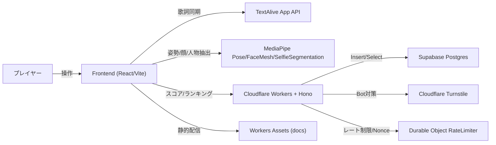
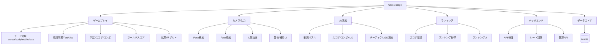
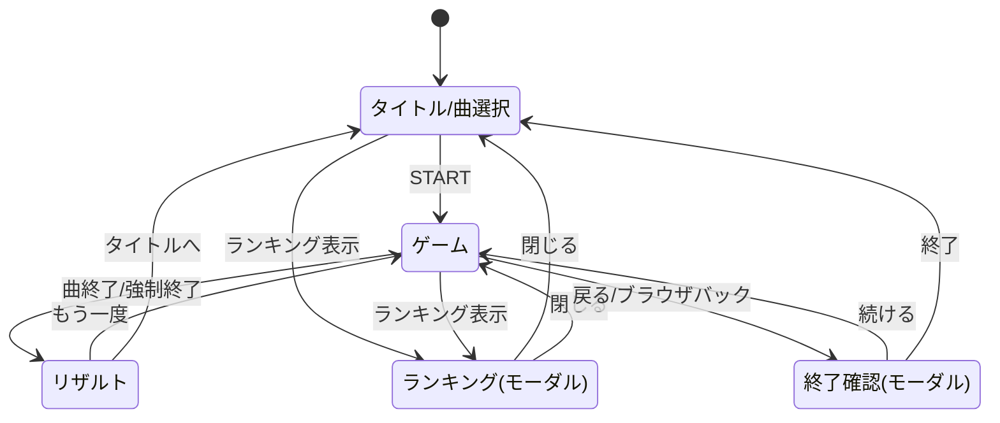
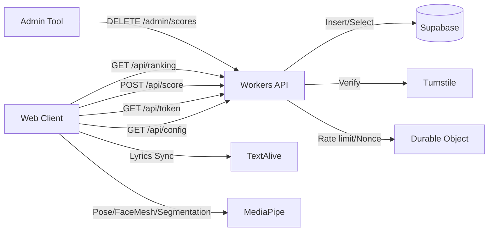
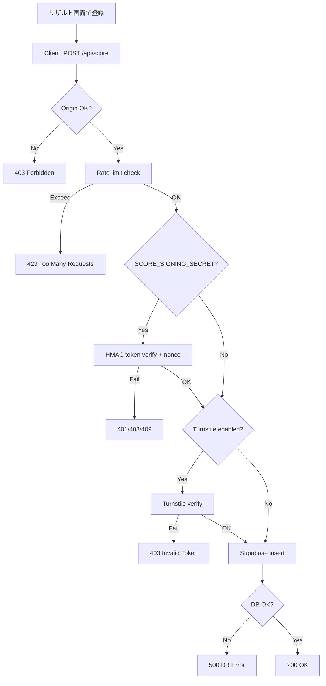
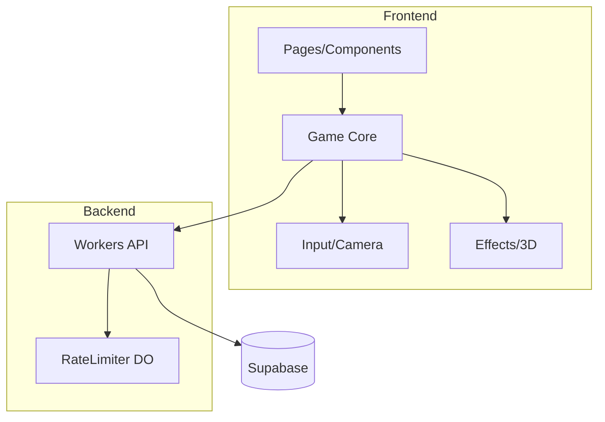
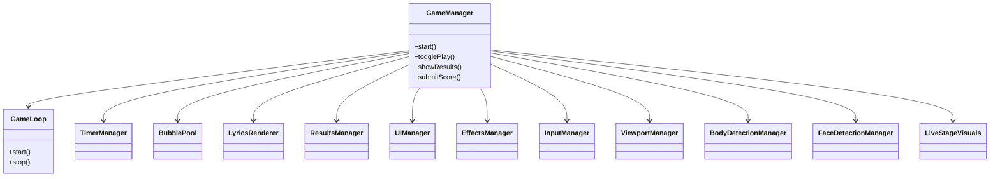
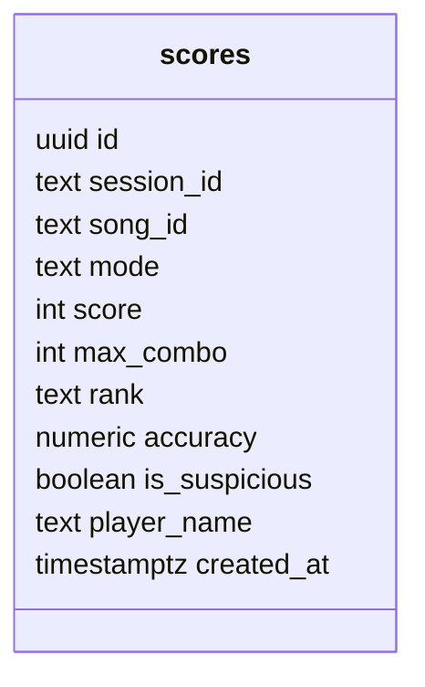
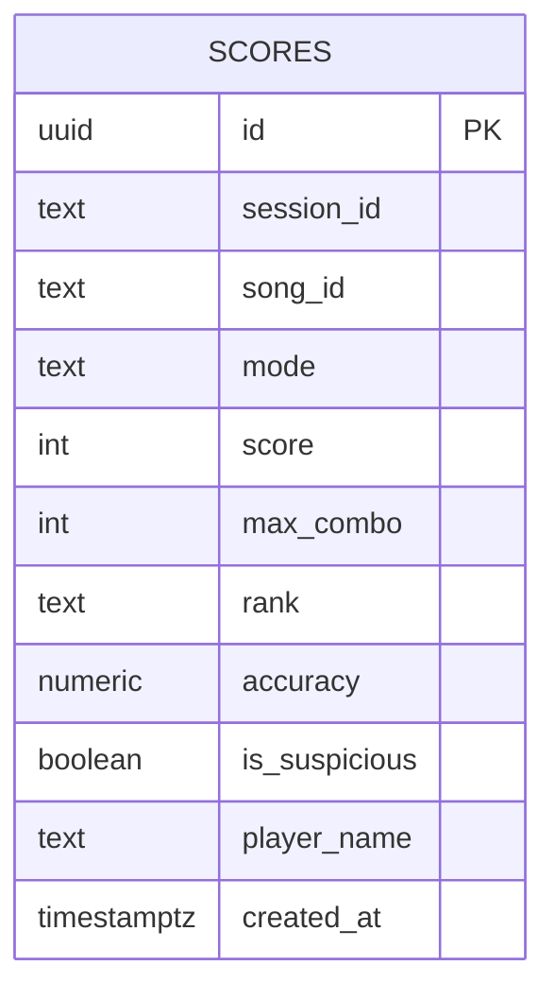

# 仕様書 - Cross Stage

## 1. システム概要
Cross Stage は、TextAlive による歌詞同期と MediaPipe による身体/顔検知を組み合わせた Web リズムゲームです。プレイモードは cursor/body/mobile/face を提供します。フロントエンドは React/Vite の SPA、バックエンドは Cloudflare Workers + Hono、データストアは Supabase (PostgreSQL) を利用します。

## 2. 機能階層図

## 3. IPO図（主要機能）

```mermaid
flowchart TB
  subgraph Gameplay[ゲームプレイ/スコアリング]
    GP_In[Input: TextAliveタイミング, プレイヤー入力, カメラLandmarks]
    GP_Proc[Process: バブル生成, ヒット/ホールド判定, コンボ/スコア計算]
    GP_Out[Output: スコアUI, 演出, リザルト]
    GP_In --> GP_Proc --> GP_Out
  end

  subgraph Camera[カメラ認識]
    C_In[Input: Webカメラ映像]
    C_Proc[Process: Pose/FaceMesh/Segmentation, 品質/負荷制御]
    C_Out[Output: ランドマーク/人体マスク/判定イベント]
    C_In --> C_Proc --> C_Out
  end

  subgraph ScoreSubmit[スコア登録]
    S_In[Input: GameResult, x-score-token?, turnstileToken?]
    S_Proc[Process: Origin/Rate limit/HMAC/Turnstile検証, Supabase挿入]
    S_Out[Output: 保存結果/エラー]
    S_In --> S_Proc --> S_Out
  end

  subgraph RankingFetch[ランキング取得]
    R_In[Input: songId, mode?, period?, limit?]
    R_Proc[Process: 検証, DB検索, フィルタ/ソート]
    R_Out[Output: ランキング一覧]
    R_In --> R_Proc --> R_Out
  end
```

## 4. 画面遷移図

## 5. 全体インターフェース図（システム構成）

### API一覧
| Method | Path | 概要 | 認証/条件 |
| --- | --- | --- | --- |
| GET | /api/health | ヘルスチェック | なし |
| GET | /api/config | Turnstile Site Key 取得 | なし |
| GET | /api/token | スコア署名トークン発行 | SCORE_SIGNING_SECRET 設定時のみ有効 |
| POST | /api/score | スコア登録 | FRONTEND_ORIGIN/Rate limit/HMAC/Turnstile (条件付き) |
| GET | /api/ranking | ランキング取得 | songId 必須 |
| DELETE | /admin/scores | スコア削除 | x-admin-token 必須 |

### 環境変数（Workers）
| 変数 | 用途 |
| --- | --- |
| SUPABASE_URL | Supabase 接続 URL |
| SUPABASE_ANON_KEY | Supabase 匿名キー |
| FRONTEND_ORIGIN | Origin チェックの許可ドメイン |
| ADMIN_TOKEN | 管理APIトークン |
| TURNSTILE_SITE_KEY | Turnstile Site Key（公開） |
| TURNSTILE_SECRET_KEY | Turnstile Secret Key（検証） |
| SCORE_SIGNING_SECRET | スコア署名用シークレット |
| RATE_LIMITER | Durable Object バインディング |
| ASSETS | 静的アセット配信用 |

## 6. フローチャート

## 7. 全体モジュール分割図

## 8. クラス図

## 9. DBテーブル図

## 10. ER図

## 11. DB設計（テーブル定義）
### scores
| カラム | 型 | 制約/デフォルト | 説明 |
| --- | --- | --- | --- |
| id | uuid | PK, default gen_random_uuid() | レコードID |
| session_id | text | NOT NULL, default gen_random_uuid()::text | 匿名セッションID (Cookie) |
| song_id | text | NOT NULL | 楽曲ID |
| mode | text | NOT NULL, default 'cursor' | cursor/body/mobile/face |
| score | integer | NOT NULL | スコア |
| max_combo | integer | NOT NULL | 最大コンボ |
| rank | text | NOT NULL | ランク |
| accuracy | numeric(5,2) | NULL | 精度(%) |
| is_suspicious | boolean | default false | チート疑い |
| player_name | text | NULL | プレイヤー名 |
| created_at | timestamptz | default now() | 登録時刻 |

### インデックス
- scores_song_mode_score_idx: (song_id, mode, score desc)

## 12. モジュール仕様書
| モジュール | 責務 | 主なファイル |
| --- | --- | --- |
| ルーティング/ページ | SPAルーティング、画面遷移 | src/App.tsx, src/pages/IndexPage.tsx, src/pages/GamePage.tsx |
| UIコンポーネント | ランキング表示、モード切替 | src/components/game/RankingModal.tsx, src/components/game/RankingPanel.tsx, src/components/game/ModeTabs.tsx |
| ゲームコア | ゲーム進行、スコア、リザルト | src/game/GameManager.ts, src/game/GameLoop.ts |
| 歌詞描画 | バブル生成、表示、判定補助 | src/game/GameManager.ts (LyricsRenderer) |
| 入力/カメラ | マウス/タッチ/カメラ入力、Pose/Face 判定 | src/game/GameManager.ts (InputManager, BodyDetectionManager, FaceDetectionManager) |
| 演出/ビジュアル | パーティクル/3D/スコアポップ | src/game/GameManager.ts (EffectsManager, LiveStageVisuals), src/game/gameLoader.ts |
| タイマ/プール | ゲームタイマ管理(結果/コンボ/待機/警告)、DOM再利用 | src/game/TimerManager.ts, src/game/BubblePool.ts |
| Workers API | スコア登録/ランキング取得/管理 | worker/index.ts, worker/routes/score.ts, worker/routes/admin.ts |
| ミドルウェア | requestId, session, admin 認証 | worker/middleware/* |
| レート制限 | Durable Object による制限/Nonce | worker/rateLimiter.ts |
| DBスキーマ | scores テーブル定義 | supabase_scores.sql, worker/types/supabase.ts |
| ローカルサーバ | 開発用API/静的配信 | server/index.ts, server/routes/score.ts |

### タイマ一覧
| キー | 種別 | 用途 | 代表間隔/遅延 |
| --- | --- | --- | --- |
| idle-timeout | timeout | 開始前の放置を検知しリザルトへ遷移 | 30s |
| combo-reset | interval | 最終スコアから30秒超でコンボをリセット | 1sチェック |
| result-check | timeout | 曲終了予定時刻でリザルト表示 | 曲長/60s |
| result-backup | timeout | result-checkの保険 | +20s |
| song-progress | interval | 曲終端監視の非常用チェック | 5s |
| finish-watch | interval | onFinish未検出時の近接監視 | 1s |
| finish-fallback | timeout | onFinish未検出の強制遷移 | duration+3s (+5s body, 未取得時120s) |
| body-countdown | interval | 全身検出カウントダウン | 1s (5秒カウント) |
| full-body-lost | timeout | 全身ロスト警告表示 | 3s |

## 13. テスト仕様書（ユーザビリティ視点）
### E2E（ユーザー体験）
| ID | シーン | 手順/入力 | 期待結果（ユーザビリティ） |
| --- | --- | --- | --- |
| E2E-01 | タイトル導線 | モードを切り替える | 選択中のモードが視覚的に強調され、説明文も即時に更新される |
| E2E-02 | 遊び方モーダル | 「遊び方」を開く→閉じる | 内容が読みやすく表示され、閉じる操作で元画面に戻る |
| E2E-03 | ランキングモーダル | 「ランキング」→期間/モード切替→閉じる | 一覧が更新され、閉じると元の画面へ戻れる |
| E2E-04 | ゲーム開始 | 「ゲームスタート」→ロード完了待ち | ロード中表示があり、再生/リスタートが無効→準備完了で有効化される |
| E2E-05 | 再生/一時停止 | 再生→一時停止→再生 | ボタン表記が状態に一致し、歌詞/スコア更新が停止/再開する |
| E2E-06 | マウス操作 | バブルを長押し | 進捗表示が出てスコア/コンボが加算され、離すと解除される |
| E2E-07 | モバイル操作 | タップで長押し | 指操作でもホールドでき、誤操作が起きにくい |
| E2E-08 | ボディモード開始 | 全身が映る→カウントダウン完了 | 調整メッセージ→カウントダウン→再生開始の順で表示される |
| E2E-09 | ボディモード警告 | 再生中に全身が外れる | 一定時間後に警告が表示され、復帰で警告が消える |
| E2E-10 | フェイスモード | 口を開く/閉じる | 開口時のみホールド判定、閉口で解除される |
| E2E-11 | リザルト表示 | 曲終了 | リザルト画面が表示され、スコア/最大コンボ/ランク/名前入力が視認できる |
| E2E-12 | スコア登録成功 | 名前入力→登録 | 「登録完了」に変わり、ボタンが無効化される |
| E2E-13 | スコア登録失敗 | 通信失敗を模擬→登録 | 「登録失敗(再試行)」に変わり、再試行が可能になる |
| E2E-14 | 未登録の離脱 | 登録せずにタイトル/リトライ | 確認モーダルが表示され、続ける/終了するを選べる |
| E2E-15 | ランキング空表示 | スコアなしの曲でランキング表示 | 「まだスコアがありません」等の案内が出る |
| E2E-16 | ランキング通信失敗 | /api/ranking 失敗 | エラーメッセージが表示され、画面がフリーズしない |

### 単体テスト（ユーザー向けフィードバック）
| ID | 対象 | 条件/入力 | 期待結果（ユーザー視点） |
| --- | --- | --- | --- |
| UT-01 | UIManager.updateInstructions | mode=cursor/body/mobile/face | 画面の操作説明文が各モードに適した文言に更新される |
| UT-02 | GameManager.togglePlay | 再生/一時停止の切替 | ボタン表記が「再生/一時停止」に切り替わる |
| UT-03 | BodyDetectionManager.remindAdjustment | 警告有効/無効 | メッセージ表示の有無が正しく切り替わる |
| UT-04 | BodyDetectionManager.evaluateLandmarks | ランドマーク有/無 | カウントダウン開始/キャンセル、警告文表示が正しく切り替わる |
| UT-05 | FaceDetectionManager.handleFaceResults | 口開/閉の閾値 | 開口時のみ checkLyrics が有効座標で呼ばれ、閉口時は解除座標になる |
| UT-06 | リザルト登録ボタン | 登録成功/失敗 | 文言が「登録完了」/「登録失敗(再試行)」に切り替わり、disabled も連動する |
| UT-07 | ConfirmModal 表示制御 | show-confirm-modal イベント | メッセージと遷移アクションが正しく設定される |
| UT-08 | RankingPanel 表示状態 | loading/error/empty | 「ロード中」「エラー」「空表示」が正しく切り替わる |
| UT-09 | calculateRank | 境界値(900000/800000/700000) | ランク表示が S/A/B/C に安定する |
