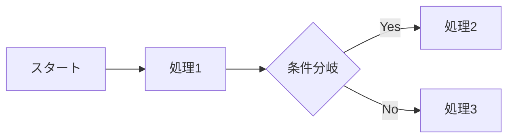
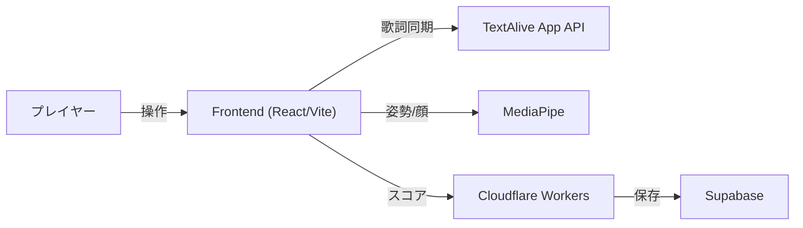
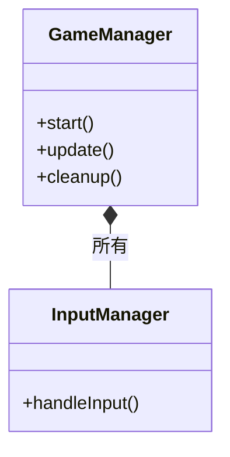
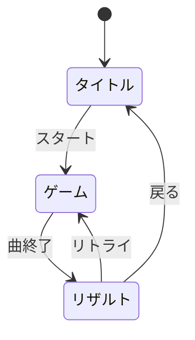

# README.md 仕様書の解説

> このドキュメントは、README.md に書かれている技術仕様を  
> **情報系専門学生向けにわかりやすく解説**したものです。

---

## この解説の読み方

README.md は「クロステ」というWebリズムゲームの**仕様書**です。  
仕様書とは「このシステムは何ができて、どう作られているか」を説明したドキュメントのこと。

この解説では、以下の順番で説明していきます：

1. **全体像を掴む** - このゲームは何をするものか
2. **技術スタックを理解する** - どんな技術が使われているか
3. **設計を読み解く** - なぜこういう構造になっているか
4. **図の読み方** - Mermaid図を読めるようになる

---

# 1. 全体像を掴む

## このゲームは何？

**クロステ** は、ブラウザで動く音ゲー（リズムゲーム）です。

普通の音ゲーとの違い：
- 流れてくるのは「ノーツ」ではなく **歌詞**
- タップだけでなく **長押し（ホールド）** でスコアを稼ぐ
- **カメラで体の動きを認識** して遊べるモードがある

```
┌─────────────────────────────────────────────────────┐
│                    クロステの体験                    │
│                                                     │
│   楽曲再生 → 歌詞が流れてくる → タイミングよく操作   │
│                      ↓                              │
│            スコア加算 → ランキング登録               │
└─────────────────────────────────────────────────────┘
```

## 4つのモードって？

| モード | 簡単に言うと | どんな人向け？ |
|:---|:---|:---|
| Cursor | マウスでクリック | PCで手軽に遊びたい人 |
| Mobile | スマホでタップ | スマホユーザー |
| Body | 全身の動きで操作 | 体を動かして遊びたい人 |
| Face | 顔の動きと口パクで操作 | 新しい体験をしたい人 |

Body/Face モードでは **MediaPipe** という Google の AI を使って、  
カメラ映像から人の体や顔の位置をリアルタイムで検出しています。

---

# 2. 技術スタックを理解する

## 「技術スタック」とは？

アプリを作るのに使った技術の組み合わせのこと。  
料理で言えば「材料リスト」みたいなものです。

## フロントエンド（ユーザーの目に見える部分）

| 技術 | 役割 | わかりやすく言うと |
|:---|:---|:---|
| **React** | UIライブラリ | 画面の部品を作るための道具箱 |
| **TypeScript** | プログラミング言語 | JavaScriptに「型」をつけて安全にしたもの |
| **Vite** | ビルドツール | コードを変換してブラウザで動くようにする |
| **Three.js** | 3Dライブラリ | 背景の3D演出を作る |
| **MediaPipe** | AI/ML | カメラ映像から体・顔を認識する |
| **TextAlive** | 歌詞同期API | 楽曲と歌詞のタイミングを合わせる |

### React って何がいいの？

```jsx
// React の考え方: UIを「部品（コンポーネント）」として作る

// スコア表示の部品
function ScoreDisplay({ score }) {
  return <div className="score">{score}点</div>;
}

// コンボ表示の部品
function ComboDisplay({ combo }) {
  return <div className="combo">{combo} COMBO!</div>;
}

// これらを組み合わせてゲーム画面を作る
function GameScreen() {
  return (
    <div>
      <ScoreDisplay score={1000} />
      <ComboDisplay combo={5} />
    </div>
  );
}
```

部品ごとに分けると：
- **再利用**しやすい（同じ部品を別の場所でも使える）
- **修正**しやすい（バグがあっても影響範囲が限定される）
- **テスト**しやすい（部品単位で動作確認できる）

### Vite って何？

ブラウザは TypeScript を直接読めません。  
Vite が TypeScript → JavaScript に変換してくれます。

```
TypeScript (.ts/.tsx)
        ↓  Vite が変換
JavaScript (.js)
        ↓
ブラウザで実行
```

さらに Vite は **HMR（Hot Module Replacement）** という機能があり、  
コードを変更すると画面が自動で更新されます（開発がめっちゃ楽）。

## バックエンド（サーバー側）

| 技術 | 役割 | わかりやすく言うと |
|:---|:---|:---|
| **Cloudflare Workers** | サーバー実行環境 | 世界中のサーバーでコードを動かせる |
| **Hono** | Webフレームワーク | APIを簡単に作れるツール |
| **Supabase** | データベース | スコアデータを保存する場所 |
| **Durable Objects** | 状態管理 | レート制限などの状態を保持 |

### なぜ Cloudflare Workers？

普通のサーバー:
```
ユーザー(日本) ──────────→ サーバー(アメリカ) ──────────→ 応答
                 遠い...                        遠い...
```

Cloudflare Workers（エッジコンピューティング）:
```
ユーザー(日本) ───→ 近くのサーバー(日本) ───→ 応答
              近い!                    速い!
```

世界中に分散したサーバーで動くので、**どこからアクセスしても速い**。

### Supabase って何？

**PostgreSQL**（有名なデータベース）をクラウドで簡単に使えるサービス。

```sql
-- scores テーブルのイメージ
SELECT * FROM scores ORDER BY score DESC LIMIT 10;

-- 結果（ランキング上位10件）
| player_name | score  | mode   | rank |
|-------------|--------|--------|------|
| たろう      | 98000  | cursor | S    |
| はなこ      | 95000  | body   | S    |
| ...         | ...    | ...    | ...  |
```

---

# 3. 設計を読み解く

## なぜ「設計」が大事なの？

小さいプログラムなら1ファイルでOK。  
でも大きくなると...

```
❌ 悪い例（全部1ファイル）
game.ts (5000行)
  - 入力処理
  - 描画処理
  - スコア計算
  - API通信
  - エフェクト
  → どこに何があるかわからない！修正が怖い！
```

```
✅ 良い例（役割で分割）
GameManager.ts    - 全体の進行を管理
InputManager.ts   - 入力だけ担当
LyricsRenderer.ts - 歌詞の描画だけ担当
ScoreService.ts   - API通信だけ担当
→ 見通しが良い！修正も安心！
```

## Manager パターン

クロステでは **「〇〇Manager」** というクラスがたくさん出てきます。

```
GameManager（司令塔）
    │
    ├── InputManager      ... 入力を受け取る
    ├── LyricsRenderer    ... 歌詞を表示する
    ├── EffectsManager    ... エフェクトを出す
    ├── UIManager         ... UI(スコア等)を更新
    ├── ResultsManager    ... 結果画面を管理
    ├── FaceDetectionManager  ... 顔認識
    └── BodyDetectionManager  ... 体認識
```

**GameManager** が司令塔となって、各 Manager に指示を出します。

### なぜこうするの？

**単一責任の原則（Single Responsibility Principle）** という考え方。

> 1つのクラスは、1つのことだけに責任を持つべき

```typescript
// ❌ 1つのクラスがなんでもやる
class Game {
  handleInput() { /* 入力処理 */ }
  render() { /* 描画処理 */ }
  calculateScore() { /* スコア計算 */ }
  playSound() { /* 音を鳴らす */ }
  sendToServer() { /* API通信 */ }
  // ... まだまだ続く
}

// ✅ 役割ごとに分ける
class InputManager { handleInput() { } }
class LyricsRenderer { render() { } }
class ScoreCalculator { calculate() { } }
// それぞれが自分の仕事だけに集中
```

## Service パターン

**「〇〇Service」** は、外部との通信を担当するクラスです。

```typescript
// scoreService.ts のイメージ

export async function submitScore(result: GameResult) {
  // 1. サーバーにスコアを送信
  const response = await fetch('/api/score', {
    method: 'POST',
    body: JSON.stringify(result)
  });
  
  // 2. 結果を返す
  return response.json();
}

export async function getRanking(songId: string) {
  // ランキングを取得
  const response = await fetch(`/api/ranking?songId=${songId}`);
  return response.json();
}
```

**なぜ分けるの？**

```
GamePage（画面）
    ↓ 「スコアを登録して」と頼むだけ
ScoreService
    ↓ 実際のAPI通信を担当
サーバー
```

画面のコードは「スコア登録をお願いする」だけでOK。  
通信の細かい処理（エラー処理、リトライなど）は Service が隠蔽します。

## セキュリティ対策を理解する

オンラインゲームには**チート対策**が必須です。

### 問題: 不正なスコア登録

```
悪意あるユーザー: 「1億点で登録しよう！」
↓
POST /api/score { score: 100000000 }
↓
ランキング破壊...
```

### 対策1: HMAC署名

**HMAC** = メッセージが改ざんされていないことを証明する技術

```
┌─────────────────────────────────────────────────────┐
│ HMAC署名の仕組み                                     │
│                                                     │
│ [ゲーム結果] + [秘密の鍵] → [署名]                   │
│                                                     │
│ サーバーは同じ鍵で署名を検証                         │
│ → 一致すれば正規のゲームからの送信                   │
│ → 不一致なら改ざんされている                         │
└─────────────────────────────────────────────────────┘
```

### 対策2: Nonce（ナンス）

**Nonce** = 一度しか使えない番号（リプレイ攻撃対策）

```
1回目: score=1000, nonce=abc123 → 登録成功
2回目: score=1000, nonce=abc123 → 拒否（同じnonceは使えない）
```

これで「同じリクエストを何度も送る」攻撃を防げます。

### 対策3: Turnstile

**Turnstile** = Cloudflare の Bot対策（reCAPTCHA みたいなもの）

```
ユーザー → Turnstile認証 → トークン取得
                              ↓
サーバー ← トークン検証 ← スコア送信
```

「人間がプレイした」ことを証明します。

### 対策4: Rate Limiter（レート制限）

```
同じIPから短時間に大量リクエスト
↓
Rate Limiter が検知
↓
「ちょっと待って！」とブロック
```

1分間に10回まで、など制限をかけて攻撃を防ぎます。

---

# 4. Mermaid図の読み方

README.md には **Mermaid** という記法で書かれた図がたくさんあります。  
読めるようになると、システムの全体像が一目でわかります。

## フローチャート (flowchart)

**データや処理の流れ** を表す図。



記号の意味：
| 記号 | 意味 |
|:---:|:---|
| `[ ]` | 四角 = 処理・ステップ |
| `{ }` | ひし形 = 条件分岐 |
| `[( )]` | 円筒 = データベース |
| `-->` | 矢印 = 流れの方向 |
| `LR` | Left to Right（左から右へ） |
| `TB` | Top to Bottom（上から下へ） |

## システム構成図を読む

README.md のシステム構成図を解説します：



読み方：
1. **Player** がゲームを操作する
2. **Frontend** が画面を表示・入力を受け付ける
3. Frontend は **TextAlive** から歌詞データをもらう
4. Frontend は **MediaPipe** で体・顔を認識する
5. スコアは **Workers API** 経由で **Supabase** に保存

## クラス図 (classDiagram)

**クラス同士の関係** を表す図。



線の意味：
| 記号 | 意味 | 例 |
|:---:|:---|:---|
| `*--` | コンポジション（所有） | GameManagerはInputManagerを持っている |
| `o--` | 集約（参照） | 参照はしているが、所有はしていない |
| `-->` | 依存 | 使っているだけ |
| `..>` | 弱い依存 | 時々使う |

## 状態遷移図 (stateDiagram)

**画面の遷移** を表す図。



- `[*]` = 開始点
- 矢印 = 遷移（画面が切り替わる）
- `:` の後ろ = 遷移のきっかけ

---

# 5. よく出てくる専門用語

| 用語 | 意味 |
|:---|:---|
| **SPA** | Single Page Application。ページ遷移なしで画面が切り替わるWebアプリ |
| **HMR** | Hot Module Replacement。コード変更が即座に画面に反映される機能 |
| **API** | Application Programming Interface。プログラム同士がやり取りする窓口 |
| **エッジ** | ユーザーに近いサーバー。Cloudflare Workers はエッジで動く |
| **RLS** | Row Level Security。データベースの行単位のアクセス制御 |
| **Durable Object** | Cloudflare の状態を持てる仕組み。レート制限に使用 |
| **ミドルウェア** | リクエストを受けてから処理するまでの間に入る処理 |
| **DOM** | Document Object Model。HTMLの構造をプログラムから操作する仕組み |
| **プール** | 再利用可能なオブジェクトを貯めておく仕組み（BubblePool等） |
| **GC** | Garbage Collection。使われなくなったメモリを自動で解放する仕組み |

---

# 6. この設計から学べること

## 学び1: 責任を分割する

大きなプログラムは「役割」で分けると管理しやすい。

```
✅ 1つのクラス = 1つの役割
```

## 学び2: 層（レイヤー）で分ける

```
UI層        ... 見た目を担当
ドメイン層  ... ゲームのルールを担当
サービス層  ... 外部通信を担当
インフラ層  ... データ保存を担当
```

層を分けると、例えば「データベースを変更」しても UI のコードは変わらない。

## 学び3: セキュリティは多層防御

1つの対策だけでは不十分。複数の対策を組み合わせる。

```
Turnstile（Bot対策）
    ↓
Rate Limiter（連続攻撃対策）
    ↓
HMAC（改ざん対策）
    ↓
Nonce（リプレイ対策）
    ↓
Origin検証（不正アクセス対策）
```

## 学び4: 図で説明する

コードだけでなく、**図**があると理解が早い。  
Mermaid なら Markdown の中に書けて便利。

---

# おわりに

README.md の仕様書は、このプロジェクトの「設計図」です。

最初は難しく感じるかもしれませんが：
1. **全体像**を掴む（何をするシステム？）
2. **技術スタック**を調べる（何を使ってる？）
3. **図を読む**（どう繋がってる？）
4. **詳細**を追う（具体的にどう実装？）

この順番で読むと理解しやすくなります。

わからない用語があったら、この解説の用語集や検索で調べてみてください。  
実際にコードを読みながら、この仕様書と照らし合わせると理解が深まります。
