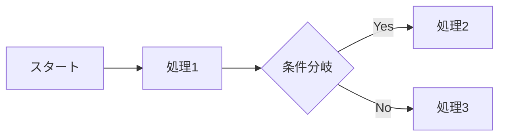
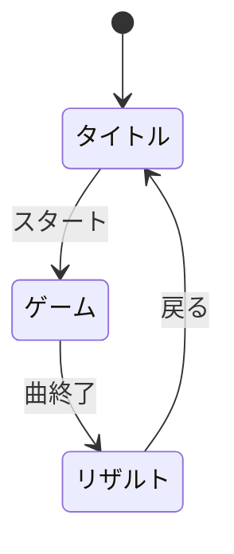
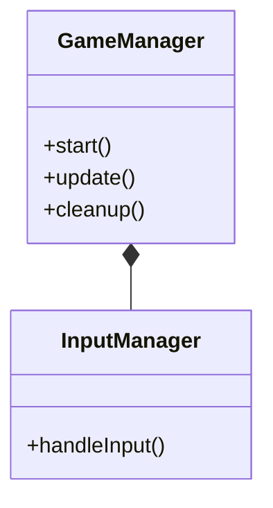
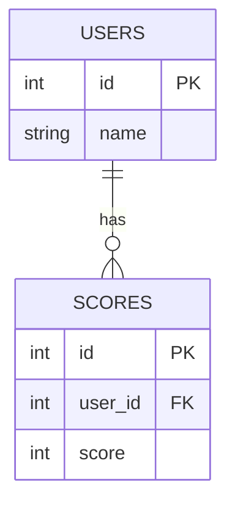
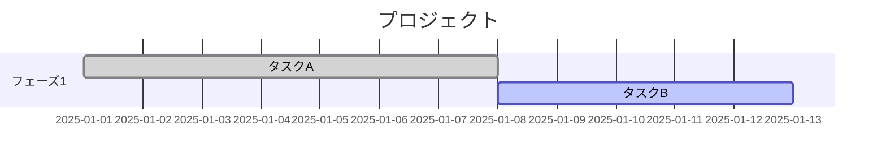

# README.md 仕様書の解説

> このドキュメントは、README.md に書かれている技術仕様を  
> **情報系専門学生向けにわかりやすく解説**したものです。

---

## この解説の読み方

README.md は「クロステ」というWebリズムゲームの**仕様書**です。  
仕様書とは「このシステムは何ができて、どう作られているか」を説明したドキュメントのこと。

この解説では、README.md の **PART 1〜5** すべてを順番に解説していきます：

| PART | 内容 | この解説での章 |
|:---:|:---|:---|
| 1 | 概要 | 1. 全体像を掴む |
| 2 | プロダクト | 2. ゲームの仕組みを理解する |
| 3 | 技術 | 3. 技術スタックを理解する / 4. システム仕様を読み解く |
| 4 | 設計 | 5. 設計を読み解く |
| 5 | 品質・運用 | 6. テスト・運用を理解する |
| - | 補足 | 7. Mermaid図の読み方 / 8. 用語集 |

---

# 1. 全体像を掴む（PART 1 対応）

## このゲームは何？

**クロステ（Cross Stage）** は、ブラウザで動く音ゲー（リズムゲーム）です。

普通の音ゲーとの違い：
- 流れてくるのは「ノーツ」ではなく **歌詞**
- タップだけでなく **長押し（ホールド）** でスコアを稼ぐ
- **カメラで体の動きを認識** して遊べるモードがある

```
┌─────────────────────────────────────────────────────┐
│                    クロステの体験                    │
│                                                     │
│   楽曲再生 → 歌詞が流れてくる → タイミングよく操作   │
│                      ↓                              │
│            スコア加算 → ランキング登録               │
└─────────────────────────────────────────────────────┘
```

## README.md の「1分でわかるクロステ」を解説

| 観点 | 内容 | もっとわかりやすく |
|:---|:---|:---|
| **体験** | 歌詞を「つかむ・奏でる」体感型リズムアクション | 歌詞をタイミングよくキャッチするゲーム |
| **特徴** | TextAlive歌詞同期 × MediaPipe動作認識の融合 | 「歌詞の同期技術」と「AIによる動き認識」の組み合わせ |
| **強み** | 4つの操作モードで誰でも遊べる | マウス/スマホ/体/顔、好きな方法で遊べる |
| **価値** | 音楽×身体×視覚演出を一体化したライブ感 | まるでライブステージにいるような体験 |

## 展示ポイントって何？

README.md には「展示ポイント」という項目があります。  
これは**作品を人に見せるとき、特にアピールすべきポイント**のこと。

| ポイント | 何がすごいの？ |
|:---|:---|
| 動きがそのまま入力になる | 従来の音ゲーはボタンを押す。このゲームは「体を動かす」だけで入力できる |
| 歌詞と演出の同期 | 歌詞のタイミングとゲームの判定がピッタリ合う気持ちよさ |
| 誰でも遊べる | PCしかない人、スマホしかない人、みんなが遊べる設計 |

---

# 2. ゲームの仕組みを理解する（PART 2 対応）

## ゲームの基本ルール

```
1. 楽曲が流れる
       ↓
2. 歌詞が「バブル」として画面に出現
       ↓
3. バブルを「ホールド（長押し）」する
       ↓
4. 長く押すほど高スコア + コンボ継続
       ↓
5. 曲が終わったらリザルト画面
       ↓
6. オンラインランキングに登録
```

### 「ホールド」って何が特別なの？

普通の音ゲー：
```
タイミングよくタップ → ◎ PERFECT!
```

クロステ：
```
タイミングよく押し始める → 押し続ける（ゲージが溜まる）→ 離す
                             ↑
                        この「溜める」感覚が独自
```

## 4つのモード詳細

README.md には4つのモードが書かれています。それぞれ解説します。

### カーソルモード（PC向け・基本）

```
操作: マウスカーソルを歌詞バブルに合わせてクリック&ホールド

┌────────────────────────────┐
│    🎵 歌詞バブル           │
│        ↑                  │
│      🖱️ カーソル           │
│                           │
│  クリックして長押し！       │
└────────────────────────────┘
```

- **対象**: PC ユーザー
- **特徴**: マウスがあれば誰でもすぐ遊べる

### モバイルモード（スマホ向け）

```
操作: 画面をタップしてホールド

┌────────────────────────────┐
│    🎵 歌詞バブル           │
│        ↑                  │
│      👆 タップ             │
│                           │
│  ※画面下部の歌詞表示なし   │
│  → プレイ領域を最大化      │
└────────────────────────────┘
```

- **対象**: スマートフォンユーザー
- **特徴**: 片手（親指）で遊べる設計

### ボディモード（カメラ + 全身）

```
操作: 体を動かして歌詞バブルに「触れる」

┌────────────────────────────┐
│  📷 Webカメラが体を認識    │
│                           │
│    🎵 ←── 🙋 手を伸ばす   │
│                           │
│  体の位置 = 入力位置        │
└────────────────────────────┘
```

- **対象**: PC + Webカメラ ユーザー
- **特徴**: 全身を使うので運動にもなる
- **技術**: MediaPipe Pose で骨格を検出

### フェイスモード（カメラ + 顔）

```
操作: 顔を動かして位置を合わせ、口を開けてキャッチ

┌────────────────────────────┐
│  📷 カメラが顔を認識       │
│                           │
│    🎵 ←── 😮 顔を移動     │
│              ↑            │
│         口を開ける = 入力   │
└────────────────────────────┘
```

- **対象**: スマートフォンユーザー
- **特徴**: 手を使わずに遊べる
- **技術**: MediaPipe FaceMesh で顔のランドマークを検出

| 演出要素 | 何をしているか | 使っている技術 |
|:---|:---|:---|
| ネオン×グラスモーフィズム | 光る感じ + すりガラス風UI | CSS (backdrop-filter, box-shadow) |
| 3Dステージ演出 | 背景が立体的に動く | Three.js + CSS Animation |
| レスポンシブデザイン | PC/スマホどちらでも見やすい | CSS Media Query |

### グラスモーフィズムって何？

最近流行りのUIデザインスタイル。すりガラスみたいに背景が透けて見える。

```css
/* グラスモーフィズムの典型的なCSS */
.glass-card {
  background: rgba(255, 255, 255, 0.1);  /* 半透明の背景 */
  backdrop-filter: blur(10px);            /* 背景をぼかす */
  border: 1px solid rgba(255, 255, 255, 0.2);
  border-radius: 16px;
}
```

---

# 3. 技術スタックを理解する（PART 3 対応）

## 「技術スタック」とは？

アプリを作るのに使った技術の組み合わせのこと。  
料理で言えば「材料リスト」みたいなものです。

README.md の技術バッジを解説します：

```


...
```

これは「使っている技術」を一目でわかるようにしたバッジ画像です。

## フロントエンド技術（ユーザーの目に見える部分）

| 技術 | バージョン | 役割 | わかりやすく言うと |
|:---|:---:|:---|:---|
| **React** | 18 | UIライブラリ | 画面の部品を作るための道具箱 |
| **TypeScript** | 5.5 | プログラミング言語 | JavaScriptに「型」をつけて安全にしたもの |
| **Vite** | 5 | ビルドツール | コードを変換してブラウザで動くようにする |
| **Three.js** | - | 3Dライブラリ | 背景の3D演出を作る |
| **MediaPipe** | - | AI/ML | カメラ映像から体・顔を認識する |
| **TextAlive** | - | 歌詞同期API | 楽曲と歌詞のタイミングを合わせる |

### React って何がいいの？

Reactは**コンポーネント（部品）ベース**でUIを作ります。

```jsx
// React の考え方: UIを「部品（コンポーネント）」として作る

// スコア表示の部品
function ScoreDisplay({ score }) {
  return <div className="score">{score}点</div>;
}

// コンボ表示の部品
function ComboDisplay({ combo }) {
  return <div className="combo">{combo} COMBO!</div>;
}

// これらを組み合わせてゲーム画面を作る
function GameScreen() {
  return (
    <div>
      <ScoreDisplay score={1000} />
      <ComboDisplay combo={5} />
    </div>
  );
}
```

部品ごとに分けると：
- **再利用**しやすい（同じ部品を別の場所でも使える）
- **修正**しやすい（バグがあっても影響範囲が限定される）
- **テスト**しやすい（部品単位で動作確認できる）

### TypeScript って何？

JavaScriptに「型」を追加した言語。

```typescript
// JavaScript: 何でも入る（危険）
let score = 100;
score = "百点";  // エラーにならない！

// TypeScript: 型を指定（安全）
let score: number = 100;
score = "百点";  // エラー！ number型に string は入らない
```

**なぜ型が大事？**
- 間違った値を入れるとエラーで教えてくれる
- エディタの補完が効く（`score.` と打つと使えるメソッドが出る）
- 大規模開発でバグが減る

### Vite って何？

ブラウザは TypeScript を直接読めません。  
Vite が TypeScript → JavaScript に変換してくれます。

```
TypeScript (.ts/.tsx)
        ↓  Vite が変換（トランスパイル）
JavaScript (.js)
        ↓
ブラウザで実行
```

さらに Vite は **HMR（Hot Module Replacement）** という機能があり、  
コードを変更すると画面が自動で更新されます（開発がめっちゃ楽）。

```
コード保存 → 0.1秒で画面に反映
（ページをリロードしなくていい！）
```

### SPA（Single Page Application）って何？

README.md に「SPA構成」と書いてあります。

**従来のWebサイト（MPA: Multi Page Application）**
```
ページA → クリック → サーバーにリクエスト → ページBを丸ごと読み込み
                     ↑ 画面が白くなる（ちらつく）
```

**SPA（Single Page Application）**
```
ページA → クリック → 必要な部分だけ書き換え → ページB
                     ↑ 画面はそのまま（滑らかに遷移）
```

ゲームでは「画面遷移のたびにリロード」だと体験が悪いので、SPAが適しています。

### TextAlive って何？

産総研（AIST）が提供する **歌詞同期API**。

```
楽曲データ
    ↓
TextAlive API が解析
    ↓
「この歌詞は 0:15.234 〜 0:17.891 に表示」
という情報を取得
    ↓
ゲームがそのタイミングでバブルを出す
```

自分で歌詞のタイミングを手打ちしなくていいのがすごい。

### MediaPipe って何？

Googleが提供する **機械学習ライブラリ**。

カメラ映像から「人の体」「顔」をリアルタイムで認識できます。

```
カメラ映像
    ↓
MediaPipe が解析（ML推論）
    ↓
「右手は座標(x: 0.3, y: 0.5)にある」
「口の開き具合は 0.7（大きく開いている）」
という情報を取得
    ↓
ゲームが入力として利用
```

README.md には3つの MediaPipe モジュールが書かれています：

| モジュール | 何を認識？ | どのモードで使う？ |
|:---|:---|:---|
| Pose | 全身の骨格（33点） | Body モード |
| FaceMesh | 顔のランドマーク（468点） | Face モード |
| SelfieSegmentation | 人物の輪郭（背景分離） | 背景演出 |

## バックエンド技術（サーバー側）

| 技術 | 役割 | わかりやすく言うと |
|:---|:---|:---|
| **Cloudflare Workers** | サーバー実行環境 | 世界中のサーバーでコードを動かせる |
| **Hono** | Webフレームワーク | APIを簡単に作れるツール |
| **Supabase** | データベース | スコアデータを保存する場所 |
| **Durable Objects** | 状態管理 | レート制限などの状態を保持 |
| **Turnstile** | Bot対策 | 人間かどうか判定（CAPTCHAの代わり） |

### なぜ Cloudflare Workers？

**普通のサーバー:**
```
ユーザー(日本) ──────────→ サーバー(アメリカ) ──────────→ 応答
                 遠い...                        遠い...
                 （往復 200ms くらい）
```

**Cloudflare Workers（エッジコンピューティング）:**
```
ユーザー(日本) ───→ 近くのサーバー(日本) ───→ 応答
              近い!                    速い!
              （往復 20ms くらい）
```

世界中に分散したサーバーで動くので、**どこからアクセスしても速い**。

### Hono って何？

軽量な Web フレームワーク。Express.js みたいなもの。

```typescript
// Hono でAPIを作る例
import { Hono } from 'hono';

const app = new Hono();

// GET /api/health にアクセスすると "OK" を返す
app.get('/api/health', (c) => c.text('OK'));

// POST /api/score にアクセスするとスコアを登録
app.post('/api/score', async (c) => {
  const body = await c.req.json();
  // スコア登録処理...
  return c.json({ success: true });
});
```

### Supabase って何？

**PostgreSQL**（有名なデータベース）をクラウドで簡単に使えるサービス。

```sql
-- scores テーブルのイメージ
SELECT player_name, score, mode, rank 
FROM scores 
ORDER BY score DESC 
LIMIT 10;

-- 結果（ランキング上位10件）
| player_name | score  | mode   | rank |
|-------------|--------|--------|------|
| たろう      | 98000  | cursor | S    |
| はなこ      | 95000  | body   | S    |
| ...         | ...    | ...    | ...  |
```

---

# 4. システム仕様を読み解く（PART 3 の図 対応）

README.md には多くの図（Mermaid）が含まれています。  
それぞれ何を表しているか解説します。

## 3-1. システム構成図

**何を表している？**: システム全体の構成要素と、それらの繋がり

```
プレイヤー
    ↓ 操作
Frontend (React/Vite)  ←→  TextAlive（歌詞）
    ↓                  ←→  MediaPipe（体/顔認識）
    ↓ スコア送信
Cloudflare Workers + Hono
    ↓                  ←→  Turnstile（Bot対策）
    ↓                  ←→  Durable Object（レート制限）
Supabase（データベース）
```

**読み方のコツ**:
- 矢印は「データの流れ」や「依存関係」を示す
- 箱は「システムの構成要素」を示す

## 3-2. 機能階層図

**何を表している？**: このシステムが持つ機能の一覧（ツリー構造）

```
クロステ
├── ゲームプレイ
│   ├── モード管理
│   ├── 歌詞同期
│   ├── 判定/スコア/コンボ
│   └── 結果/リザルト
├── カメラ/入力
│   ├── Pose検出
│   ├── Face検出
│   └── ...
├── UI/演出
├── ランキング
├── バックエンド
└── データストア
```

**読み方のコツ**:
- 機能を分類・整理したもの
- 仕様を漏れなく把握するのに便利

## 3-3. IPO図（処理フロー）

**IPO** = Input（入力）→ Process（処理）→ Output（出力）

```
┌────────────────────────────────────────┐
│ ゲームプレイ/スコアリング              │
│                                        │
│ Input:  タイミング, 入力, カメラ情報   │
│    ↓                                   │
│ Process: バブル生成, 判定, スコア計算  │
│    ↓                                   │
│ Output: スコアUI, 演出, リザルト       │
└────────────────────────────────────────┘
```

**読み方のコツ**:
- 「何を入れたら、どう処理されて、何が出るか」を明確にする
- 処理の責任範囲を明確にできる

## 3-4. 画面遷移図

**何を表している？**: どの画面からどの画面に移動できるか

```
[開始]
   ↓
タイトル/曲選択 ←──────────────────┐
   ↓ ゲームスタート                 │
ゲーム ─────────────→ リザルト ───→┘
   │                     │ もう一度
   │                     ↓
   └─→ 終了確認 ────→ ゲームに戻る
```

**読み方のコツ**:
- `[*]` は開始点
- 矢印の横の文字は「どういう操作で遷移するか」

## 3-5. 要件定義（マインドマップ）

**何を表している？**: このシステムに必要な要件を整理したもの

要件は大きく2種類：
- **機能要件**: 「何ができるか」（ゲームプレイ、モード、ランキング等）
- **非機能要件**: 「どのくらいの品質か」（性能、セキュリティ、使いやすさ等）

```
機能要件の例:
  - リズムアクションができる
  - 4つのモードで遊べる
  - ランキングに登録できる

非機能要件の例:
  - 60fps で動作する（性能）
  - チートを防ぐ（セキュリティ）
  - スマホでも遊べる（ユーザビリティ）
```

## 3-6. ガントチャート

**何を表している？**: 開発スケジュール

```
2025/10      11         12         2026/01
|──企画──|
    |──要件定義──|
    |────デザイン────|
              |────ゲーム機能────|
                        |──歌詞同期──|
                              |──基本モード──|
                                    ...
```

**読み方のコツ**:
- 横軸が時間、縦軸がタスク
- バーの長さがそのタスクにかかる期間

## 3-7. API仕様

**何を表している？**: バックエンドが提供するAPIの一覧

| Method | Path | 簡単に言うと |
|:---|:---|:---|
| GET | `/api/health` | サーバーが生きてるか確認 |
| GET | `/api/config` | 設定情報を取得 |
| GET | `/api/token` | スコア送信用のトークンを取得 |
| POST | `/api/score` | スコアを登録 |
| GET | `/api/ranking` | ランキングを取得 |
| DELETE | `/admin/scores` | スコアを削除（管理者用） |

### HTTPメソッドの基本

| メソッド | 意味 | 例 |
|:---:|:---|:---|
| GET | データを取得 | ランキングを見る |
| POST | データを作成 | スコアを登録する |
| PUT | データを更新 | ユーザー名を変える |
| DELETE | データを削除 | スコアを消す |

---

# 5. 設計を読み解く（PART 4 対応）

## なぜ「設計」が大事なの？

小さいプログラムなら1ファイルでOK。  
でも大きくなると...

```
❌ 悪い例（全部1ファイル）
game.ts (5000行)
  - 入力処理
  - 描画処理
  - スコア計算
  - API通信
  - エフェクト
  → どこに何があるかわからない！修正が怖い！
```

```
✅ 良い例（役割で分割）
GameManager.ts    - 全体の進行を管理
InputManager.ts   - 入力だけ担当
LyricsRenderer.ts - 歌詞の描画だけ担当
ScoreService.ts   - API通信だけ担当
→ 見通しが良い！修正も安心！
```

## データベース設計

### ER図って何？

**ER図（Entity Relationship Diagram）** = テーブル構造を図にしたもの

README.md のER図を解説：

```
SCORES テーブル
┌─────────────────────────────────────┐
│ id (PK)        │ uuid              │ ← 一意に識別するID
│ session_id     │ text              │ ← ブラウザセッションID
│ song_id        │ text              │ ← どの曲か
│ mode           │ text              │ ← どのモードか
│ score          │ int               │ ← スコア
│ max_combo      │ int               │ ← 最大コンボ
│ rank           │ text              │ ← ランク(S/A/B/C)
│ accuracy       │ numeric           │ ← 精度(%)
│ is_suspicious  │ boolean           │ ← チート疑いフラグ
│ player_name    │ text              │ ← プレイヤー名
│ created_at     │ timestamptz       │ ← 登録日時
└─────────────────────────────────────┘
```

### なぜ `is_suspicious` がある？

チート対策のためのフラグ。

```
普通のスコア: score=50000, is_suspicious=false
怪しいスコア: score=999999999, is_suspicious=true
                               ↑
                     こういうのはランキングから除外
```

## モジュール設計

### レイヤー（層）で分ける考え方

README.md の「境界定義」を解説：

```
┌───────────────────────────────────────┐
│ UI層（見た目）                        │
│   IndexPage, GamePage, RankingModal   │
├───────────────────────────────────────┤
│ ドメイン層（ゲームのルール）          │
│   GameManager, LyricsRenderer, etc.   │
├───────────────────────────────────────┤
│ サービス層（外部通信）                │
│   scoreService, tokenService          │
├───────────────────────────────────────┤
│ インフラ層（データ保存等）            │
│   Workers, Supabase, RateLimiter      │
└───────────────────────────────────────┘
```

**層を分けると何がいいの？**

例えば「データベースを変更」しても UI のコードは変わらない。

```
変更前: Supabase (PostgreSQL)
変更後: Firebase (NoSQL)

→ インフラ層だけ変えればOK
→ UI層・ドメイン層は触らなくていい
```

## Manager パターン

クロステでは **「〇〇Manager」** というクラスがたくさん出てきます。

```
GameManager（司令塔）
    │
    ├── InputManager      ... 入力を受け取る
    ├── LyricsRenderer    ... 歌詞を表示する
    ├── EffectsManager    ... エフェクトを出す
    ├── UIManager         ... UI(スコア等)を更新
    ├── ResultsManager    ... 結果画面を管理
    ├── FaceDetectionManager  ... 顔認識
    ├── BodyDetectionManager  ... 体認識
    └── ViewportManager   ... 表示領域調整
```

**GameManager** が司令塔となって、各 Manager に指示を出します。

### 単一責任の原則（SRP）

> 1つのクラスは、1つのことだけに責任を持つべき

```typescript
// ❌ 1つのクラスがなんでもやる
class Game {
  handleInput() { /* 入力処理 */ }
  render() { /* 描画処理 */ }
  calculateScore() { /* スコア計算 */ }
  playSound() { /* 音を鳴らす */ }
  sendToServer() { /* API通信 */ }
  // ... まだまだ続く
}

// ✅ 役割ごとに分ける
class InputManager { handleInput() { } }
class LyricsRenderer { render() { } }
class ScoreCalculator { calculate() { } }
// それぞれが自分の仕事だけに集中
```

## Service パターン

**「〇〇Service」** は、外部との通信を担当するクラスです。

```typescript
// scoreService.ts のイメージ

export async function submitScore(result: GameResult) {
  // 1. サーバーにスコアを送信
  const response = await fetch('/api/score', {
    method: 'POST',
    body: JSON.stringify(result)
  });
  
  // 2. 結果を返す
  return response.json();
}

export async function getRanking(songId: string) {
  // ランキングを取得
  const response = await fetch(`/api/ranking?songId=${songId}`);
  return response.json();
}
```

**なぜ分けるの？**

```
GamePage（画面）
    ↓ 「スコアを登録して」と頼むだけ
ScoreService
    ↓ 実際のAPI通信を担当
サーバー
```

画面のコードは「スコア登録をお願いする」だけでOK。  
通信の細かい処理（エラー処理、リトライなど）は Service が隠蔽します。

## クラス図の読み方

README.md にはクラス図が2つあります（Frontend / Backend）。

### 矢印の意味

| 記号 | 読み方 | 意味 | 例 |
|:---:|:---|:---|:---|
| `*--` | コンポジション | 「所有している」 | GameManager が InputManager を持っている（GameManager が消えると InputManager も消える） |
| `o--` | 集約 | 「参照している」 | 参照はしているが、ライフサイクルは別 |
| `-->` | 依存 | 「使っている」 | 一方向に使う関係 |
| `..>` | 弱い依存 | 「時々使う」 | たまに参照する程度 |

### ステレオタイプ（<<...>>）

```
<<component>>   ... Reactコンポーネント
<<module>>      ... モジュール（関数の集まり）
<<service>>     ... サービスクラス
<<middleware>>  ... ミドルウェア
<<schema>>      ... バリデーションスキーマ
<<external>>    ... 外部ライブラリ
```

## セキュリティ対策を理解する

オンラインゲームには**チート対策**が必須です。

### 問題: 不正なスコア登録

```
悪意あるユーザー: 「1億点で登録しよう！」
↓
POST /api/score { score: 100000000 }
↓
ランキング破壊...
```

### 対策1: HMAC署名

**HMAC** = メッセージが改ざんされていないことを証明する技術

```
┌─────────────────────────────────────────────────────┐
│ HMAC署名の仕組み                                     │
│                                                     │
│ [ゲーム結果] + [秘密の鍵] → [署名]                   │
│                                                     │
│ サーバーは同じ鍵で署名を検証                         │
│ → 一致すれば正規のゲームからの送信                   │
│ → 不一致なら改ざんされている                         │
└─────────────────────────────────────────────────────┘
```

### 対策2: Nonce（ナンス）

**Nonce** = 一度しか使えない番号（リプレイ攻撃対策）

```
1回目: score=1000, nonce=abc123 → 登録成功
2回目: score=1000, nonce=abc123 → 拒否（同じnonceは使えない）
```

これで「同じリクエストを何度も送る」攻撃を防げます。

### 対策3: Turnstile

**Turnstile** = Cloudflare の Bot対策（reCAPTCHA みたいなもの）

```
ユーザー → Turnstile認証 → トークン取得
                              ↓
サーバー ← トークン検証 ← スコア送信
```

「人間がプレイした」ことを証明します。

### 対策4: Rate Limiter（レート制限）

```
同じIPから短時間に大量リクエスト
↓
Rate Limiter が検知
↓
「ちょっと待って！」とブロック
```

1分間に10回まで、など制限をかけて攻撃を防ぎます。

### 対策5: Origin検証

```
正規のフロントエンド（https://example.com）からのリクエスト → OK
不正なサイト（https://evil.com）からのリクエスト → 拒否
```

HTTPヘッダーの `Origin` を確認して、正規のサイトからのアクセスか判定。

### 多層防御の考え方

```
         リクエスト
              ↓
┌─────────────────────┐
│ Turnstile（Bot対策）│ ← 1層目
└─────────────────────┘
              ↓
┌─────────────────────┐
│ Origin検証          │ ← 2層目
└─────────────────────┘
              ↓
┌─────────────────────┐
│ Rate Limiter        │ ← 3層目
└─────────────────────┘
              ↓
┌─────────────────────┐
│ HMAC署名検証        │ ← 4層目
└─────────────────────┘
              ↓
┌─────────────────────┐
│ Nonce検証           │ ← 5層目
└─────────────────────┘
              ↓
         データベース保存
```

1つの対策を突破されても、他の対策で止められる。

## ディレクトリ構成

README.md のディレクトリ構成を解説：

```
star/
├── src/                  # フロントエンド
│   ├── components/       # UIパーツ（モーダルなど）
│   ├── game/             # ゲームのコアロジック
│   │   ├── GameManager.ts    # 司令塔
│   │   ├── GameLoop.ts       # 毎フレームの更新
│   │   └── managers/         # 各種Manager
│   ├── pages/            # ページ（タイトル、ゲーム）
│   ├── services/         # API呼び出し
│   └── styles.css        # スタイル
│
├── worker/               # バックエンド（本番用）
│   ├── index.ts          # エントリーポイント
│   ├── rateLimiter.ts    # レート制限
│   ├── routes/           # APIルート定義
│   ├── services/         # ビジネスロジック
│   └── schemas/          # バリデーション
│
└── server/               # バックエンド（開発用）
                          # ↑ workerと同じ機能をローカルで動かす用
```

### なぜ worker と server が両方ある？

| ディレクトリ | 用途 | 実行環境 |
|:---|:---|:---|
| `worker/` | 本番用 | Cloudflare Workers（エッジ） |
| `server/` | 開発用 | ローカル（Node.js） |

開発中は `server/` を使って素早くテスト。  
本番では `worker/` をデプロイ。

---

# 6. テスト・運用を理解する（PART 5 対応）

## テスト仕様の読み方

README.md には「結合テスト」と「単体テスト」があります。

### 単体テスト vs 結合テスト

```
単体テスト: 1つの部品を個別にテスト
┌─────┐
│  A  │ ← Aだけをテスト
└─────┘

結合テスト: 複数の部品を組み合わせてテスト
┌─────┐    ┌─────┐    ┌─────┐
│  A  │ → │  B  │ → │  C  │ ← A→B→Cの流れをテスト
└─────┘    └─────┘    └─────┘
```

### テスト仕様書の読み方

| 列 | 意味 |
|:---|:---|
| ID | テストの番号（管理用） |
| シーン/対象 | 何をテストするか |
| 手順/入力 | どうやって操作するか |
| 期待結果 | こうなってほしい（これが通ればOK） |

例：
```
ID: 06
シーン: マウス操作
手順: バブルを長押し
期待結果: 進捗表示が出てスコア/コンボが加算され、離すと解除される
```

このテストが通れば「マウス操作でちゃんとスコアが入る」ことが確認できる。

## 展示チェックリスト

実際にデモ展示するときの確認項目：

| カテゴリ | チェック項目 | なぜ必要？ |
|:---|:---|:---|
| 機材 | PC/スマホ、Webカメラ、スピーカー | これがないと動かない |
| 環境 | 明るさと背景が安定 | カメラ認識の精度に影響 |
| 動作確認 | カメラ許可、音声出力 | 本番で動かないと困る |
| 説明順 | 1分概要→デモ→技術解説 | 聞く人が理解しやすい順番 |

## 開発・デプロイ

### セットアップ手順

```bash
# 1. プロジェクトをクローン
git clone [リポジトリURL]
cd star

# 2. 依存関係をインストール
npm install

# 3. 環境変数を設定（.envファイル）
#    - SUPABASE_URL
#    - SUPABASE_ANON_KEY
#    - TURNSTILE_SECRET_KEY
#    など

# 4. 開発サーバー起動
npm run dev        # フロントエンド（Vite）
npm run cf:dev     # バックエンド（Wrangler）

# 5. 本番デプロイ
npm run deploy
```

### npm コマンドの意味

| コマンド | 何をする？ |
|:---|:---|
| `npm install` | package.json に書かれたライブラリをダウンロード |
| `npm run dev` | 開発用サーバーを起動 |
| `npm run build` | 本番用にコードを最適化 |
| `npm run deploy` | Cloudflare にデプロイ |

---

# 7. Mermaid図の読み方

README.md には **Mermaid** という記法で書かれた図がたくさんあります。  
読めるようになると、システムの全体像が一目でわかります。

## 基本構文

````markdown
```mermaid
図の種類
  内容
```
````

## 図の種類一覧

| 種類 | 用途 | 例 |
|:---|:---|:---|
| `flowchart` | フローチャート（処理の流れ） | システム構成図、データフロー |
| `graph` | グラフ（関係性） | 機能階層図、モジュール分割図 |
| `stateDiagram` | 状態遷移図 | 画面遷移 |
| `classDiagram` | クラス図 | クラス間の関係 |
| `erDiagram` | ER図 | データベース設計 |
| `gantt` | ガントチャート | スケジュール |
| `mindmap` | マインドマップ | 要件整理 |

## フローチャート (flowchart)

**データや処理の流れ** を表す図。



記号の意味：
| 記号 | 形 | 意味 |
|:---:|:---:|:---|
| `[ ]` | 四角 | 処理・ステップ |
| `{ }` | ひし形 | 条件分岐 |
| `[( )]` | 円筒 | データベース |
| `(( ))` | 丸 | 開始/終了 |
| `-->` | 矢印 | 流れの方向 |

方向の指定：
| 記号 | 意味 |
|:---:|:---|
| `LR` | Left to Right（左から右へ） |
| `TB` | Top to Bottom（上から下へ） |
| `RL` | Right to Left（右から左へ） |
| `BT` | Bottom to Top（下から上へ） |

## 状態遷移図 (stateDiagram)

**画面の遷移** を表す図。



- `[*]` = 開始点
- 矢印 = 遷移（画面が切り替わる）
- `:` の後ろ = 遷移のきっかけ

## クラス図 (classDiagram)

**クラス同士の関係** を表す図。



## ER図 (erDiagram)

**テーブル構造** を表す図。



関係の記号：
| 記号 | 意味 |
|:---:|:---|
| `||` | 1つ |
| `o{` | 0以上 |
| `|{` | 1以上 |

## ガントチャート (gantt)

**スケジュール** を表す図。



- `:done` = 完了済み
- `:active` = 進行中
- `after a1` = a1の後に開始

---

# 8. 用語集

| 用語 | 意味 |
|:---|:---|
| **SPA** | Single Page Application。ページ遷移なしで画面が切り替わるWebアプリ |
| **HMR** | Hot Module Replacement。コード変更が即座に画面に反映される機能 |
| **API** | Application Programming Interface。プログラム同士がやり取りする窓口 |
| **REST API** | HTTPメソッド（GET/POST等）でリソースを操作するAPI設計スタイル |
| **エッジ** | ユーザーに近いサーバー。Cloudflare Workers はエッジで動く |
| **CDN** | Content Delivery Network。世界中にコンテンツを配信するネットワーク |
| **RLS** | Row Level Security。データベースの行単位のアクセス制御 |
| **Durable Object** | Cloudflare の状態を持てる仕組み。レート制限に使用 |
| **ミドルウェア** | リクエストを受けてから処理するまでの間に入る処理 |
| **DOM** | Document Object Model。HTMLの構造をプログラムから操作する仕組み |
| **プール** | 再利用可能なオブジェクトを貯めておく仕組み（BubblePool等） |
| **GC** | Garbage Collection。使われなくなったメモリを自動で解放する仕組み |
| **トランスパイル** | ある言語を別の言語に変換（TypeScript → JavaScript等） |
| **バンドル** | 複数のファイルを1つにまとめること |
| **ランドマーク** | MediaPipeが検出する体や顔の特徴点 |
| **HMAC** | Hash-based Message Authentication Code。メッセージ認証の仕組み |
| **Nonce** | Number used once。一度しか使えない番号（リプレイ攻撃対策） |
| **UUID** | Universally Unique Identifier。世界で一意なID |
| **timestamptz** | タイムゾーン付きタイムスタンプ（PostgreSQLの型） |
| **コンポーネント** | UIの部品。Reactではfunctionで定義 |
| **バリデーション** | 入力値が正しいか検証すること |
| **スキーマ** | データの構造定義（どんな型のデータが入るか） |
| **エントリーポイント** | プログラムの開始地点となるファイル |
| **ルート/ルーティング** | URLと処理の対応付け |

---

# 9. この設計から学べること

## 学び1: 責任を分割する

大きなプログラムは「役割」で分けると管理しやすい。

```
✅ 1つのクラス = 1つの役割（単一責任の原則）
```

## 学び2: 層（レイヤー）で分ける

```
UI層        ... 見た目を担当
ドメイン層  ... ゲームのルールを担当
サービス層  ... 外部通信を担当
インフラ層  ... データ保存を担当
```

層を分けると、例えば「データベースを変更」しても UI のコードは変わらない。

## 学び3: セキュリティは多層防御

1つの対策だけでは不十分。複数の対策を組み合わせる。

```
Turnstile（Bot対策）
    ↓
Rate Limiter（連続攻撃対策）
    ↓
HMAC（改ざん対策）
    ↓
Nonce（リプレイ対策）
    ↓
Origin検証（不正アクセス対策）
```

## 学び4: 図で説明する

コードだけでなく、**図**があると理解が早い。  
Mermaid なら Markdown の中に書けて便利。

## 学び5: テスト仕様を書く

「何をテストするか」を明文化しておくと：
- テスト漏れが減る
- 他の人もテストできる
- 仕様書にもなる

## 学び6: 開発と本番を分ける

```
開発環境: ローカルで素早く動作確認
本番環境: 最適化されたコードをデプロイ
```

`server/` と `worker/` を分けているのがこの例。

---

# おわりに

README.md の仕様書は、このプロジェクトの「設計図」です。

最初は難しく感じるかもしれませんが：
1. **全体像**を掴む（何をするシステム？）
2. **技術スタック**を調べる（何を使ってる？）
3. **図を読む**（どう繋がってる？）
4. **詳細**を追う（具体的にどう実装？）

この順番で読むと理解しやすくなります。

わからない用語があったら、この解説の用語集や検索で調べてみてください。  
実際にコードを読みながら、この仕様書と照らし合わせると理解が深まります。

---

# 補足: README.md の各セクション対応表

| README.md のセクション | この解説の章 |
|:---|:---|
| 1分でわかるクロステ | 1. 全体像を掴む |
| 展示ポイント | 1. 全体像を掴む |
| デモの流れ | 1. 全体像を掴む |
| ゲーム概要 | 2. ゲームの仕組みを理解する |
| Immersive Live Experience | 2. ゲームの仕組みを理解する |
| プレイモード | 2. ゲームの仕組みを理解する |
| 技術的な特徴（Frontend） | 3. 技術スタックを理解する |
| 技術的な特徴（Backend） | 3. 技術スタックを理解する |
| 技術の見せ場 | 3. 技術スタックを理解する |
| システム構成図 | 4. システム仕様を読み解く |
| 機能階層図 | 4. システム仕様を読み解く |
| IPO図 | 4. システム仕様を読み解く |
| 画面遷移図 | 4. システム仕様を読み解く |
| 要件定義（マインドマップ） | 4. システム仕様を読み解く |
| ガントチャート | 4. システム仕様を読み解く |
| API仕様 | 4. システム仕様を読み解く |
| データベース設計 | 5. 設計を読み解く |
| モジュール設計 | 5. 設計を読み解く |
| 主要モジュールの責務 | 5. 設計を読み解く |
| クラス図（Frontend） | 5. 設計を読み解く |
| クラス図（Backend） | 5. 設計を読み解く |
| 設計方針 | 5. 設計を読み解く |
| 境界定義 | 5. 設計を読み解く |
| データフロー | 5. 設計を読み解く |
| 非機能設計 | 5. 設計を読み解く |
| クラス設計一覧 | 5. 設計を読み解く |
| ディレクトリ構成 | 5. 設計を読み解く |
| 結合テスト | 6. テスト・運用を理解する |
| 単体テスト | 6. テスト・運用を理解する |
| 展示チェックリスト | 6. テスト・運用を理解する |
| 必須要件 | 6. テスト・運用を理解する |
| セットアップ | 6. テスト・運用を理解する |
| ライセンス & クレジット | 6. テスト・運用を理解する |
